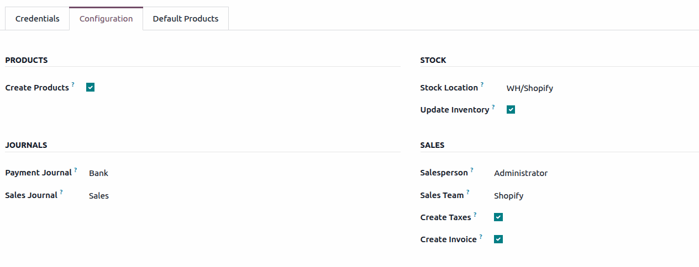

===============================
Shopify Connector configuration
===============================

Odoo allows users to register one or several Shopify stores in the database. Each Shopify store
requires a separate account configuration in Odoo, and orders, products, and inventory are scoped
per connected store.

To create and link a new Shopify account, navigate to :menuselection:`Sales app --> Configuration
--> Shopify --> Accounts`. Alternatively, from the Odoo home page, start typing `Shopify` to open
the :menuselection:`Sales --> Configuration --> Shopify --> Accounts` menu item. Then, click
:guilabel:`New`.

.. _shopify/authentication:

Authentication methods
======================

The integration connects to Shopify using two methods:

#. **OAuth**: mandatory for stores created on or after 1 January 2026.
#. **Custom App** (Admin API Access Token – Self Access).

Select the desired authentication method in the :guilabel:`Credentials` tab of the
:guilabel:`Shopify Account` form, and provide the required information for that method.

.. _shopify/multi-store:

Multi-store and multi-company management
========================================

Each Shopify store operates independently, with its own sync timestamps and configuration:

- Each Shopify store requires a separate account configuration in Odoo.
- Orders, products, and inventory are scoped per connected Shopify store.
- Multiple Shopify stores can be configured under the same Odoo company.
- Multi-company environments are supported, with a separate configuration per company.

.. _shopify/administrative-settings:

Administrative settings
=======================

The following settings are available on the :guilabel:`Shopify Account` form, and define how data is
imported and processed:

- :guilabel:`Create Products`: automatically create products in Odoo when importing orders or
  products from Shopify. If disabled, Odoo automatically selects an existing product that has the
  same internal reference as the SKU of the Shopify product. If no matching product is found, the
  default eCommerce product is used.
- :guilabel:`Default Warehouse Location`: a stock location must be defined, and must belong to the
  selected company. If not configured, Odoo automatically creates a dedicated Shopify stock
  location. In a multi-location setup, click the :guilabel:`Fetch Locations` button in the account
  configuration to pull all locations from Shopify. By default, they are all mapped to the defined
  default warehouse location, and the mapping can be changed as needed.
- :guilabel:`Update Inventory`: when enabled, the scheduled action that pushes inventory from Odoo
  to Shopify runs for this account. To stop pushing inventory from Odoo to Shopify, keep it
  disabled.
- :guilabel:`Payment Journal` and :guilabel:`Sales Journal`: journals used to register payments and
  create sales orders during order synchronization. If no existing journal is found, Odoo
  automatically uses one of the journals of the current company.
- :guilabel:`Sales Team` and :guilabel:`Salesperson`: the responsible team and user assigned to
  orders imported from Shopify. If no existing team is found, Odoo automatically creates one, and
  assigns it to the account.
- :guilabel:`Create Taxes`: import taxes from Shopify with the sales order. Odoo tries to find a
  matching tax, and creates one if no match exists. If disabled, taxes are determined using the
  order's fiscal position and the product's configured taxes in Odoo.
- :guilabel:`Create Invoice`: automatically create an invoice and register payment when importing
  paid orders from Shopify. If disabled, the invoice must be created manually from the sales order.

.. important::
   Any of the settings of a Shopify account configuration in Odoo can only be changed in a
   disconnected state. If the account is already connected, first disconnect it, change the required
   setting or field, and then connect the account again.

.. seealso::
   - :doc:`features`
   - :doc:`manage`
   - :doc:`fulfillment`
