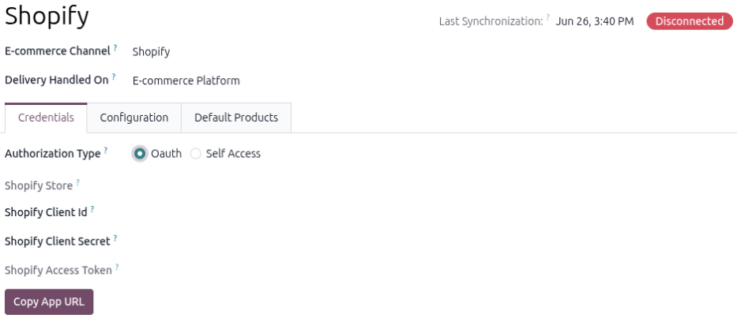
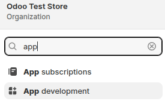
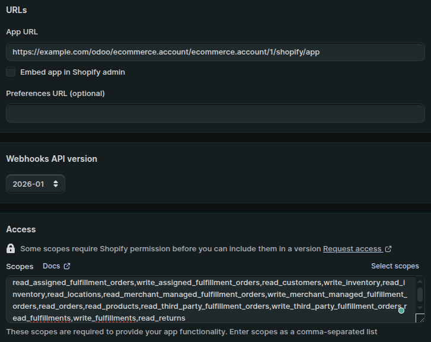
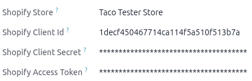

:orphan:
:nosearch:

.. _Odoo-SH: http://odoo.sh/
.. _access-tokens: https://shopify.dev/docs/apps/build/authentication-authorization/access-tokens/generate-app-access-tokens-admin
.. _shopify-account-configuration: https://youtu.be/n0_MO0CWo6s?si=nZMuNXrLjqS248S1
.. _set-up-shopify-connector: https://youtu.be/6SHsfl8gVbk?si=gTvEzvDFInlRafEP

===============================
Shopify Connector configuration
===============================

Odoo allows users to register one or more Shopify stores in the database. Each Shopify store
requires a separate account configuration in Odoo, and orders, products, and inventory are scoped
per connected store.

.. seealso::
   - `Tutorial: Configure a Shopify connector account <shopify-account-configuration_>`_
   - `Tutorial: Set up the Shopify connector <set-up-shopify-connector_>`_

.. _shopify/setup/prerequisites:

Prerequisites
=============

This integration only works with Odoo-SH_ and requires version 19.0. Before configuring the *Shopify
connector*, users need the following:

- A Shopify account
- The **Shopify connector** app
- Odoo **Sales** app (this app auto-installs with the **Shopify connector** app)

.. tip::
   It's recommended to have the Odoo database and Shopify account dashboard in different tabs in the
   same browser for the setup.

.. _shopify/setup/create-account-form:

Create Shopify account in Odoo
==============================

.. important::
   Users must be in :ref:`developer mode <developer-mode>` to configure the Shopify account form.

To create a new Shopify account, navigate to :menuselection:`Sales app --> Configuration -->
Shopify: Accounts`. Alternatively, from the Odoo home page, start typing `Shopify` to open the
:menuselection:`Sales --> Configuration --> Shopify: Accounts` menu item. Then, click
:guilabel:`New`.

On the blank *Shopify account form* page, start by:

#. Choose a name for the account (e.g., American Marketplace).
#. Select :guilabel:`Shopify` for the :guilabel:`E-commerce Channel`.
#. Select an option from the :guilabel:`Delivery Handled On` drop-down menu: :guilabel:`Odoo` or
   :guilabel:`E-commerce Platform`.

To learn more about how each option affects the delivery flow, refer to the
:ref:`shopify/fulfillment/delivery-modes` section on the *Shopify delivery and return management*
page.

.. _shopify/setup/authentication:

Select an authentication method
-------------------------------

In the *Credentials* tab of the Shopify account form, select an authentication method for the
:guilabel:`Authorization Type` field:

- :guilabel:`Oauth`: Mandatory for stores created on or after January 1, 2026.
- :guilabel:`Self Access`: An admin API Access Token. Stores created before January 1, 2026 can use
  this method.

If using the :guilabel:`Self Access` option, refer to Shopify's `access-tokens`_ page.

If using the :guilabel:`Oauth` option, click the :guilabel:`Copy App URL` button.

.. _shopify/setup/administrative-settings:

Configuring administrative settings
-----------------------------------

The *Configuration* tab settings can be changed anytime, even while the Shopify account is
connected. All changes are logged in the account form's chatter. These settings control how data is
imported and processed:

- :guilabel:`Create Products`: Controls what happens when a Shopify product is pulled and no Odoo
  product matches it. Odoo always looks for a product whose internal reference equals the Shopify
  SKU.

  When enabled, if no match is found, a new Odoo product is created from the Shopify data. Once an
  offer is mapped, its title and Shopify identifiers are refreshed on every pull, regardless of this
  setting. However, the mapped Odoo product itself is not updated afterward, since cost, weight,
  barcode, and image are only read when the product is first created. When disabled, the offer is
  mapped to the default :guilabel:`E-commerce Sale product` instead.

  .. important::
     A product must have a SKU in Shopify to be imported into Odoo.

- :guilabel:`Stock Location`: A stock location must be defined and must belong to the selected
  company. If not configured, Odoo automatically creates a dedicated Shopify stock location. In a
  multi-location setup, complete the new Shopify account form and connect to Shopify. Click the
  :icon:`fa-refresh` :guilabel:`Fetch Locations` button in the *Operations* tab to pull all
  locations from Shopify. By default, they are all mapped to the defined default warehouse location,
  and the mapping can be changed as needed.
- :guilabel:`Update Inventory`: When enabled, the scheduled action that pushes inventory from Odoo
  to Shopify runs for this account. If users do not want to push inventory from Odoo to Shopify,
  keep it disabled.
- :guilabel:`Payment Journal` and :guilabel:`Sales Journal`: Journals used to register payments and
  create sales orders during order synchronization. If no existing journal is found, Odoo
  automatically uses one of the journals of the current company.
- :guilabel:`Sales Team` and :guilabel:`Salesperson`: The responsible team and user assigned to
  orders imported from Shopify. If no existing team is found, Odoo automatically creates one and
  assigns it to the account.
- :guilabel:`Create Taxes`: Import taxes from Shopify with the sales order. Odoo tries to find a
  matching tax and creates one if no match exists. If disabled, taxes are determined using the
  order's fiscal position and the product's configured taxes in Odoo.
- :guilabel:`Create Invoice`: Automatically create an invoice and register payment when importing
  paid orders from Shopify. If disabled, the user must manually create the invoice from the sales
  order.

.. image:: setup/shopify-account-settings.png
   :alt: The Shopify account configuration page in Odoo Sales.

.. _shopify/setup/create-custom-app:

Create a custom app in Shopify
==============================

To create a custom app in Shopify, the user must sign in to an existing admin account or create a
new one. From the Shopify homepage, open the :guilabel:`Settings` menu and select :guilabel:`App
development`.

Click :guilabel:`Build app in Dev Dashboard` to open a new tab for the dev dashboard. Click
:guilabel:`Create app` and in the *Start from Dev Dashboard* option, enter the app name and click
:guilabel:`Create`.

In the *Create Version* page, enter the following information for the listed fields:

- :guilabel:`App URL`: Paste the copied URL from the :ref:`Credentials tab
  <shopify/setup/authentication>` of the Create a Shopify account form.
- Turn off the :guilabel:`Embed app in Shopify admin` checkbox.
- :guilabel:`Webhooks API version`: 2026-01

  .. note::
     Check the *Release Notes* page on the Shopify connector's app store page for the latest version
     of the Webhooks API.

- In the *Access* section, ensure the *Scopes* tab is selected. Then copy the following code block
  and paste it into the tab:
  `read_assigned_fulfillment_orders,write_assigned_fulfillment_orders,read_customers,write_inventory,read_inventory,read_locations,read_merchant_managed_fulfillment_orders,write_merchant_managed_fulfillment_orders,read_orders,read_products,read_third_party_fulfillment_orders,write_third_party_fulfillment_orders,read_fulfillments,write_fulfillments,read_returns`

Click the :guilabel:`Release` button at the top of the page, then click :guilabel:`Release` again to
release the app with the version name.

.. _shopify/setup/connect-shopify-to-odoo:

Connect Shopify to Odoo
=======================

.. important::
   This process also applies to reconnecting a Shopify app to an existing Shopify account form.

Navigate to the Shopify app's *Settings* page by clicking :guilabel:`Settings` in the navigation
bar. Copy the :guilabel:`Client ID` and :guilabel:`Client Secret` from the *Credentials* section.

Switch to the Odoo browser tab, paste these into the :guilabel:`Shopify Client Id` and
:guilabel:`Shopify Client Secret` fields in the *Credentials* tab.

Next, switch back to the Shopify browser tab and click the app's name. Click :guilabel:`Install
app`, then on the new page select the Shopify store to link to Odoo, and click :guilabel:`Install`.

After installing the app in the Shopify store, the page is automatically redirected to the Shopify
account form in Odoo with the *Operations* tab open. Verify that the app is connected by checking
the account connection status in the top-right corner. Click the :guilabel:`Credentials` tab and
confirm that the access token has been fetched in the :guilabel:`Shopify Access Token` field.

.. _shopify/setup/multi-store:

Multi-store and multi-company management
========================================

The **Sales** app supports configuring multiple Shopify stores under the same Odoo company. Each
Shopify store requires a Shopify account form and operates independently, with its own sync
timestamps and configuration. All orders, products, and inventory are scoped per connected Shopify
store. Multi-company environments are supported, with a separate configuration per company.

The only exception is when the same internal Odoo location is synced with more than one Shopify
store location: the inventory for those Shopify account forms is synced with the internal Odoo
location.

.. seealso::
   - :doc:`../shopify_connector`
   - :doc:`manage`
   - :doc:`fulfillment`
