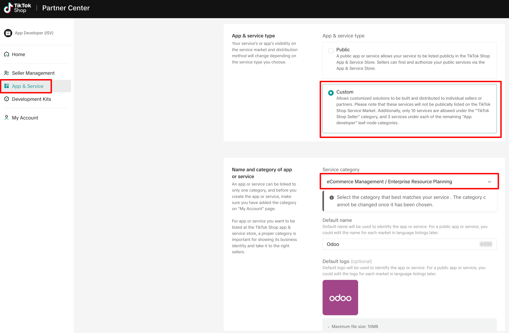
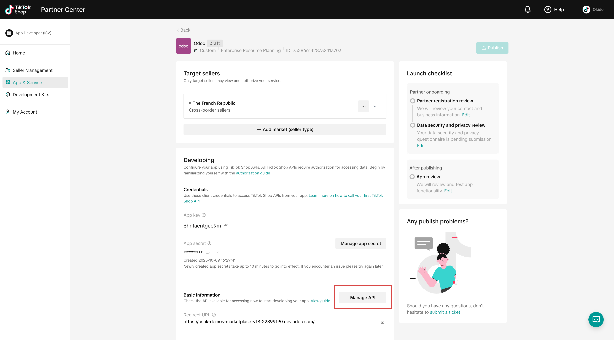
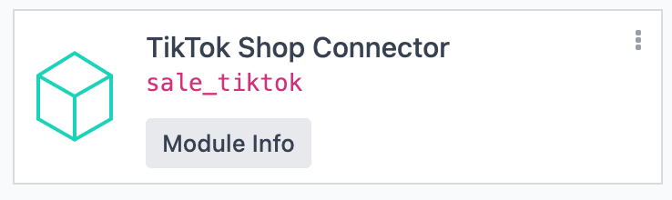
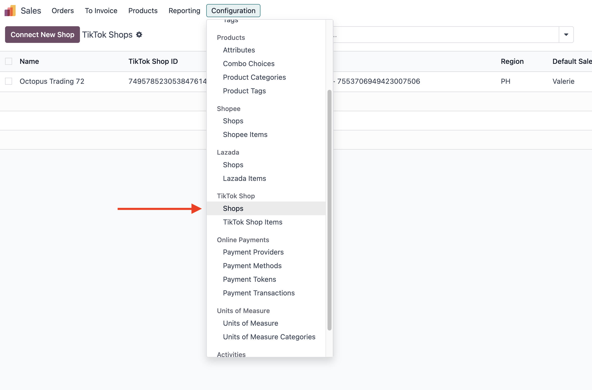

=================================== 
TikTok Shop Connector Configuration
===================================

This guide explains how to set up the **TikTok Shop Connector** in Odoo to integrate your TikTok Shop
Seller account(s) and manage multiple marketplaces efficiently. Follow these steps to configure your
account, synchronize your product catalog, and prepare your shop for go-live.

Prerequisites
=============

Before configuring the **TikTok Shop Connector**, ensure you have:

- A TikTok Shop Seller account.
- A valid email address and password for the *TikTok Shop Partner Center*.
- A brief description of your integration purpose (e.g., "Connecting Odoo ERP to our TikTok Shop for
  order and inventory synchronization").
- Your Odoo database URL and tester account credentials (name and password).

.. note::
   The *TikTok Shop Partner Center* account for API access is separate from your TikTok Shop Seller
   account.

Create a TikTok Shop Partner Center Account
===========================================

1. Navigate to :guilabel:`TikTok Shop Partner Center`: Go to https://partner.tiktokshop.com/ and
   click :guilabel:`Log in` or :guilabel:`Sign Up` :guilabel:`Join now` or to create an account.

   .. image:: setup/TikTok-Shop-Partner-Center-create-account.png

2. Select App Developer Role:

   - Once logged in, select :guilabel:`Add category and market`.
   - Choose :guilabel:`App developers (ISV)` as the account type.

3. Complete Registration:

   - Fill out the form, selecting :guilabel:`App developers --> eCommerce Management --> Connector`
     as the :guilabel:`Business category`.

        .. image:: setup/tiktok-shop-business-set-up.png
        .. image:: setup/TikTok-Shop-Partner-Center-app-information.png

   - Provide your email, password, and other required details.      
   - Submit the application and wait for approval (typically a few hours to a couple of business
     days). Check your registered email for confirmation.

.. tip::
   Ensure accurate business category selection to avoid delays. If your application is rejected,
   review the reason in the notification email and resubmit with corrections.

Create an App on TikTok Shop Partner Center
===========================================

To obtain the :guilabel:`Service ID`, :guilabel:`App Key`, and :guilabel:`App Secret` for Odoo
integration:

1. Access :guilabel:`App Management`: Log in to the *TikTok Shop Partner Center*, navigate to
   :menuselection:`App & Service` on the sidebar, and select :guilabel:`Create App`.
2. Configure App Settings:

   - Choose :guilabel:`Custom` as the :guilabel:`App & service type`.
   - Select :guilabel:`eCommerce Management / Connectors` as the :guilabel:`Service category`.
   - Enter the app name and target market.
   - Ensure :guilabel:`Enable API` is turned ON.
   - Set the :guilabel:`Redirect URL` to
     ``https://<your database url>.odoo.com/tiktok/return_from_authorization``.

3. Manage API Scope:

   - Go to :guilabel:`Manage API` in the created app.

   - Enable the following services:

     - Finance Information
     - Fulfillment Basic
     - Logistics Basic
     - Order Information
     - Product Basic
     - Product Modify
     - Shop Authorized Information
     - Global Shop Information

   .. image:: setup/TikTok-Shop-Partner-Center-enable-api-options.png

   - Re-authorize the app after enabling services to apply changes.

4. Configure Webhook:

   - Go to :guilabel:`Manage Webhook` and set the :guilabel:`Webhook URL` to
     ``https://<your database url>.odoo.com/tokopedia/webhook``.
     
     .. image:: setup/TikTok-Shop-Partner-Center-webhook.png

   - Enable the :guilabel:`Order Status Change` topic.

   .. image:: setup/tiktok-shop-partner-webhook-status.png

5. Note Credentials: Record the :guilabel:`Service ID`, :guilabel:`App Key`, and
   :guilabel:`App Secret` from the app details.

  .. image:: setup/TikTok-Shop-Partner-Center-app-secret.png

.. note::
   App creation and API scope configuration may take up to 24 hours to process. Ensure the
   :guilabel:`Redirect URL` and :guilabel:`Webhook URL` match your Odoo database URL exactly.

Connect TikTok Shop Seller Account to Odoo
==========================================

1. Install the Connector: In Odoo, install the :guilabel:`TikTok Shop Connector` module.

2. Enable :guilabel:`TikTok Sync`: Navigate to :menuselection:`Sales --> Configuration --> TikTok Shops`, 
activate the :guilabel:`TikTok Sync` feature, and click :guilabel:`Save`.

3. Create TikTok Account:

   - Go to :menuselection:`Sales --> Configuration --> Settings --> Connectors -->
     TikTok Accounts` and click :guilabel:`New`.
   - Enter a name (e.g., "TikTok Shop Indonesia"), :guilabel:`Service ID`, :guilabel:`App Key`,
     :guilabel:`App Secret`, and select the marketplace (e.g., TikTok Shop Indonesia).

     .. image:: setup/TikTok-Shops-create-shop-odoo.png

4. Link Account:

   - Save the form to reveal the :guilabel:`Link with TikTok` button.
   - Click the button to redirect to the TikTok Shop authentication page. Log in with your TikTok
     Shop Seller account credentials and grant Odoo access.
   - Upon successful authorization, Odoo lists available marketplaces under the
     :guilabel:`Marketplaces` tab.

     .. image:: setup/Tiktok-Shop-Seller-Login.png

5. Manage Marketplaces:

   - Newly added marketplaces are automatically synchronized. To disable synchronization for
     specific marketplaces, remove them from the list.
   - Avoid synchronizing the same shop multiple times to prevent duplicate orders.

.. important::
   To maintain data integrity, ensure each shop is synchronized only once. If synchronization
   fails, try manually fetching orders before reconfiguring. Use the :guilabel:`Re-Authorize App`
   button to refresh the authorization if needed.

Configure Shop Before Go-Live
=============================

1. Set Up Warehouses:

   - Navigate to :menuselection:`Sales --> Configuration --> Settings --> Connectors -->
     TikTok Sync --> TikTok Accounts`.
   - Select the TikTok account and configure the :guilabel:`FBM Warehouse` field to limit stock
     fetching to specific warehouses.
   - By default, all accounts use the same TikTok stock location. To isolate stock for a specific
     marketplace, create a separate account registration and assign a unique stock location.

2. Synchronize Product Catalog:

   - Use the :guilabel:`Sync Product Catalogue` button in Odoo to automatically fetch active
     TikTok Shop products daily.
   - For new Odoo databases, export the TikTok Shop catalog from *TikTok Shop Partner Center*
     (including Item IDs). Import into Odoo via :menuselection:`Inventory --> Products --> Import`,
     mapping Item IDs to the :guilabel:`Internal Reference` field.
   - For existing Odoo products, export both TikTok Shop and Odoo catalogs, map Item IDs to
     :guilabel:`Internal References` in a spreadsheet, and import the updated mappings back into
     Odoo.

.. tip::
   Test catalog synchronization with a small product set to verify Item ID mappings before full
   import. Leave SKU ID empty during manual entry, as it is populated during inventory
   synchronization.

.. seealso::
   - :doc:`features`
   - :doc:`manage`