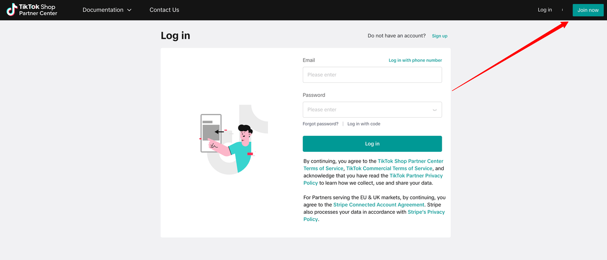
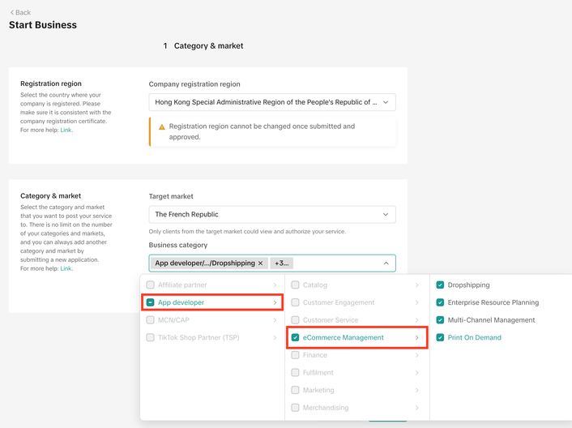
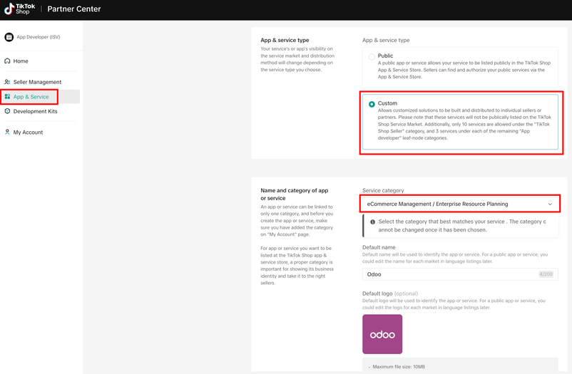
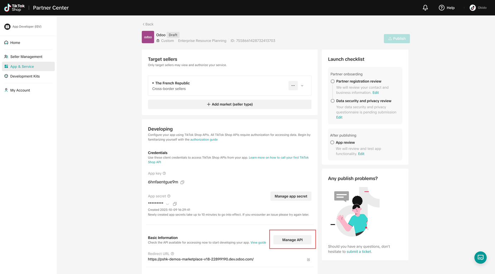
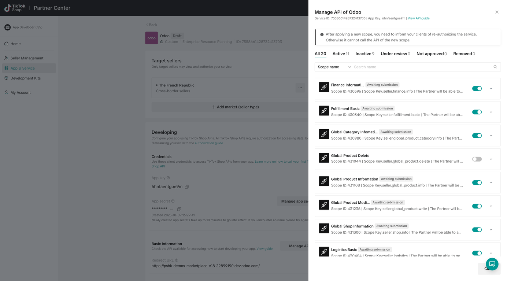
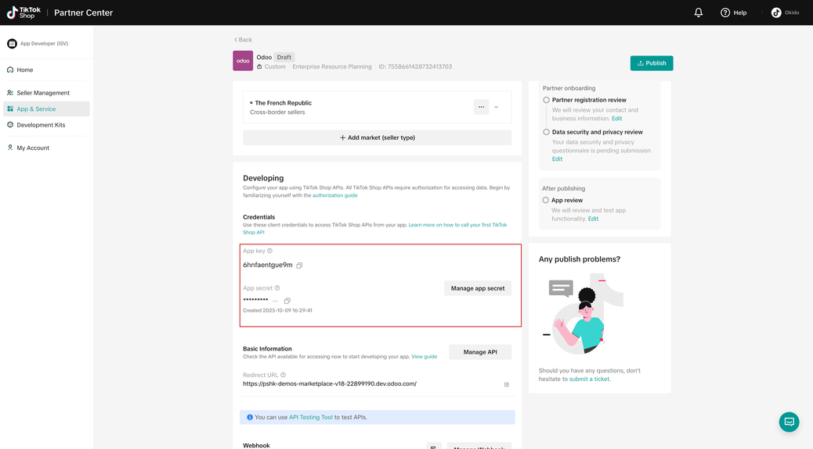
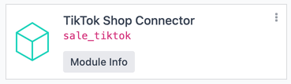
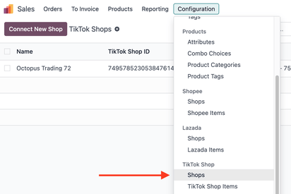
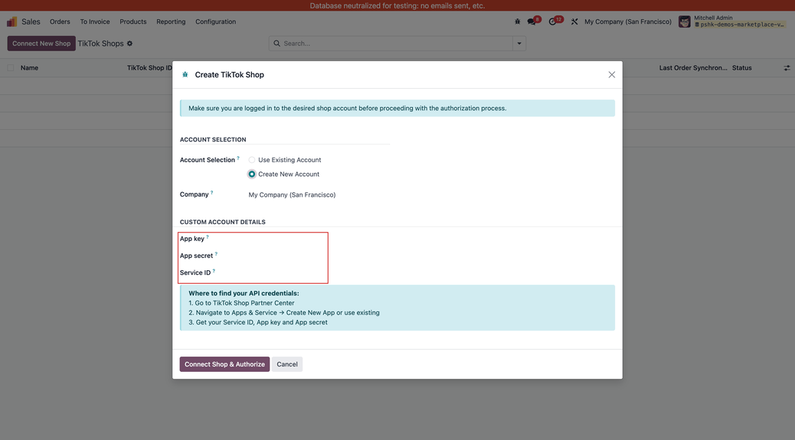
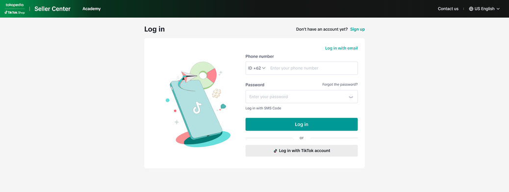

===================================
TikTok Shop connector configuration
===================================

This guide explains how to set up the **TikTok Shop Connector** in Odoo to integrate TikTok Shop
Seller accounts and manage multiple marketplaces efficiently. Follow these steps to configure the
account, synchronize the product catalog, and prepare the shop for go-live.

Prerequisites
=============

Configuring a *TikTok Shop Connector* requires:

- A TikTok Shop Seller account.
- A valid email address and password for the *TikTok Shop Partner Center*.
- A brief description of the integration purpose.
- An Odoo database URL and tester account credentials.

.. note::
   The *TikTok Shop Partner Center* account used for API access is separate from a TikTok Shop
   Seller account.

Create a TikTok Shop Partner Center account
===========================================

Navigate to :guilabel:`TikTok Shop Partner Center`, and go to the TikTok Shop platform. Log in with
the TikTok account or create a new one if needed.

Once logged in, select :guilabel:`Add category and market` and fill in all the information. Choose
:guilabel:`App developers (ISV)` as the :guilabel:`Business category`. Fill the registration region
and target market, then click :guilabel:`Next`.

Fill the :guilabel:`Partner Name` and contact email, then click :guilabel:`Get app key now`. Submit
the application and wait for approval.

Create an app on TikTok Shop Partner Center
===========================================

To obtain the :guilabel:`Service ID`, :guilabel:`App Key`, and :guilabel:`App Secret` for Odoo
integration, log in to the *TikTok Shop Partner Center*, navigate to :menuselection:`App & Service`
on the sidebar. Click :guilabel:`Manage` next to the app name.
Choose :guilabel:`Custom` as the :guilabel:`App & service type`. Select :guilabel:`eCommerce
Management / Connectors` as the :guilabel:`Service category`. Enter the name of the app and market.
Ensure :guilabel:`Enable API` is ON. Enter the redirect URL as `https://<your database url>.odoo.co
m/tiktok/return_from_authorization`.

Go to :guilabel:`Manage API` in the created app.

Make sure to enable these services:

- :guilabel:`Finance Information`,
- :guilabel:`Fulfillment Basic`,
- :guilabel:`Logistics Basic`,
- :guilabel:`Order Information`,
- :guilabel:`Product Basic`,
- :guilabel:`Product Modify`,
- :guilabel:`Shop Authorized Information`,
- and :guilabel:`Global Shop Information`.

For newly created accounts, it may be necessary to submit the app for review before enabling API
usage. Click :guilabel:`Publish App` to generate a new API key. Take the :guilabel:`Service ID`,
:guilabel:`App key`, and :guilabel:`App secret` of the app.

Connect TikTok Shop seller account to Odoo
==========================================

Go to Odoo's Apps module, search for the :guilabel:`TikTok Shop Connector` module, and click
:guilabel:`Activate` to install it.

Once installed, activate the feature by going to :menuselection:`Sales --> Configuration -->
Shops`. Click :guilabel:`Connect New Shop`.

Fill in the :guilabel:`App Key`, :guilabel:`App Secret` and :guilabel:`Service ID`.

The system redirects to an authentication page to connect the newly created app to the TikTok Shop
seller account. Ensure the login credentials match the specific TikTok Shop account intended for
connection and complete the authentication process.

Upon completion, the system redirects back to Odoo. Click the :guilabel:`Re-authorize Shop` button
to refresh the authorization and get a new Refresh Token.

Configure shop before go-live
=============================

Navigate to :menuselection:`Sales --> Configuration --> Shops`. Select the TikTok account and
configure the :guilabel:`FBS Warehouse` field to limit stock fetching to specific warehouses.
Enable synchronizing inventory in shop settings to push stock levels to TikTok Shop.

Use the :guilabel:`Sync Catalog` button in Odoo to automatically fetch active TikTok Shop products.
Shipping labels, orders, inventory and product catalogs can be manually synced using their
respective buttons on the shop configuration page.

.. seealso::
   - :doc:`features`
   - :doc:`manage`
