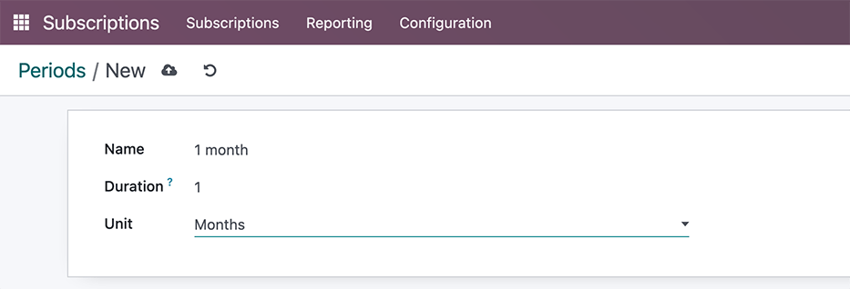
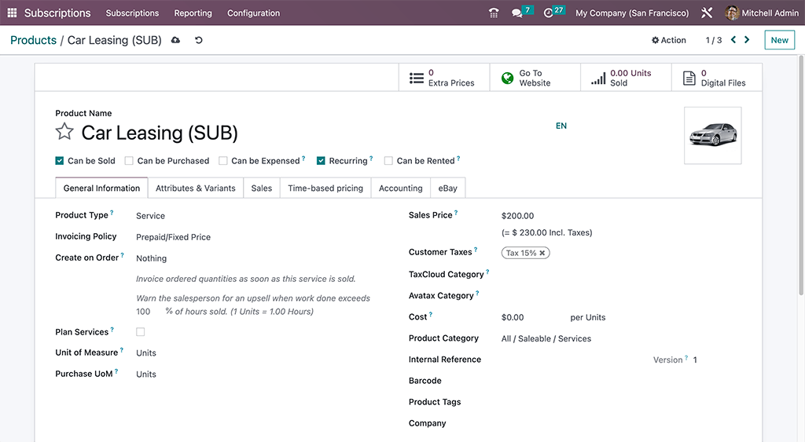
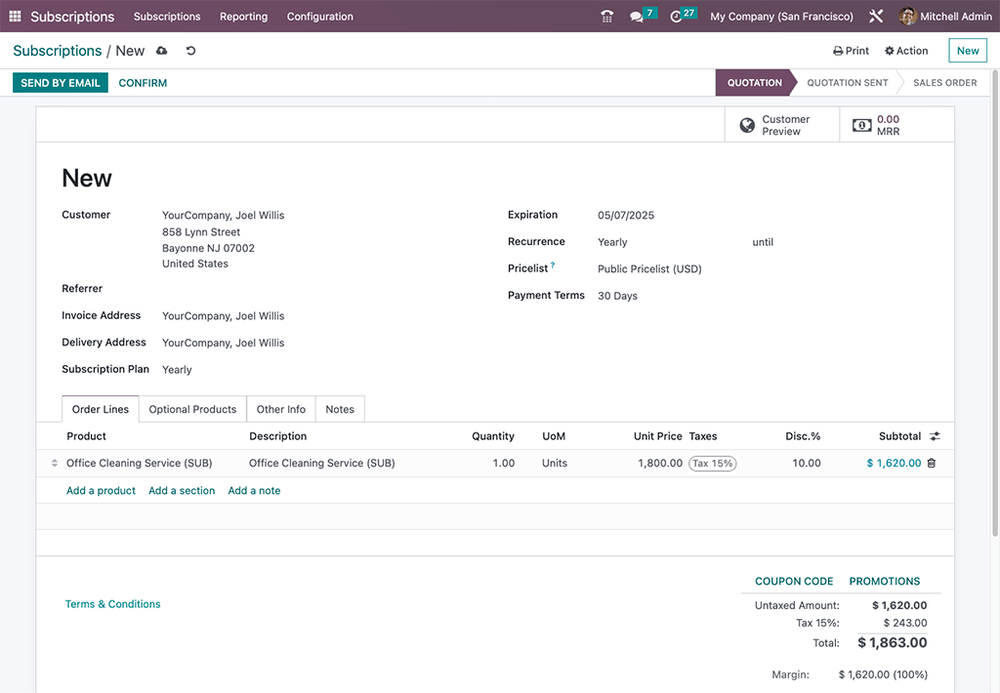

:show-content:
:hide-toc:

=============
Subscriptions
=============

The Odoo **Subscriptions** app is designed to manage recurring revenue through subscription-based
products or services. It supports automated invoicing, renewal management, and customer lifecycle
tracking.

Subscriptions can be created manually or automatically through online sales, with varying options
for recurring billing. The app integrates with other Odoo modules such as **Invoicing**, **CRM**,
**Sales**, and **Helpdesk** to support end-to-end subscription workflows.

.. cards::

   .. card:: Subscription plans
      :target: subscriptions/plans
      :large:

      Customize subscription plan templates tailored to various product offerings

   .. card:: Renew a subscription
      :target: subscriptions/plans
      :large:

      Understand the core management activity for subscriptions

   .. card:: Upsell a subscription
      :target: subscriptions/plans
      :large:

      Offer more value for current subscribers on the same sales order

   .. card:: Integrate subscriptions with eCommerce
      :target: subscriptions/plans
      :large:

      Offer subscription products with an Odoo **eCommerce** app integration

.. seealso::
   - `Odoo Tutorials: Subscriptions <https://www.odoo.com/slides/subscription-20>`_

Set up recurrence periods
=========================

To get started with subscription products in Odoo, *recurrence periods* must first be configured.

Recurrence periods are the time windows in which subscriptions are active before they renew again.
While a subscription is active, customers receive products or services, and may also have access to
additional benefits such as support desk triage. In terms of payment, these recurrence periods
designate how often the customer is charged in order to maintain the benefits of their subscription.

To configure recurrence periods, go to :menuselection:`Subscriptions app --> Configuration -->
Recurrence periods`.

By default, the **Subscriptions** app includes a number of common recurrence periods already
available, such as :guilabel:`Monthly` and :guilabel:`Yearly`.

Create new recurrence periods by clicking :guilabel:`NEW` on the :guilabel:`Recurrence Periods`
dashboard, to reveal a blank form where the period :guilabel:`Name`, :guilabel:`Duration` and
:guilabel:`Unit` values are specified.

.. important::
   The unit :guilabel:`Days` *cannot* be used as a recurrence period for subscription products. The
   daily recurrence period in Odoo is designated for rentals, and **cannot** be added to
   subscription-based sales orders.

   This limitation is there to avoid sales orders that would generate daily invoices.

Product form configuration
==========================

With recurrence periods set up, create a subscription product by navigating to
:menuselection:`Subscriptions app --> Subscriptions --> Products`, and either clicking an existing
product to turn into a subscription, or by clicking :guilabel:`NEW` to open up a blank product form.

.. note::
   By default, the :guilabel:`Recurring` option is already enabled, prompting Odoo to recognize it
   as a subscription product. Be sure to leave the :guilabel:`Recurring` and :guilabel:`Can be Sold`
   options enabled.

On the product form, configure the following items in the :guilabel:`General Information` tab so the
subscription product will function correctly:

- :guilabel:`Recurring`: check this box to turn the product into a subscription in Odoo.
- :guilabel:`Product type`: this value is typically set to a :guilabel:`Service`, however other
  product types may be used (e.g., physical product box subscriptions, eLearning course, etc.).
- :doc:`Invoicing policy <sales/invoicing/invoicing_policy>`: set this value to when the customer
  should be charged for their subscription.
- :guilabel:`Unit of Measure`: how the product should be counted in Odoo, for stock purposes. For
  most subscriptions, the :abbr:`UoM (Unit of Measure)` will be :guilabel:`Units`.
- :guilabel:`Sales Price`: enter the recurring cost of the subscription that the customer will pay
  per recurrence period.

Optionally set up information on the :doc:`Attributes & Variants
<sales/products_prices/products/variants>` tab if the subscription contains multiple choices for
customers (i.e. food delivery, tailored fashion boxes, etc.).

In the :guilabel:`Time-based pricing` tab, clarify the pricing options for the subscription. For
each option available, click :guilabel:`Add a price` to add a new row.

.. tip::
   Longer time :guilabel:`Period` options are typically incentivized with cost savings. Consider
   dropping the total :guilabel:`Price` values to offer customers a discount while supporting the
   business's financial runway.

Last, if the subscription is meant to be purchased on the **eCommerce** website, click the
:icon:`fa-globe` :menuselection:`Go To Website` smart button and in the product page header, click
the gray slider from :guilabel:`Unpublished` to the green :guilabel:`Published` status.

.. _subscriptions/quotations:

Create a subscriptions quotation
================================

Manually create a new customer subscription by navigating to either the :menuselection:`Sales` or
:menuselection:`Subscriptions` app dashboards, and then clicking :guilabel:`NEW`.

.. note::
   Products that have been marked as :guilabel:`Recurring` on their product forms, and are also sold
   on the **eCommerce** website will *automatically* create and confirm subscription quotations in
   the backend of Odoo.

.. important::
   Sales orders with a defined recurrence period automatically become subscriptions.

On the quotation form, fill in the necessary fields such as :guilabel:`Customer` and
:guilabel:`Recurrence`, as well as the :guilabel:`Order Lines` tab.

Optionally, specify a:

- :doc:`Quotation Template <sales/send_quotations/quote_template>`, if one is readily available to
  help populate the form fields.
- :guilabel:`Expiration` date, to indicate when the subscription offer is no longer valid.

  .. tip::
     Expiration dates pair well with :ref:`discounts <sales/products_prices/discounts>` to
     incentivize faster purchases, since the discount will expire with the quotation if it's not
     turned into a sales order within the specified date range.

- :ref:`Pricelist <sales/product_prices/pricelist>`, if one is available and appropriate to use
  (i.e., summer sale discount, VIP customer, etc.).
- :guilabel:`Payment Terms`, to set a specified time window for when the subscription must be paid.
  This is not to be confused for when the quotation is *confirmed* and becomes a sales order, to
  where, payment may then be obtained immediately or within a certain amount of days, weeks, months,
  etc.

.. tip::
   You can define different invoice and delivery addresses by enabling the :doc:`Customer Addresses
   </applications/finance/accounting/customer_invoices/customer_addresses>` feature.

.. _subscriptions/confirmation:

Confirmation
============

Send the quotation to the customer for confirmation by clicking on :guilabel:`SEND BY EMAIL`, or
confirm it immediately by clicking on :guilabel:`CONFIRM`.

.. tip::
   Click on :guilabel:`Customer Preview` to preview the customer portal where the customer can view
   their quotation, sign and pay it, and communicate with you.

If a signature or a payment is required to confirm the quotation, set either (or both) of these
options in the :guilabel:`Other Info` tab, next to the :guilabel:`Online confirmation` field.

.. toctree::
   :titlesonly:

   subscriptions/ecommerce
   subscriptions/plans
   subscriptions/upselling
   subscriptions/renewals
   subscriptions/closing
   subscriptions/automatic_alerts
   subscriptions/reports
