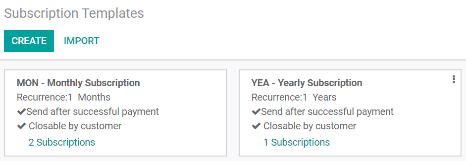

:show-content:

=============
Subscriptions
=============

.. toctree::
   :titlesonly:

   subscriptions/sales_flow
   subscriptions/follow_up
   subscriptions/reporting

Simplicity. Higher customer retention. Opportunities for marketing. Business consistency. Better
cash flow management.

- For **customers**, value lies in **convenience**:

  - Subscriptions simplify the business process. Indeed, subscribers never have to remember to renew
    their orders every month, which gives them the assurance that they will have everything they
    need before they actually need it.
  - Subscriptions help customers stay on budget.

- For **businesses**, value lies in the **ability to predict recurring revenue**:

  - Subscriptions reduce customer churn rate and significantly increase customer retention.
  - Subscriptions provide much higher payment security for your business. They stabilize and
    maintain recurring revenue streams by guaranteeing monthly revenues and adding value to your
    business.

.. seealso::
   - `Odoo Subscriptions: product page <https://www.odoo.com/app/subscriptions>`_

.. _subscriptions/templates:

Subscription Templates
======================

**Subscription Templates** can help you generate recurring invoices and manage renewals at a fast
pace. With Odoo you have the possibility to create, edit, and manage your own subscription
templates.

Go to :menuselection:`Subscriptions --> Configuration --> Subscription Templates`. By default, Odoo
suggests you two types of subscription (MON - Monthly subscription *vs* YEA - Yearly subscription).
You can also create your own ones.

.. important::
   The **Odoo Subscriptions** application automatically installs **Odoo Sales** and **Odoo
   Invoicing** as they work integrated.

Create your first template
--------------------------

You can create a new template or edit an existing one. The first thing you need to do is give your
template a name. After that, choose an *Invoicing period* and specify whether you would like to
invoice your customers per *Days*, *Weeks*, *Months* or *Years*. On *Duration*, determine if
the subscription must go on *Forever* (until it’s manually closed), or for a *Fixed amount* of time.
Among the payment options, an additional field called *Invoice email* appears when you choose
*Send*, *Send & try to charge* or *Send after successful payment*. This field allows you to add an
invoice email template to your subscription templates.

.. image:: subscriptions/templates-create.png
   :align: center
   :alt: Create your own subscription templates on Odoo Subscriptions

For each template, you can also choose if you want your customers to be able to close their
subscriptions or not. If enabled, you can set an *Automatic closing* limit and specify the
*Group of subscription* and *Journal* options.

.. note::
   On each template, you can add your **Terms and Conditions**. Specifying terms and conditions is
   essential to set out important contractual points between the customers and the sellers (payment,
   refund policy, cancellation, complaints, etc.).

   .. image:: subscriptions/templates-terms-and-conditions.png
      :align: center
      :alt: Terms & conditions on Odoo Subscriptions

   Finally, if you want to know the basic running health status of your subscriptions, you also have
   access to a specific tab called **Health Check**. There, you can edit and create your own
   filters to define what is a subscription in good health *vs* bad health. The system automatically
   summarizes all the records corresponding to these filters and you are able to manage them in one
   click.

   .. image:: subscriptions/templates-health-check.png
      :align: center
      :alt: Health check on Odoo Subscriptions

.. _subscriptions/products:

Subscription Products
=====================

To properly sell your subscriptions using our amazing **Odoo Subscriptions** application, you must
follow these steps:

1. **Create your own subscription templates**
2. **Create your own subscription products with the right settings**

As a result, you will be able to manage your subscriptions like any other product, create your
quotations and continue the sales flow to track the number of subscriptions you sell and manage the
revenue they generate.

Configuration
-------------

Go to :menuselection:`Subscriptions --> Subscription Products` to learn how you can configure your
own subscription products. You have the possibility to create a new product or edit an existing one.
Once named, be careful to select the option *Can be sold* and deselect *Can be purchased*. For the
product type, it is recommended to use *Service* for subscription products as they are non-material
products that you provide to your customers. Finally, you can adapt your prices and also add an
internal reference.

.. image:: subscriptions/products-configuration.png
   :align: center
   :alt: View of a subscription product form in Odoo Subscriptions

.. note::
   In the Sales tab, underneath the Subscriptions section, make sure the *Subscription products*
   option is activated. In fact, if you create a subscription product from the **Odoo
   Subscriptions** application, this option is selected by default. However, if you create a product
   from another application, it is not the case.

   .. image:: subscriptions/products-form.png
      :align: center
      :alt: View of a subscription product form in Odoo Subscriptions

   You can also choose the subscription templates you want to use.

   .. image:: subscriptions/products-using-templates.png
      :align: center
      :alt: View of a subscription product form in Odoo Subscriptions

.. seealso::
  - :doc:`subscriptions/sales_flow/create_a_quotation`
