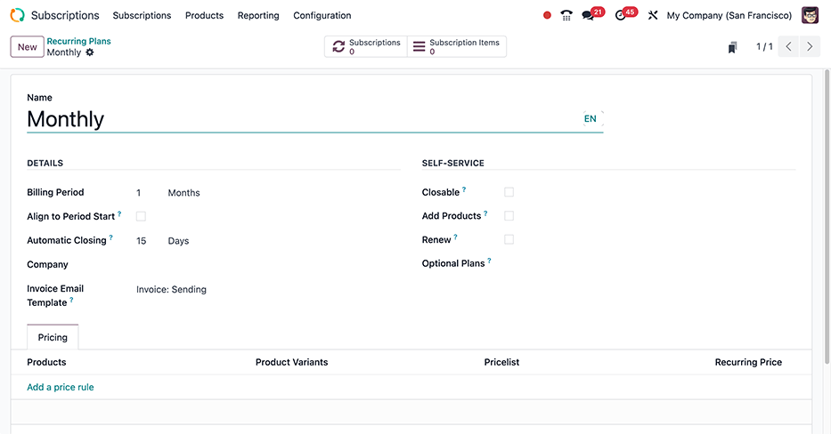

:show-content:
:hide-toc:

=============
Subscriptions
=============

The Odoo **Subscriptions** app is designed to manage recurring revenue through subscription-based
products or services. It supports automated invoicing, renewal management, and customer lifecycle
tracking.

Subscriptions can be created manually or automatically through online sales, with varying options
for recurring billing. The app integrates with other Odoo modules such as **Invoicing**, **CRM**,
**Sales**, and **Helpdesk** to support end-to-end subscription workflows.

.. cards::

   .. card:: Renew a subscription
      :target: subscriptions/renewals
      :large:

      Understand the core management activity for subscriptions

   .. card:: Upsell a subscription
      :target: subscriptions/upselling
      :large:

      Offer more value for current subscribers on the same sales order

   .. card:: Close a subscription
      :target: subscriptions/closing
      :large:

      Customize subscription plan templates tailored to various product offerings

   .. card:: eCommerce integration
      :target: subscriptions/ecommerce
      :large:

      Offer subscription products through your Odoo eCommerce store

.. seealso::
   - `Odoo Tutorials: Subscriptions <https://www.odoo.com/slides/subscription-20>`_

Set up recurring plans
======================

To get started with subscription products in Odoo, *recurring plans* (previously known as
*recurrence periods*) must first be configured.

Recurring plans are the time periods when subscriptions are active before they need to be renewed
again. While a subscription is active, customers receive products or services, and may also have
access to additional benefits like support desk triage. Recurring plans also set the interval when
the customer is charged in order to maintain their subscription.

To configure recurring plans, go to :menuselection:`Subscriptions app --> Configuration -->
Recurring Plans`.

The **Subscriptions** app includes :guilabel:`Monthly`, :guilabel:`6 Months`, and :guilabel:`Yearly`
as default recurring plan options.

Create a new recurring plan by clicking :guilabel:`New` on the :guilabel:`Recurring Plans`
dashboard. A new recurring plan form is generated with the :guilabel:`Name` and some
:guilabel:`DETAILS` filled out by default. These can all be changed freely.

.. important::
   `Days` *is not* available as an option in the :guilabel:`Billing Period` drop-down menu.
   Recurring plans cannot be configured to bill on a daily basis.

DETAILS section
---------------

After giving the recurring plan a :guilabel:`Name`, the plan can be customized by filling out the
fields in the :guilabel:`DETAILS` section. Only the :guilabel:`Billing Period` field is mandatory
for a recurring plan to be saved.

- :guilabel:`Billing Period`: determines the interval which the subscription is billed. Set the unit
  of time (:guilabel:`Weeks`, :guilabel:`Months`, or :guilabel:`Years`) in the drop-down menu and
  the numerical value in the corresponding text field.

The following fields allow for further customization and refinement of the recurring plan.

- :guilabel:`Automatic Closing`: sets how many days it takes for the subscription to automatically
   close if payment is not made.

  .. example::
     If a subscription is set to renew on the 1st of every month, and :guilabel:`Automatic Closing`
     is set to `15` :guilabel:`Days`, then the subscription closes on the 16th of that month if
     payment is not received.

- :guilabel:`Align to Period Start`: sets new and recurring subscription plans to bill on the first
  day of the next :guilabel:`Billing Period`. When a subscription plan is purchased in the middle of
  a billing period, the invoice shows a reduced cost. Setting a custom period start dates (such as
  the 5th of each month) requires custom development and is not available by default.

  .. example::
     On the 15th of July, a customer purchases a monthly subscription for a streaming service.
     Selecting :guilabel:`Align to Period Start` for this recurring plan configures this
     subscription to bill on the 1st of each month instead of the 15th. The subscription begins as
     soon as payment is confirmed. The quotation shows the full cost of the subscription for July 1
     - 31, but the invoice shows an adjusted cost for July 15 - 31. On the 1st of August, the
     customer is charged the full price for the month's subscription.

- :guilabel:`Company`: makes the recurring plan only available for the chosen company. By default,
   this option is blank and the recurring plan is available to all companies. Only one company may
   be chosen for this option. :doc:`Multi-company <../general/companies/multi_company>`
   functionality must be enabled to use this option.
- :guilabel:`Invoice Email Template`: assigns a specific email template to be used in subscriptions
  invoicing communications. The default is `Invoice: Sending` which contains dynamic fields that
  autopopulate specific variables across the :guilabel:`Subject` field and :guilabel:`Content` tab,
  such as the customer's name, invoice number, total amount invoiced, etc.

  .. tip::
     Although this field is optional, using it is recommended since this type of communication
     fulfills good business practices around price transparency, regular communication (especially
     as relates to invoiced amounts), and financial documentation around recurring revenues.

     .. figure:: subscriptions/subscriptions-invoice-email-template.png
        :alt: An email template in Odoo used to send subscriptions invoicing messages to customers.

        The `Invoice: Sending` email template is accessible by clicking the :icon:`fa-arrow-right`
        (:guilabel:`Internal link`) that appears after hovering over the :guilabel:`Invoice Email
        Template` drop-down field in the :guilabel:`Recurring Plans` form.

SELF-SERVICE section
--------------------

The following optional fields enable customers to take administrative actions on their own
subscriptions. Enabling any of these options may decrease customer service request volume or
increase customer lifetime value (LTV).

- :guilabel:`Closable`: gives customers the power to close their own subscriptions without having to
  get assistance from sales or support teams.

  .. tip::
     Although enabling this may reduce service requests and improve the customer experience, sales
     teams with strong customer offboarding processes may consider leaving this option unchecked to
     create more interactions that might save the subscription or a different form of recurring
     revenue (such as in the case of a lesser subscription or a new trial period with an alternative
     plan).

- :guilabel:`Add Products`: allows customers to add new products or edit existing product quantities
  to their recurring sales orders, thereby enabling customer-driven upselling. When enabled,
  :doc:`Upsell quotations <subscriptions/upselling>` are generated whenever a customer performs a
  quantitative adjustment on their sales order product lines.
- :guilabel:`Renew`: allows customers to manually create a :doc:`Renewal quotation
  <subscriptions/renewals>` for their subscription.
- :guilabel:`Optional Plans`: allows customers to switch their subscription plans from the current
  recurring plan to one of the values chosen here. This generates a new subscription or renewal
  quote to accommodate the change request.

Pricing tab
-----------

Make product-specific pricing adjustments, as part of the recurring plan, by adding them to the
:guilabel:`Pricing` tab order lines. Sequentially add the :guilabel:`Products`, along with any
respective :guilabel:`Product Variants`, and then assign a :guilabel:`Pricelist` (if available) and
a :guilabel:`Recurring Price`.

.. note::
   Price rules that are added here take precedent over the default pricing information on the
   subscription product's form. This is meant to accommodate deals, discounts, and similar pricing
   adjustment strategies that would incentivize customers to purchase the recurring plan.

Smart buttons
-------------

At the top of the individual :guilabel:`Recurring Plans` form, are two smart buttons to aid in
navigating the recurring revenue sources attached to the plan:

- :guilabel:`Subscriptions`: shows the number of active subscriptions sales orders that fall under
  the recurring plan. Clicking the button leads to a tabled list view, where each row hyperlinks to
  a respective subscriptions sales order.
- :guilabel:`Subscription Items`: lists all the individual recurring subscription services that are
  active, in an itemized fashion. :guilabel:`Subscription` and :guilabel:`Customer` values repeat if
  the customer ordered multiple subscriptions on the same sales order.

Product form configuration
==========================

With recurring plans set up, create a subscription product by navigating to
:menuselection:`Subscriptions app --> Products --> Products`. Edit an existing product to edit or
make a new one by clicking :guilabel:`New` to open up the subscription product's form.

.. note::
   When making a product in the **Subscriptions** app, the :guilabel:`Subscriptions` option is
   enabled by default. Both the :guilabel:`Subscriptions` and :guilabel:`Sales` options enabled to
   sell the product as a subscription product.

.. image:: subscriptions/subscription-product-form.png
   :alt: A basic subscription product form in the Odoo Subscriptions application.

On the product form, configure the following items in the :guilabel:`General Information` tab so the
subscription product functions correctly:

- :guilabel:`Product Type`: sets the product type to a physical good, a provided service, or a
  combination of both. This is typically set to a :guilabel:`Service` by default.
- :doc:`Invoicing Policy <sales/invoicing/invoicing_policy>`: sets when the customer is charged for
  their subscription, such as when the good or service is rendered, when the order is placed, etc.
- :guilabel:`Unit of Measure`: determines how the product should be counted in Odoo, for stock
  purposes. For most subscriptions, the :abbr:`UoM (Unit of Measure)` is :guilabel:`Units`.
- :guilabel:`Sales Price`: sets the recurring cost of the subscription that the customer pays per
  recurrence period.

Additionally, the following may be used to further customize the subscription product.

- The :guilabel:`Create on Order` options: enables secondary actions in Odoo such as creating a new
  :guilabel:`Task` in a chosen :guilabel:`Project` :icon:`fa-building-o`, :guilabel:`Event
  Registration` or :guilabel:`Course Access`. If none of the selectable actions in this field's
  drop-down menu are needed, it may be set to :guilabel:`Nothing`.
- The :guilabel:`Is Published` field under the :guilabel:`Sales` tab: adds the subscription as a
  product customers can purchase from the eCommerce website.
- The :guilabel:`Recurring Prices` tab: allows different pricing options for the subscription. For
  each desired option, click :guilabel:`Add a line` to add a new row.
- The :doc:`Attributes & Variants <sales/products_prices/products/variants>` tab: enables multiple
  choices for customers (i.e. food delivery, tailored fashion boxes, etc.).
- The :guilabel:`Purchase` tab: sets up purchasing information if the product is sourced from a
  vendor, as with reseller (retail) or subcontracting operations.

.. tip::
   Longer :guilabel:`Recurring Plan` time periods usually feature discounts to incentivize customers
   to lock in a price and create a predictable revenue stream for businesses.

.. _subscriptions/quotations:

Manually creating a subscriptions quotation
===========================================

A new customer subscription can be created by going to either the :menuselection:`Sales`` or
:menuselection:`Subscriptions` app dashboards, then clicking :guilabel:`New`. On the quotation form,
fill in the necessary fields such as :guilabel:`Customer` and :guilabel:`Recurring Plan`, as well as
the :guilabel:`Order Lines` tab.

Additionally, any of the following can also be added to the quotation:

- :guilabel:`Expiration` date: indicates when the subscription offer is no longer valid.

  .. tip::
     Expiration dates pair well with :doc:`discounts <sales/products_prices/prices/discounts>` to
     incentivize faster purchases, since the discount expires with the quotation if it is not turned
     into a sales order within the specified date range.

- :guilabel:`Payment Terms`: specifies a time frame by which the subscription must be paid once
  confirmed as a sales order.

.. image:: subscriptions/new-subscription-form.png
   :alt: A completed example of a new subscription quotation in Odoo.

.. _subscriptions/confirmation:

Confirmation
============

Send the quotation to the customer for confirmation by clicking on :guilabel:`Send By Email`, or
confirm it immediately by clicking on :guilabel:`Confirm`. Click on :guilabel:`Preview` to preview
the customer portal where the customer can view their quotation, sign and pay it, and communicate
with you.

If an :guilabel:`Online signature` or :guilabel:`Online payment` is required to confirm the
quotation, set the checkboxes next to either (or both) of these labels in the :guilabel:`Other Info`
tab, under the :guilabel:`SALES` section.

Automatically created subscriptions quotations
==============================================

Products that have been marked as :guilabel:`Subscriptions` on their product forms, and are also
sold on the **eCommerce** website *automatically* create and confirm subscription quotations in
Odoo. Sales orders with defined recurring plans automatically become subscriptions.

.. seealso::
   - :doc:`/applications/finance/accounting/payments/online`
   - :doc:`Payment providers and payment methods </applications/finance/payment_providers>`

.. toctree::
   :titlesonly:

   subscriptions/ecommerce
   subscriptions/upselling
   subscriptions/renewals
   subscriptions/closing
   subscriptions/scheduled_actions
   subscriptions/reports
