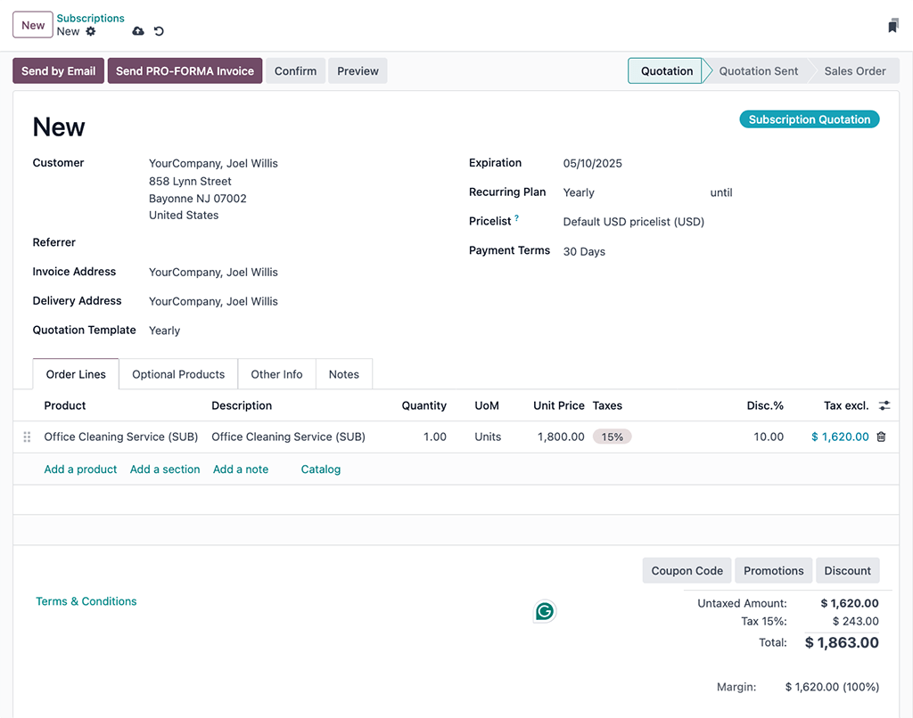

:show-content:
:hide-toc:

=============
Subscriptions
=============

The Odoo **Subscriptions** app is designed to manage recurring revenue through subscription-based
products or services. It supports automated invoicing, renewal management, and customer lifecycle
tracking.

Subscriptions can be created manually or automatically through online sales, with varying options
for recurring billing. The app integrates with other Odoo modules such as **Invoicing**, **CRM**,
**Sales**, and **Helpdesk** to support end-to-end subscription workflows.

.. cards::

   .. card:: Subscription plans
      :target: subscriptions/plans
      :large:

      Customize subscription plan templates tailored to various product offerings

   .. card:: Renew a subscription
      :target: subscriptions/plans
      :large:

      Understand the core management activity for subscriptions

   .. card:: Upsell a subscription
      :target: subscriptions/plans
      :large:

      Offer more value for current subscribers on the same sales order

   .. card:: Integrate subscriptions with eCommerce
      :target: subscriptions/plans
      :large:

      Offer subscription products with an Odoo **eCommerce** app integration

.. seealso::
   - `Odoo Tutorials: Subscriptions <https://www.odoo.com/slides/subscription-20>`_

Set up recurring plans
======================

To get started with subscription products in Odoo, *recurring plans* (previously known as
*recurrence periods*) must first be configured.

Recurring plans are the time windows in which subscriptions are active before they renew again.
While a subscription is active, customers receive products or services, and may also have access to
additional benefits such as support desk triage. In terms of payment, these recurring plans
designate how often the customer is charged in order to maintain the benefits of their subscription.

To configure recurring plans, go to :menuselection:`Subscriptions app --> Configuration -->
Recurring Plans`.

By default, the **Subscriptions** app includes a number of common recurring plans already available,
such as :guilabel:`Monthly` and :guilabel:`Yearly`.

Create a new recurring plan by clicking :guilabel:`New` on the :guilabel:`Recurring Plans`
dashboard, to reveal a blank form where the plan :guilabel:`Name`, :guilabel:`DETAILS`,
:guilabel:`SELF-SERVICE` and :guilabel:`Pricing` field values are specified.

.. image:: subscriptions/recurring-plan-blank-form.png
   :alt: A blank recurring plan form in the Odoo Subscriptions application.

.. important::
   The `Days` unit of measure *cannot* be used as a :guilabel:`Billing Period` for subscription
   products. The daily recurrence period in Odoo is designated for rentals, and **cannot** be added
   to subscription-based sales orders.

   This limitation is there to avoid sales orders that would generate daily invoices.

DETAILS section
---------------

After giving the recurring plan a suitable :guilabel:`Name` (e.g. `Monthly`, `Bi-weekly`,
`Quarterly`, etc.), proceed to the form's :guilabel:`DETAILS` section to fill out the following
configuration fields:

- :guilabel:`Billing Period`: determines the recurrence period of the recurring plan. Set the
  numerical value in the text field and contextualize the quantity with a unit of time in the
  corresponding drop-down menu, in :guilabel:`Weeks`, :guilabel:`Months`, or :guilabel:`Years`.
- :guilabel:`Automatic Closing`: a numerical value, in days, where the subscription is set to close
  automatically if payment is not made.

  .. example::
     If a subscription is set to renew on the 1st of every month, and the :guilabel:`Automatic
     Closing` value is set to `15` :guilabel:`Days`, then the subscription will close on the 16th of
     that month if payment is not received.

- :guilabel:`Company`: optional assignment, if the database has :doc:`Multi-company
  <../general/multi_company>` functionality enabled. Assigning this value will make the recurring
  plan available for that company's location, specifically.
- :guilabel:`Invoice Email Template`: assigns a specific email template to be used in subscriptions
  invoicing communications. The default assignment here is `Invoice: Sending` which contains various
  dynamic fields that autopopulate specific variables across the :guilabel:`Subject` field and
  :guilabel:`Content` tab, such as the customer's name, invoice number, total amount invoiced, etc.

  .. tip::
     Although this field is optional, it is recommended to use it since this type of communication
     fulfills good business practices around price transparency, regular customer communication
     (especially as it relates to charged amounts), and helps build contextual financial
     documentation around recurring revenues.

     .. figure:: subscriptions/subscriptions-invoice-email-template.png
        :alt: An email template in Odoo used to send subscriptions invoicing messages to customers.

        The `Invoice: Sending` email template is accessible by clicking the :icon:`fa-arrow-right`
        (:guilabel:`Internal link`) that appears after hovering over the :guilabel:`Invoice Email
        Template` drop-down field in the :guilabel:`Recurring Plans` form.

SELF-SERVICE section
--------------------

The following optional fields enable customers to take administrative actions on their own
subscriptions. Enabling any of these options may decrease customer service request volume or
increase customer lifetime value (LTV).

- :guilabel:`Closable`: checking this box will give customers the power to close their own
  subscriptions. Consider enabling this option to reduce customer service requests and improve the
  overall customer experience; customers that can manage their own subscriptions in this way helps
  offload tedious tasks for sales and support teams, and reduces the likelihood of negative reviews.

  .. tip::
     Although this option is generally advisable to enable, sales teams with strong customer
     offboarding processes may consider leaving this option unchecked in order to force an
     interaction that might save the subscription or a different form of recurring revenue (such as
     in the case of a lesser subscription or a new trial period with an alternative plan).

- :guilabel:`Add Products`: allows customers to add new products or edit existing product quantities
  to their recurring sales orders, thereby enabling customer-driven upselling. When enabled,
  :doc:`Upsell quotations <subscriptions/upselling>` are generated in Odoo whenever a customer
  performs a quantitative adjustment on their sales order product lines.

- :guilabel:`Renew`: enabling this allows customers to manually create a :doc:`Renewal quotation
  <subscriptions/renewals>` for their subscription.
- :guilabel:`Optional Plans`: adding values here from the drop-down field menu enables customers to
  switch their subscription plans, in which case a new subscription quotation or renewal quote is
  created to accommodate the change request.

Pricing tab
-----------

Make product-specific pricing adjustments, as part of the recurring plan, by adding them to the
:guilabel:`Pricing` tab order lines. Sequentially add the :guilabel:`Products`, along with any
respective :guilabel:`Product Variants`, and then assign a :guilabel:`Pricelist` (if available) and
a :guilabel:`Recurring Price`.

.. note::
   Price rules that are added here take precedent over the default pricing information on the
   subscription product's form. This is meant to accommodate deals, discounts, and similar pricing
   adjustment strategies that would incentivize customers to purchase the recurring plan.

Product form configuration
==========================

With recurring plans set up, create a subscription product by navigating to
:menuselection:`Subscriptions app --> Products --> Products`, and click either an existing product
to edit, or make a new one by clicking :guilabel:`New` to open up the subscription product's form.

.. note::
   By default, the :guilabel:`Recurring` option is already enabled, prompting Odoo to recognize it
   as a subscription product. Be sure to leave the :guilabel:`Recurring` and :guilabel:`Can be Sold`
   options enabled.

.. image:: subscriptions/subscription-product-form.png
   :alt: A basic subscription product form in Odoo Subscriptions application.

On the product form, configure the following items in the :guilabel:`General Information` tab so the
subscription product will function correctly:

- :guilabel:`Product type`: this value is typically set to a :guilabel:`Service`, however other
  product types may be used depending on the purpose of the subscription (e.g., physical product box
  subscriptions, eLearning course, etc.).
- :doc:`Invoicing policy <sales/invoicing/invoicing_policy>`: set this value to when the customer
  should be charged for their subscription.
- :guilabel:`Unit of Measure`: how the product should be counted in Odoo, for stock purposes. For
  most subscriptions, the :abbr:`UoM (Unit of Measure)` will be :guilabel:`Units`.
- :guilabel:`Sales Price`: enter the recurring cost of the subscription that the customer will pay
  per recurrence period.

Optionally set up information on the :doc:`Attributes & Variants
<sales/products_prices/products/variants>` tab if the subscription contains multiple choices for
customers (i.e. food delivery, tailored fashion boxes, etc.).

In the :guilabel:`Recurring Prices` tab, clarify the pricing options for the subscription. For each
option available, click :guilabel:`Add a price rule` to add a new row.

.. tip::
   Longer time :guilabel:`Recurring Plan` time periods are typically incentivized with cost savings.
   Consider dropping the total :guilabel:`Recurring Price` values to offer customers a discount
   while supporting the business's financial runway.

Last, if the subscription is meant to be purchased on the **eCommerce** website, click the
:icon:`fa-globe` :menuselection:`Go To Website` smart button and in the product page header, click
the gray slider from :guilabel:`Unpublished` to the green :guilabel:`Published` status.

.. _subscriptions/quotations:

Create a subscriptions quotation
================================

Manually create a new customer subscription by navigating to either the :menuselection:`Sales` or
:menuselection:`Subscriptions` app dashboards, and then clicking :guilabel:`New`.

.. note::
   Products that have been marked as :guilabel:`Recurring` on their product forms, and are also sold
   on the **eCommerce** website will *automatically* create and confirm subscription quotations in
   the backend of Odoo.

.. important::
   Sales orders with a defined recurring plan automatically become subscriptions.

On the quotation form, fill in the necessary fields such as :guilabel:`Customer` and
:guilabel:`Recurring Plan`, as well as the :guilabel:`Order Lines` tab.

Optionally, specify a:

- :doc:`Quotation Template <sales/send_quotations/quote_template>`, if one is readily available to
  help populate the form fields.
- :guilabel:`Expiration` date, to indicate when the subscription offer is no longer valid.

  .. tip::
     Expiration dates pair well with :ref:`discounts <sales/products_prices/discounts>` to
     incentivize faster purchases, since the discount will expire with the quotation if it's not
     turned into a sales order within the specified date range.

- :ref:`Pricelist <sales/product_prices/pricelist>`, if one is available and appropriate to use
  (i.e., summer sale discount, VIP customer, etc.).
- :guilabel:`Payment Terms`, to set a specified time window for when the subscription must be paid.
  This is not to be confused for when the quotation is *confirmed* and becomes a sales order, to
  where, payment may then be obtained immediately or within a certain amount of days, weeks, months,
  etc.

.. tip::
   Define different invoice and delivery addresses by enabling the :doc:`Customer Addresses
   </applications/finance/accounting/customer_invoices/customer_addresses>` feature.

.. _subscriptions/confirmation:

Confirmation
============

Send the quotation to the customer for confirmation by clicking on :guilabel:`Send By Email`, or
confirm it immediately by clicking on :guilabel:`Confirm`.

.. tip::
   Click on :guilabel:`Preview` to preview the customer portal where the customer can view their
   quotation, sign and pay it, and communicate with you.

If an :guilabel:`Online signature` or :guilabel:`Online payment` is required to confirm the
quotation, set the checkboxes next to either (or both) of these labels in the :guilabel:`Other Info`
tab, under the ::guilabel:`SALES` section.

.. toctree::
   :titlesonly:

   subscriptions/ecommerce
   subscriptions/plans
   subscriptions/upselling
   subscriptions/renewals
   subscriptions/closing
   subscriptions/automatic_alerts
   subscriptions/scheduled_actions
   subscriptions/reports
   subscriptions/payment_providers
