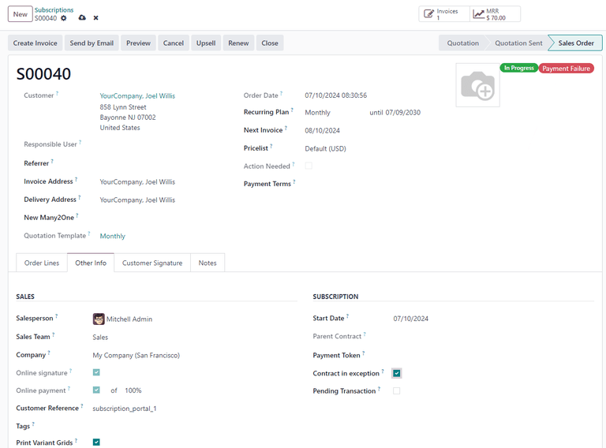

====================================
Subscriptions and automatic payments
====================================

By default, the **Subscriptions** app will automatically generate quotations and invoices for
customers, but it can also support automatic payments. Setting up automatic payments requires
additional configuration, including choosing an automatic payment provider and either setting up a
customer portal or an **eCommerce** website. Here's an overview of how to get started.

Setting up a payment processor that supports automatic payments
===============================================================

Setting up automatic recurring payments requires using a payment provider that supports
tokenization. Tokenization lets customers save their payment details, such as credit card or banking
account information, for automatic billing. The following payment providers support tokenization:

- :doc:`Adyen <../../finance/payment_providers/adyen>`
- :doc:`Authorize.net <../../finance/payment_providers/authorize>`
- :doc:`Flutterwave <../../finance/payment_providers/flutterwave>`
- :doc:`Razorpay <../../finance/payment_providers/razorpay>`
- :doc:`Stripe <../../finance/payment_providers/stripe>`
- :doc:`Xendit <../../finance/payment_providers/xendit>`

Here are the steps to setting up automatic payments.

#. Choose a payment provider that supports tokenization.
#. Follow the provider's own setup guide to create an account and begin configuring their API
   credentials in Odoo.
#. :ref:`Enable <payment_providers/add_new>` the payment provider.
#. :ref:`Configure the payment methods <payment_providers/payment_methods>` for the chosen payment
   provider.
#. :ref:`Configure the tokenization <payment_providers/tokenization>` for the chosen payment
   provider.

How customers can set up automatic payments
===========================================

Once these steps are complete, payment providers will be able to create tokens with customers' saved
payment details during the checkout process. Saved payment details can then be used for future
online or recurring subscription charges. Customers will also be able to log into their
:doc:`customer portal <../../general/users/portal>` and enter their payment information there.

Some payment providers will automatically save customers' payment information as part of the
checkout process. Others will give them the option to save their information for future payments. If
customers choose not to save their payment information, they will not be able to make automatic
payments.

.. important::
   Building an **eCommerce** website requires the :doc:`Website <../../websites/website>` app.

What happens if an automatic payment fails?
===========================================

When an automatic payment fails, the sales order is updated with:

- a :guilabel:`Payment Failure` tag
- the :guilabel:`Contract in exception` checkbox ticked (in the :guilabel:`Subscription` section of
  the :guilabel:`Other Info` tab).

Being marked :guilabel:`Contract in exception` prevents scheduled actions from running, which keeps
the system from accidentally double-charging the customer if the automatic payment actually went
through. Because the status of the payment failed to register with the system, users must manually
check if the payment has been made before automatic payments and other scheduled actions can resume.

To do this, navigate to :menuselection:`Subscriptions app --> Subscriptions --> Quotations`. Click
into the desired subscription, then check the Chatter to see if the payment was made.

If the payment *was not* made, first enter :doc:`developer mode <../../general/developer_mode>`.
Then, click the :guilabel:`Other Info` tab, and untick the checkbox next to :guilabel:`Contract in
exception`. Reload the sales order and confirm that the :guilabel:`Payment Failure` tag is gone.

If the payment *was* made, a new invoice must be made and posted manually. This automatically
updates the next invoice date of the subscription. Once the invoice is created, enter
:doc:`developer mode <../../general/developer_mode>` and navigate to the new sales order. Click the
:guilabel:`Other Info` tab, and untick the checkbox next to :guilabel:`Contract in exception`.
Reload the sales order and confirm that the :guilabel:`Payment Failure` tag is gone.

The :guilabel:`Contract in exception` option selected with the :guilabel:`Payment Failure` tag
shown.

In both cases, once the :guilabel:`Contract in exception` checkbox is no longer ticked, Odoo handles
renewals automatically again. If the subscription remains in :guilabel:`Payment Failure`, it is
ignored by Odoo until the sales order is closed.

.. seealso::
  - :doc:`../../finance/payment_providers`
  - :doc:`../../general/users/portal`
