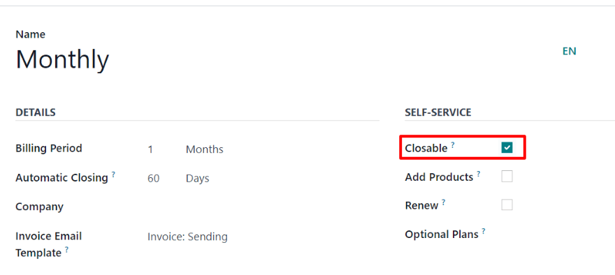
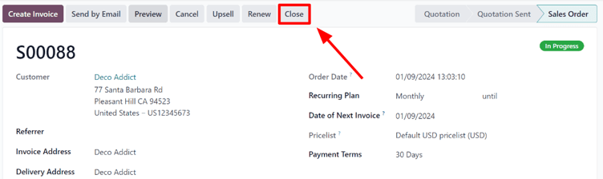
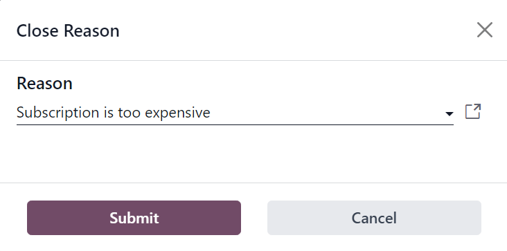
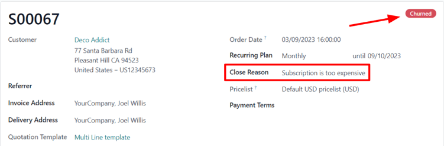
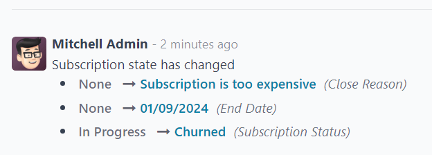
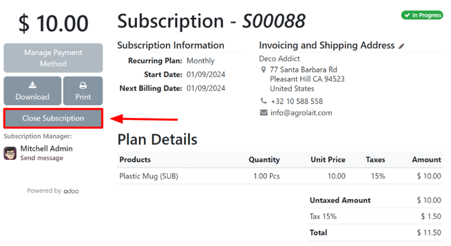
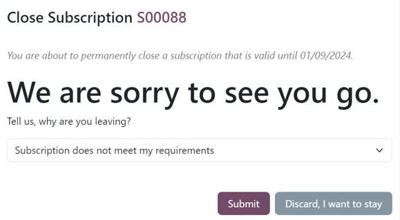

===================
Close subscriptions
===================

Odoo *Subscriptions* provides flexibility for businesses to decide whether customers can self-manage
their subscriptions, or restrict that ability entirely.

Configuration
=============

Start by navigating to :menuselection:`Subscriptions app --> Configuration --> Recurring Plans`.
From there, either create a new plan by clicking :guilabel:`New` or select an existing one to modify
it.

Once on the :guilabel:`Recurring Plans` form, enable the :guilabel:`Closable` option, in the
:guilabel:`Self-Service` section, to allow customers to close their own subscriptions using the
customer portal.

.. seealso::
   :doc:`Configure recurring plans <plans>`

Close a subscription
====================

Administrator view
------------------

After a quotation for a subscription product has been confirmed, it becomes a sales order, and the
subscription status changes to :guilabel:`In Progress`.

At that point, the ability to close the subscription becomes available, via the :guilabel:`Close`
button at the top of the subscription order, near the row that contains :guilabel:`In Progress` and
other stages. This option is also available after the order has been invoiced and the payment has
been registered.

Clicking the :guilabel:`Close` button prompts a :guilabel:`Close Reason` pop-up window to appear,
allowing administrators to input the reason for closing the subscription, or choose from the
drop-down menu of options in the :guilabel:`Reason` field.

When the desired :guilabel:`Reason` is entered, click the :guilabel:`Submit` button.

Clicking :guilabel:`Submit` on the :guilabel:`Close Reason` pop-up window updates the subscription
sales order to show :guilabel:`Churned` status tag, along with the specified :guilabel:`Close
Reason`.

That same close reason can be found in the *Chatter* of the sales order, as well.

Customer view
-------------

.. note::
   As an administrator, the ability to visualize what customers see when managing their
   subscriptions is accessible via the :guilabel:`Preview` button, located at the top of the
   subscription sales order.

From the customer's point of view, in the customer portal, the :guilabel:`Close Subscription` button
is located on the left side of the sales order.

When the customer clicks the :guilabel:`Close Subscription` button, a :guilabel:`Close Subscription`
pop-up window appears, in which the customer has to choose from a select list of reasons why they
are choosing to close the subscription.

.. note::
   Customers can *only* chose a pre-configured reason why the subscription is being closed. They can
   *not* enter a custom reason from the customer portal. These selections can be adjusted by
   navigating to :menuselection:`Subscriptions --> Configuration --> Close Reasons`.

Once the customer has chosen a close reason, they would click the :guilabel:`Submit` button on the
pop-up window.

Upon closure, the subscription order in the customer portal is tagged as :guilabel:`Closed`.

In addition, the specified :guilabel:`Close Reason` appears on the subscription order in the
*Subscriptions* app in the backend (Administrator's view).

.. seealso::
   - :doc:`../subscriptions`
   - :doc:`plans`
   - :doc:`products`
