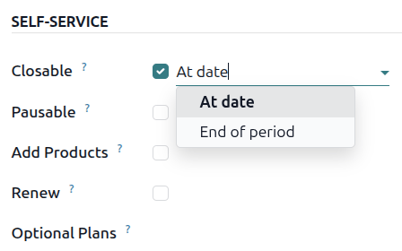
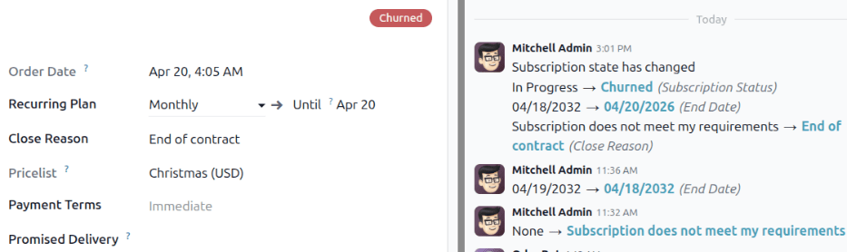
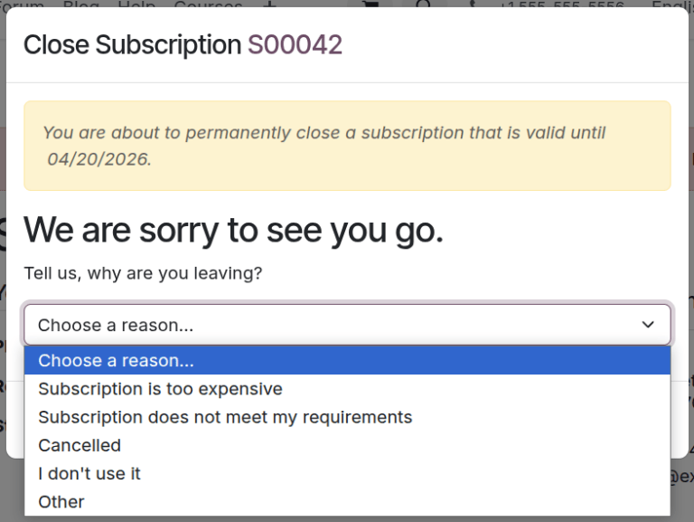

===================
Close subscriptions
===================

The Odoo **Subscriptions** app provides flexibility for businesses to decide whether customers can
self-manage their subscriptions, or restrict that ability entirely.

.. note::
   A subscription must have been invoiced before it can be closed. Subscriptions that have not yet
   been invoiced may be cancelled instead.

Configuration
=============

To allow customers to close their own subscriptions using their user portal, navigate to
:menuselection:`Subscriptions app --> Configuration --> Recurring Plans`. From there, either create
a new plan by clicking :guilabel:`New` or select an existing one to modify it.

Once on the :guilabel:`Recurring Plans` form, enable the :guilabel:`Closable` option in the
:guilabel:`Self-Service` section. This adds a drop-down menu that allows plans to be closed either
on the date of the user's choosing or at the end of the current renewal period.

Close a subscription
====================

The methods available for closing a subscription depend on users' :doc:`access rights
<../../general/users/access_rights>`. Users with administrator access rights to the Odoo database
can close the subscription from within the **Subscriptions** app. External users must use their
:doc:`user portal <../../general/users/user_portals>`.

With administrator access rights
--------------------------------

After a quotation for a subscription product has been confirmed, it becomes a sales order, and the
subscription status changes to :guilabel:`In Progress`. At that point, the subscription may be
closed.

From the dashboard, open the :menuselection:`Subscriptions` app. By default, the **Subscriptions**
dashboard displays both :guilabel:`In Progress` and :guilabel:`Paused` subscriptions. Open an
in-progress subscription.

The :guilabel:`Close` button is at the top of the subscription order. Clicking it opens the *Close
Subscription* form, allowing an administrator to enter the date when the subscription is to be
closed in the :guilabel:`When` field and select the reason for closing from the drop-down menu of
options in the :guilabel:`Reason` field. Custom reasons may be created by opening the
:guilabel:`Reason` drop-down and choosing :guilabel:`Search more...`

When the desired :guilabel:`Reason` is entered, click the :guilabel:`Submit` button. Clicking
:guilabel:`Submit` on the :guilabel:`Close` form updates the chatter with the reason for closing.
Once it's been closed, a :guilabel:`Churned` banner appears on the subscription order and the
chatter reflects the subscription's updated status, end date, and reason for closure.

         and the chatter.

Customer view
-------------

.. tip::
   As an administrator, the ability to visualize what users see when managing their subscriptions is
   accessible via the :guilabel:`Preview` button at the top of each subscription sales order.

In the user portal, subscriptions may be managed by clicking the :guilabel:`Subscriptions` button on
the home page. Clicking this button takes the user to the :guilabel:`Subscriptions` page, where they
can see a list of all subscriptions associated with their account, including those that are
currently closed.

Clicking a subscription opens the details page for that subscription, which includes a
:guilabel:`Close Subscription` button. Clicking the :guilabel:`Close Subscription` button opens a
:guilabel:`Close Subscription` pop-up, where users must select from a list of reasons why they are
choosing to close the subscription.

.. note::
   Users must choose a pre-configured reason why the subscription is being closed. They **cannot**
   enter a custom reason from the user portal. Administrators can create custom reasons for users to
   choose from by logging into the database and navigating to :menuselection:`Subscriptions app -->
   Configuration --> Close Reasons`.

Once the customer has chosen a reason for closing the subscription, they can click the
:guilabel:`Submit` button on the pop-up window. Upon closure, the subscription order in the user
portal is labeled :guilabel:`Closed`. Within the database, the subscription is marked *Churned*, and
the specified reason for closure is added to the chatter.

.. seealso::
   :doc:`../subscriptions`
