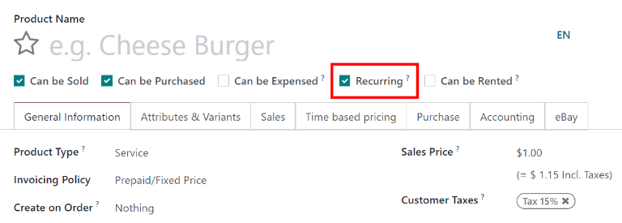
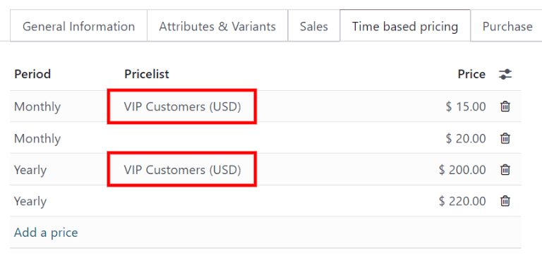

===============================
Configure subscription products
===============================

By integrating closely with the Odoo *Sales* app, the *Subscriptions* app enables users to sell
subscription products alongside regular sales products. While regular products are sold on a
one-time basis, subscription products are sold on a renewing basis, generating recurring revenue.

Configure recurrence periods
============================

To get started with subscriptions, first make sure that the *recurrence periods* are configured as
needed.

Recurrence periods are the time periods in which subscriptions renew. They designate how often
the customer pays for (and receives) subscription products.

To configure recurrence periods, go to :menuselection:`Subscriptions --> Configuration -->
Recurrence Periods`.

The *Subscriptions* app comes with some basic recurrence periods already configured: Daily,
Monthly, Quarterly, Weekly, Yearly, 3 Years, and 5 Years. These can be edited as needed, and any
number of new recurrence periods can be added.

To create a new recurrence period, click :guilabel:`New`. Then, type in the :guilabel:`Name` and
:guilabel:`Duration` of the recurrence period, and select the :guilabel:`Unit` that defines the
duration.

.. example::
   To create a recurrence period for a subscription that will renew every two weeks, set the
   :guilabel:`Duration` to `2` and the :guilabel:`Unit` to `Weeks`.

   .. image:: subscription_products/recurrence-period-form.png
      :align: center
      :alt: A recurrence period of 2 weeks.

Configure the product form
==========================

To create a new subscription product, navigate to the *Subscriptions* app. Then go to
:menuselection:`Subscriptions --> Products`, and click :guilabel:`New` to create a new product.

The :guilabel:`Product Type` for the new product is automatically set to :guilabel:`Service`.
Subscription products can be set to other types as well; however, they currently *cannot* be set to
:guilabel:`Storable Product`.

The new product also automatically has the :guilabel:`Recurring` checkbox activated. This enables
Odoo to recognize it as a subscription product.

Next, configure the :guilabel:`Time-based pricing` tab.

Click :guilabel:`Add a price` to begin defining recurring prices.

In the :guilabel:`Period` column, select a recurrence period. In the :guilabel:`Price` column,
enter the price for that recurrence period.

To create pricing rules for specific pricelists, select a pricelist in the :guilabel:`Pricelist`
column. This allows customers included in this pricelist to receive special recurring pricing for
the subscription product.

Add as many lines as desired to the :guilabel:`Time-based pricing` table.

.. note::
   An existing product can be made into a subscription product simply by marking it as
   :guilabel:`Recurring` and configuring :guilabel:`Time-based pricing` on the product form.

   A subscription product can still be sold as a regular product by adding it to a quotation and
   *not* selecting a :guilabel:`Recurrence` on the quotation.
