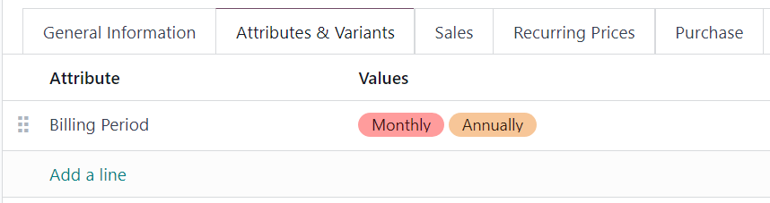
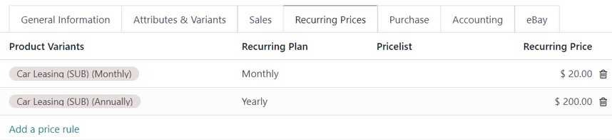
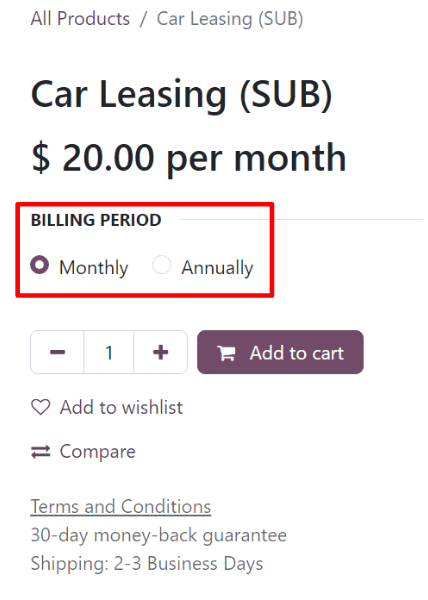

=======================================
Use subscriptions in the eCommerce shop
=======================================

Subscription products can be sold in the Odoo *eCommerce* shop just like regular sales products.

However, by default, the eCommerce product page only displays the shortest recurrence period listed
in the :guilabel:`Time-based pricing` tab of the product form. For example, if a subscription
product has *monthly* and *yearly* recurrence periods configured, then only the monthly price
appears on the eCommerce page for that product by default.

To add more recurrence periods to the eCommerce product page, create a *product variant* for each
recurrence period.

.. seealso::
   - :doc:`Configure subscription products </applications/sales/subscriptions/products>`
   - :doc:`Product variants </applications/sales/sales/products_prices/products/variants>`

Create recurrence periods as product variants
=============================================

To set up each recurrence period as a product variant, go to :menuselection:`Subscriptions -->
Subscriptions --> Products` and select a product. In the :guilabel:`Attributes & Variants` tab,
click :guilabel:`Add a line`.

Create an :guilabel:`Attribute` called `Billing Period` (or something similar) by typing in the
name and clicking :guilabel:`Create`. This attribute name appears as the option heading on the
product page of the eCommerce shop.

Next, create :guilabel:`Values` that correspond to the recurrence periods that are configured in
the :guilabel:`Time-based pricing` tab of the product form. Type in the name of the recurrence
period, then click :guilabel:`Create`. These value names appear as selectable options on the
product page of the eCommerce shop.

         the product form.

Click on the :guilabel:`☁️ (cloud)` icon at the top of the page to save manually. After saving, a
:guilabel:`Product Variants` column appears on the :guilabel:`Time-based pricing` tab. Assign the
product variants to their corresponding recurrence periods and prices.

The product variants are now available for selection on the eCommerce product page.

