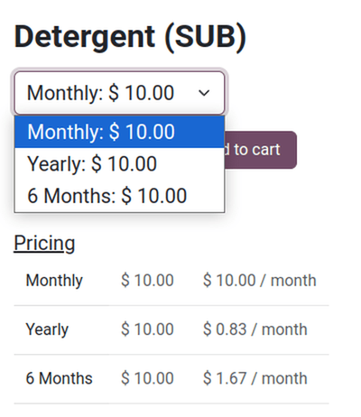

===================================
Subscriptions in the eCommerce shop
===================================

Subscription products can be sold in the Odoo *eCommerce* shop just like regular sales products.

.. seealso::
   - :doc:`Configure subscription products </applications/sales/subscriptions>`
   - :doc:`Product variants </applications/sales/sales/products_prices/products/variants>`

Selling eCommerce subscriptions
===============================

:doc:`Configure subscription products </applications/sales/subscriptions>` as a regular recurring
sales product. To start selling the subscription in the eCommerce shop, click the :guilabel:`Go to
Website` smart button to navigate to the product page.

From here, review the subscription product and its recurring periods. Then, toggle the switch in the
upper-right corner from :guilabel:`Unpublished` to :guilabel:`Published`.

The new subscription product is now available to purchase on the eCommerce website, with options
for the different recurring periods.

