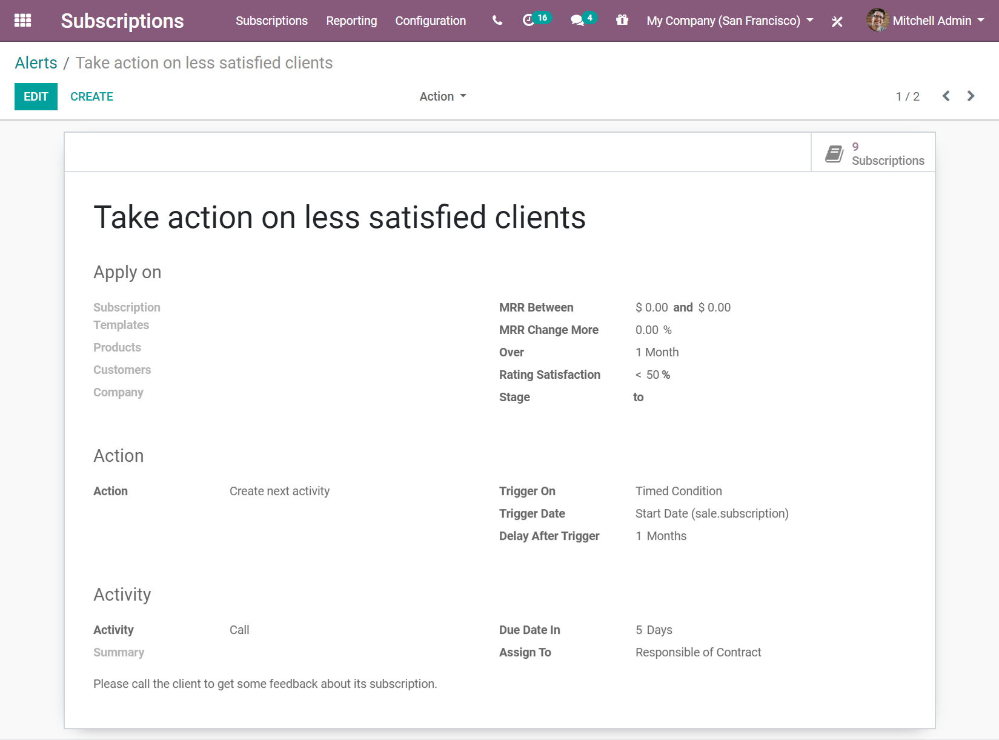

=======================
Set up automatic alerts
=======================

Now that your subscriptions are up and running, you want to stay up-to-date with your customers.
Some automation would be appreciated since you would not want to go through the list of all your
subscribers to check how things are going. This is what the *Automatic Alerts* feature is for.

For example, when customers subscribe to your magazine, you would probably want to send them an
email to welcome them and express your gratitude. Or, if the satisfaction rate of your customers
drops below 50%, you would probably want to schedule a call with them to understand the reasons for
their dissatisfaction.

With **Odoo Subscriptions**, you can set automatic emails, create a "Call" task for one
of your salespeople so that he/she can try to understand your customer's dissatisfaction, and
finally, why not automatically send satisfaction surveys so customers can evaluate your services?
All of that is now possible.

Create a new automatic alert
============================

The following example shows how to create a new automatic alert to send satisfaction surveys to your
customers, by email, after one month of subscription. To do so, go to :menuselection:`Subscriptions
--> Configuration --> Alerts`, and create a new alert.

.. image:: automatic_alerts/create-a-new-automatic-alert.png
  :align: center
  :alt: New automatic alert in Odoo Subscriptions

1. On the *Apply on* section, first give the alert a name. Then, you can choose to apply this alert
   on a subscription template, on a specific customer, or even on a specific product. If you want
   to add more specifications, you can also specify the value of your MRR, the change rate of your
   MRR over a certain period of time, the value of the satisfaction rate, and even the stage to
   which you want to apply this alert.

   .. note::
      In this example, the alert is applied to a specific product, and the stage goes from
      *Undefined* to *In Progress*.

2. For the *Action* section, specify the *Action* and the *Trigger on*. If the *Trigger on* is set
   to *Modification*, the action is triggered every time there is a change or anything added to the
   subscription, and all the conditions on the *Apply on* section are met. Now, if the *Trigger on*
   is set to *Timed condition*, it means that the action is triggered based on the type of
   *Trigger date*. After that, you can choose your *Action*. You have the choice between
   *Create next activity*, *Set a tag on the subscription*, *Set a stage on the subscription*,
   *Mark as To Renew*, *Send an email to the customer* and *Send an SMS Text Message to the
   customer*.

   .. note::
      In the example above, the *Trigger on* is set to *Timed condition*, therefore, a
      *Trigger date* and *Delay after trigger* need to be specified. And because the *Send an email
      to the customer* action was adopted, an *Email template* can be chosen.

As a result, this alert will send a rating survey after one month, to the customers who have
purchased that specific product. The survey will appear in the chatter of your respective
subscription.

.. image:: automatic_alerts/rating-satisfaction-survey.png
  :align: center
  :alt: Satisfaction survey in Odoo Subscriptions

Modify an existing automatic alert
==================================

By default, Odoo suggests you an automatic alert called *Take action on less satisfied clients*.

This alert is applied to the *Rating Satisfaction* of your customers, and the action is triggered
on *Timed condition*. If their satisfaction rate is lower than 50%, a salesperson contacts the
customer. This action is automatically assigned to the salesperson who manages the subscription,
and the due date is 5 days after the triggering of this action. This alert ensures that your
clients are happy and that you are taking actions if they are not. It helps to keep your customer
retention rates very high.

.. note::
   By editing the alert, you can modify the *Apply on*, the *Action* and *Activity* sections, and
   adapt them to your own needs.

.. seealso::
  - :doc:`../../subscriptions/configuration/subscription_templates`
  - :doc:`../../subscriptions/configuration/subscription_products`
  - :doc:`../../subscriptions/sales_flow/create_a_quotation`
  - :doc:`../../subscriptions/reporting/subscription_reports`
