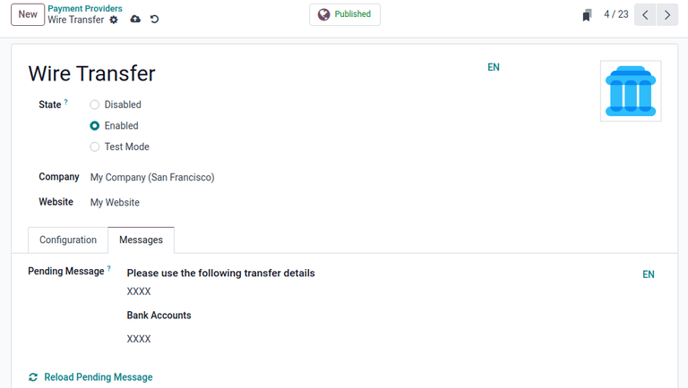
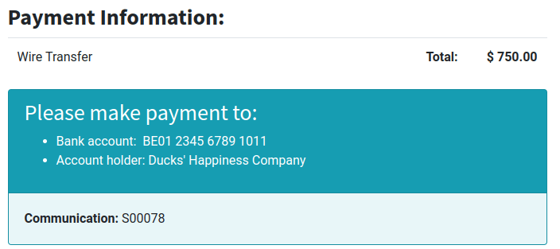
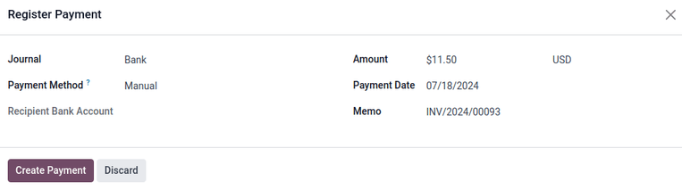
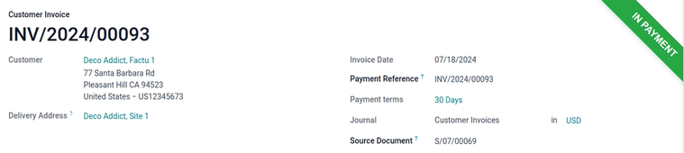

=============
Wire transfer
=============

The *wire transfer* payment method allows for payment instructions to be shared with a customer
after purchasing a product. With a subscription, these payment instructions are shared every time
the payment is renewed.

.. note::
   The wire transfer payment method requires minimal setup, but in most cases, it is inefficient
   compared to other online payment providers. It is recommended to use another payment provider
   with subscriptions, due to wire transfers requiring manual confirmation for each payment.

.. _subscriptions/wire-transfer-configuration:

Configuration
=============

To use the wire transfer payment method, first ensure the *Wire Transfer* payment method is enabled.

To do so, begin by navigating to the *Payment Providers* page in either the **Accounting**,
**Website**, or **Sales** apps.

For example, navigate to :menuselection:`Accounting app --> Configuration --> Online Payments:
Payment Providers`, then click the :guilabel:`Wire Transfer` card.

.. tip::
   If the **Accounting** app is not installed, the *Payment Providers* page can also be reached by
   navigating to :menuselection:`Website app --> Configuration --> eCommerce: Payment Providers`, or
   :menuselection:`Sales app --> Configuration --> Online Payments: Payment Providers`.

Next, set the :guilabel:`State` to :guilabel:`Enabled` to enable wire transfers. Use the drop-down
menus next to the :guilabel:`Company` and :guilabel:`Website` fields to set where wire transfers can
be used.

The options in the :guilabel:`Configuration` tab can be used to customize the wire transfer.
Optionally tick the checkbox next to :guilabel:`Enable QR Codes` to enable the use of QR codes when
paying by wire transfer, if desired.

Use the drop-down menu next to the :guilabel:`Communication` field to select the communication type
used on sales orders. Choose :guilabel:`Based on Document Reference` to use the sales order (or
invoice number), or :guilabel:`Based on Customer ID` to use the customer identifier. With either
method selected, communication is given to the customer, once they choose the wire transfer payment
method.

The configuration options listed under the :guilabel:`Availability` section are used to set payment
restrictions, and are optional. Use the :guilabel:`Maximum Amount` field to set a maximum payment
value, the :guilabel:`Currencies` field to restrict any currencies from being used for payment, and
the :guilabel:`Countries` field to restrict payment from any particular countries, if desired.

In the :guilabel:`Messages` tab, use the :guilabel:`Pending Message` field to add a message
containing wire transfer information. This message is displayed to the customer after confirming
their order, as well as if the order is marked as pending after the payment is processed.

If :doc:`a bank account <../../../finance/accounting/bank>` has already been defined, the account
number is automatically added to the default message generated by Odoo. A bank account can also be
added afterwards, and the message updates with the appropriate bank information by clicking
:icon:`fa-refresh` :guilabel:`Reload pending message`.

Once all necessary configuration settings are complete, the :icon:`fa-eye-slash`
:guilabel:`Unpublished` smart button located at the top of the page automatically changes to
:icon:`fa-globe` :guilabel:`Published` to show the wire transfer payment option is now visible
to customers. Only keep the payment method published if payments are ready to be received.

.. tip::
   It is possible to keep the payment method enabled, but **not** visible to customers, until
   payments are ready to be received. To do that, set the smart button to :icon:`fa-eye-slash`
   :guilabel:`Unpublished` after setting the :guilabel:`State` to :guilabel:`Enabled`.

Test mode
---------

The wire transfer payment method can be tested before it is accessed by customers by selecting the
:guilabel:`Test Mode` option in the :guilabel:`State` field on the form. Upon selecting
:guilabel:`Test Mode`, an orange :guilabel:`Test mode` banner appears in the upper-right corner of
the form.

Next, enter the credentials for a bank account with accessible transactions in the
:guilabel:`Messages` tab. To re-enable normal function after testing, change the :guilabel:`State`
setting to :guilabel:`Enabled`.

.. note::
   By default, the payment provider remains :guilabel:`Unpublished` in :guilabel:`Test Mode`, so it
   is not visible to visitors.

.. warning::
   It is recommended to use the :guilabel:`Test Mode` setting on a duplicate (or test) database to
   avoid potential issues with invoice numbering.

.. _subscriptions/wire-transfer-payment:

Pay by wire transfer
====================

With wire transfers :ref:`enabled and published <subscriptions/wire-transfer-configuration>`,
customers see wire transfers as an available payment method at checkout when purchasing a product.

When this method is selected by a customer, they are shown the *Pending Message* set in the
:ref:`wire transfer configuration page <subscriptions/wire-transfer-configuration>`, after
confirming their purchase. Once the purchase is confirmed, a sales order is created.

.. important::
   Online orders remain in the *Quotation sent* (i.e. unpaid order) stage until both the payment is
   received, *and* the order is confirmed manually, using the :guilabel:`Confirm` button on the
   sales order.

To begin processing the payment, navigate to :menuselection:`Sales app --> Orders --> Orders`, and
click the corresponding sales order. Ensure the sales order is correct, then click
:guilabel:`Confirm` to confirm the sales order.

Next, click the new :guilabel:`Create Invoice` button, then choose :guilabel:`Regular invoice`, and
click :guilabel:`Create Draft Invoice`. A draft of the invoice appears. Click :guilabel:`Confirm` to
validate the invoice.

To send this invoice to the customer, click the :guilabel:`Send & Print` button. A :guilabel:`Send`
pop-up window appears, with an email template configured, and a PDF invoice attached.

Ensure the information is correct, then click :guilabel:`Send & Print`. The pop-up window
disappears, and the :guilabel:`Send & Print` button turns gray to show the invoice has been sent.

.. tip::
   The default template for sending an invoice can be modified by navigating to
   :menuselection:`Settings app --> Companies --> Email Templates --> Review All Templates -->
   Invoice: Sending`.

Next, click the :guilabel:`Register payment` button on the invoice page. A pop-up window titled,
:guilabel:`Register Payment`, appears with options for selecting the type of payment. In the
:guilabel:`Journal` field, select :guilabel:`Bank` from the drop-down menu. Next, set the
:guilabel:`Payment Method` to :guilabel:`Manual`. Ensure the :guilabel:`Amount` and
:guilabel:`Payment Date` are correct, then click the :guilabel:`Create Payment` button.

The customer invoice is revealed with a green :guilabel:`In Payment` banner in the upper-right
corner. At this point, the flow is now complete.

.. note::
   If payment has been received before sending the invoice, such as in cash, the payment can still
   be registered in Odoo by clicking the :guilabel:`Register Payment` button, and creating the
   payment *before* clicking :guilabel:`Send & Print`. Now, when an invoice is sent using the
   :guilabel:`Send & Print` button, a new line is automatically added to the invoice message,
   stating the invoice is already paid.
