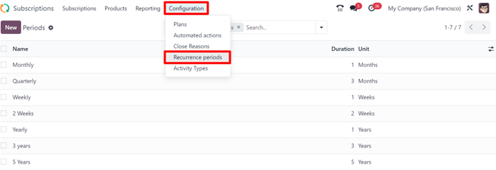
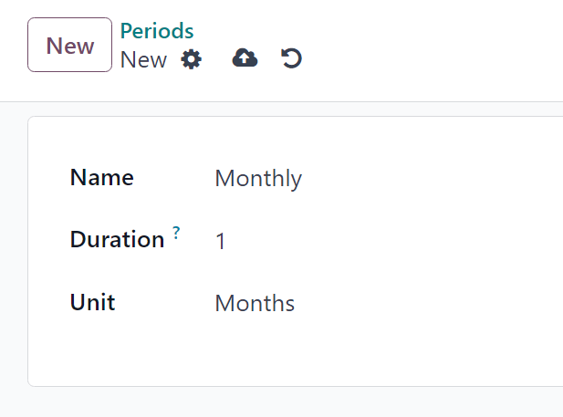
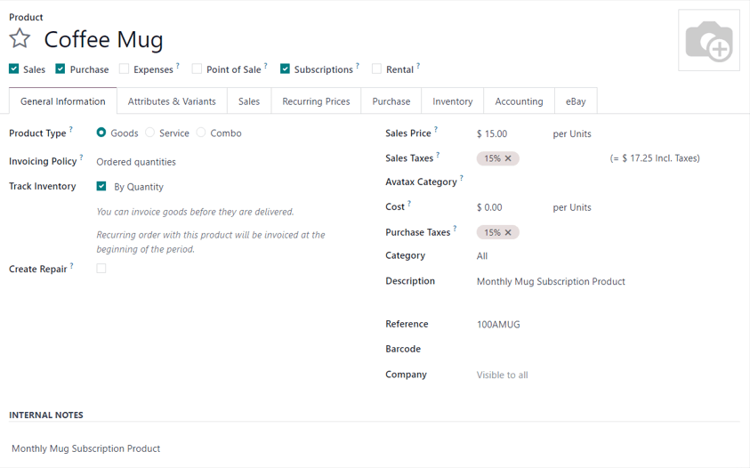
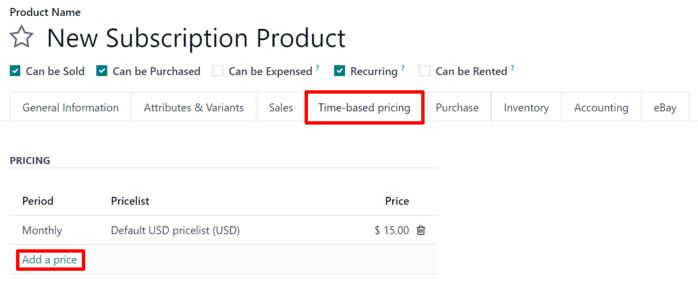
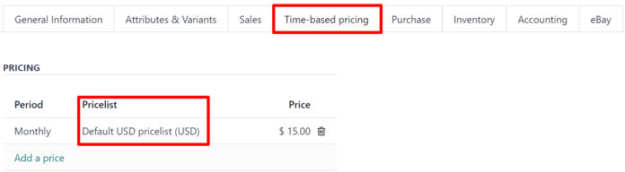
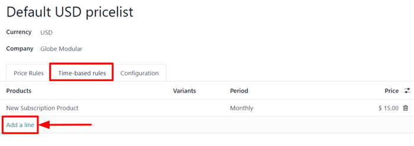

=====================
Subscription products
=====================

By closely integrating with the Odoo *Sales* app, the *Subscriptions* app enables users to sell
subscription products alongside regular sales products. While regular products are sold on a
one-time basis, subscription products are sold on a renewing basis, generating recurring revenue.

In Odoo, subscription products are also called *recurring* products.

Configure recurrence periods
============================

To get started with subscriptions, the *recurrence periods* must be properly configured, as needed.

Recurrence periods are the time periods in which subscriptions renew. They designate how often the
customer pays for (and receives) subscription products.

To configure recurrence periods, go to :menuselection:`Subscriptions app --> Configuration -->
Recurrence periods`.

The *Subscriptions* app comes with some basic recurrence periods already configured:

- :guilabel:`Monthly`
- :guilabel:`Quarterly`
- :guilabel:`Weekly`
- :guilabel:`2 Weeks`
- :guilabel:`Yearly`
- :guilabel:`3 Years`
- :guilabel:`5 Years`

New recurrence periods can be added and/or edited at any time.

To create a new recurrence period, click :guilabel:`New` on the :guilabel:`Recurrence Periods` page.
Doing so reveals a blank recurrence period form.

Then, type in the :guilabel:`Name` and :guilabel:`Duration` of the recurrence period, and select the
:guilabel:`Unit` that defines the duration.

.. important::
   The unit :guilabel:`Days` *cannot* be used as a recurrence period on subscriptions. The daily
   recurrence is meant for rentals, and **cannot** be added on recurring subscription sales orders.

   This limitation is there to avoid sales orders that would generate daily invoices.

Product form configuration
==========================

To create a new subscription product, navigate to :menuselection:`Subscriptions app --> Products -->
Products`, and click :guilabel:`New`.

Doing so reveals a blank product form, which can be configured and customized in a number of ways.

.. note::
   By default, the :guilabel:`Recurring` option is already enabled, prompting Odoo to recognize it
   as a subscription product. Be sure to leave the :guilabel:`Recurring` and :guilabel:`Can be Sold`
   options enabled.

   The :guilabel:`Product Type` field is set to :guilabel:`Service` by default, as well. However,
   subscription products *can* be set to other types, if needed.

Time-based pricing
------------------

Once the desired fields in the :guilabel:`General Information` tab have been entered, click the
:guilabel:`Time-based pricing` tab on the product form.

From here, click :guilabel:`Add a price` to begin defining recurring prices.

In the :guilabel:`Period` column, select a desired recurrence period. In the :guilabel:`Pricelist`
column, select a pricelist, if needed. Then, in the :guilabel:`Price` column, enter the price for
that recurrence period.

.. note::
   :guilabel:`Daily` and :guilabel:`Hourly` periods **cannot** be used on recurring products.

   .. image:: products/validation-error-popup.png
      :align: center
      :alt: The validation error pop-up window that appears in Odoo Subscriptions.

.. note::
   There is *no limit* to how many lines can be added to the :guilabel:`Time-based pricing` table.

.. tip::
   An existing product can be made into a subscription product, simply by marking it as
   :guilabel:`Recurring`, and configuring :guilabel:`Time-based pricing` on the product form.

Pricelists
~~~~~~~~~~

:doc:`Pricelists <../sales/products_prices/prices/pricing>` can be used with subscription products
to give special pricing to customers included in pricelists.

This can be configured either in the :guilabel:`Time-based pricing` tab of the product form, or on
the pricelist form in the *Sales* application.

To create recurring price rules for specific pricelists in the :guilabel:`Time-based pricing` tab of
the product form, select a pricelist in the :guilabel:`Pricelist` column.

When pricelists are added to the :guilabel:`Time-based pricing` tab, the pricelist form in the
*Sales* app is automatically updated.

Time-based pricing rules can also be configured directly on the pricelist form.

To do this, go to :menuselection:`Sales app --> Products --> Pricelists`, and select a pricelist (or
click :guilabel:`New` to create a new pricelist).

.. note::
   Pricelists are also accessible through the Odoo *Subscriptions* app by following the same menu
   steps.

Then, on the pricelist form, under the :guilabel:`Time-based rules` tab, click :guilabel:`Add a
line`.

Then, select a subscription product in the :guilabel:`Products` column, and select a recurrence
period in the :guilabel:`Period` column. Lastly, enter a :guilabel:`Price` for that particular
product and period. Add as many lines as needed.

When :guilabel:`Time-based rules` are added to the pricelist form, the :guilabel:`Time-based
pricing` tab of the product form is automatically updated.

.. seealso::
   :doc:`ecommerce`
