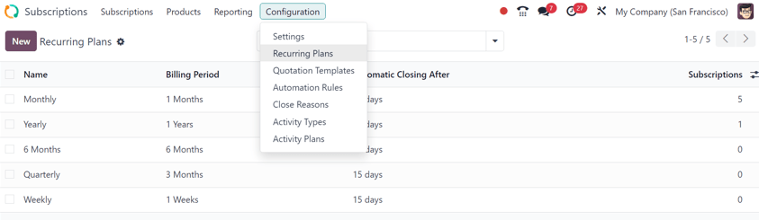
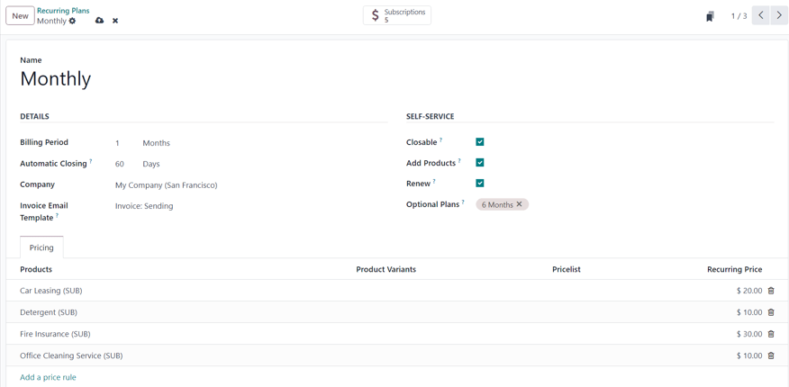
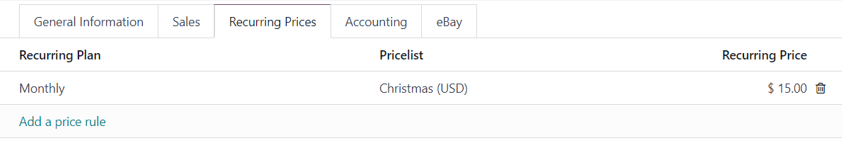
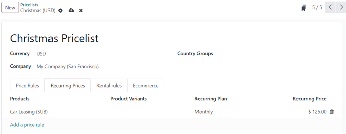

=====================
Subscription products
=====================

By closely integrating with the Odoo **Sales** app, the **Subscriptions** app enables users to sell
subscription products and services alongside regular sales products. While regular products are sold
on a one-time basis, subscription products and services are sold on a renewing basis, generating
recurring revenue.

Configure recurrence periods
============================

To get started with subscriptions, the *Recurring Plans* **must** be properly configured, as needed.

*Recurring Plans* represent the time periods in which subscriptions renew. They designate how often
the customer pays for (and receives) subscription products and services.

To configure recurring plans, go to :menuselection:`Subscriptions app --> Configuration -->
Recurring Plans`.

   The Recurring Plans page, under the Configuration menu, in Odoo Subscriptions application.

The *Subscriptions* app comes with some basic recurring plans already configured:

- :guilabel:`Monthly`
- :guilabel:`Yearly`
- :guilabel:`6 Months`

New recurring plans can be added and/or edited at any time.

To create a new recurring plans, click :guilabel:`New` on the :guilabel:`Recurring Plans` page.
Doing so reveals a blank recurring plan form.

Type in the :guilabel:`Name` of the plan at the top of the form.

In the :guilabel:`Details` section, there are four fields to configure:

- :guilabel:`Billing Period`: designate the time period in which the customer is billed for their
  subscription purchase. Start by choosing a number in the first field, then choose the unit of time
  in the drop-down field to the right. The options are: :guilabel:`Weeks`, :guilabel:`Months`, or
  :guilabel:`Years`.

  .. important::
   The unit of *Days* **cannot** be used as a :guilabel:`Billing Period` option on subscriptions.
   The daily recurrence is meant for rentals. This limitation avoids sales orders that would
   generate daily invoices.

- :guilabel:`Automatic Closing`: designate a period of time after which the subscription is
  automatically closed, if the subscription is unpaid or the payment method attached to the
  subscription fails. The amount configured in this field is in :guilabel:`Days`.
- :guilabel:`Company`: choose which company in the database should be attached to this plan, if
  working in a multi-company environment. If no selection is made, the plan applies to all companies
  in the database.
- :guilabel:`Invoice Email Template`: choose to use a preconfigured email template for the automatic
  invoicing of a subscription. If no selection is made, the invoice email is **not** sent
  automatically.

In the :guilabel:`Self-Service` section, there are four optional fields:

- :guilabel:`Closable`: Tick this checkbox to allow the customer to close their subscription on
  their own.
- :guilabel:`Add Products`: Tick this checkbox to allow customers to create an upsell quote to
  adjust the quantity of products in their subscription. **Only** products list as *optional
  products* can be modified.
- :guilabel:`Renew`: Tick this checkbox to allow customers to renew their subscription on their own.
- :guilabel:`Optional Plans`: Choose to allow customers to switch from this plan to another on their
  quotation (new subscription or renewal), by selecting other recurring plans in this field.
  Multiple options can be selected in this field.

In the :guilabel:`Pricing` tab, click :guilabel:`Add a price rule` to add :guilabel:`Products` to
the recurring plan, along with :guilabel:`Product Variants`, custom :guilabel:`Pricelist`, and
special :guilabel:`Recurring Price`, if desired.

At the top of the form, there is a :guilabel:`Subscriptions` smart button that appears when there
are subscription sales orders related to that recurring plan.

Product form configuration
==========================

To create a new subscription product, navigate to :menuselection:`Subscriptions app --> Products -->
Products`, and click :guilabel:`New`. Doing so reveals a blank product form, which can be configured
and customized in a number of ways.

.. image:: products/subscription-product-form.png
   :align: center
   :alt: A subscription product form being filled out in the Odoo Subscriptions application.

.. tip::
   Subscription products can also be created in the **Sales** app, by navigating to
   :menuselection:`Sales app --> Products --> Products`, clicking :guilabel:`New`, and ensure the
   :guilabel:`Subscriptions` checkbox beneath the :guilabel:`Product` title field is ticked. Then,
   follow the workflow detailed below.

.. note::
   There are numerous fields and tabs that appear on product forms, but for this documentation, the
   focus is mainly on the necessary fields and tabs that are directly related to subscription
   products.

Give the subscription product a name in the :guilabel:`Product` field at the top of the form.

When creating a subscription product, via the **Subscriptions** app, the :guilabel:`Subscriptions`
checkbox on product forms is already ticked, prompting Odoo to recognize it as a subscription
product. Be sure to leave the :guilabel:`Subscriptions` and :guilabel:`Sales` checkboxes ticked.

Should an accompanying image of the product be added, hover the cursor over the :guilabel:`(camera
plus)` square to the right of the :guilabel:`Product` field, and click the :icon:`fa-pencil`
:guilabel:`(pencil)` icon, and upload the desired image.

General Information tab
-----------------------

The :guilabel:`Product Type` field is set to :ref:`Service <products/service>`, by default.
However, subscription products can be set to :ref:`Goods <products/goods>` or :ref:`Combo
<products/combo>`, if necessary. Depending on the :guilabel:`Product Type` selection, corresponding
fields appear on the left-side of the :guilabel:`General Information` tab.

All other fields on the right-side of the tab remain the same, and should be filled in accordingly.

.. _products/goods:

Product type: Goods
~~~~~~~~~~~~~~~~~~~

When creating a storable or consumable subscription product, select the :guilabel:`Goods` option.
Then, it is recommended to select the :guilabel:`Invoicing Policy` option: :guilabel:`Ordered
quantities`.

.. important::
   Setting the :guilabel:`Invoicing Policy` to :guilabel:`Delivered quantities` causes issues with
   the invoice creation, and disrupts the subscription process.

If creating a storable subscription product, the :guilabel:`Track Inventory` checkbox **must** be
ticked, and a selection from the drop-down field that appears **must** be chosen. The options are:
:guilabel:`By Unique Serial Number`, :guilabel:`By Lots`, or :guilabel:`By Quantity`.

If creating a consumable subscription product, do **not** tick the :guilabel:`Track Inventory`
checkbox.

If the **Repairs** application is installed, the option to :guilabel:`Create Repair` appears beneath
the :guilabel:`Track Inventory` checkbox. If ticked, the option to link an existing repair order to
a confirmed sales order becomes available.

.. _products/service:

Product type: Service
~~~~~~~~~~~~~~~~~~~~~

When creating a subscription service product, select the :guilabel:`Services` option. Then, unless
a specific option is needed, leave the :guilabel:`Create on Order` field set to the default
:guilabel:`Nothing` option.

In the :guilabel:`Invoicing Policy` field, it is recommended to set it to :guilabel:`Prepaid/Fixed
Price`. This means Odoo invoices ordered quantities as soon as the service is sold. The ability to
create projects or tasks later is still available, which can be linked to the sales order to track
time, if needed.

There is also an option to :guilabel:`Warn the salesperson for an upsell when work done exceeeds` a
predetermined percentage of hours sold, if desired.

If needed, tick the checkbox beside the :guilabel:`Plan Services` option, and select an employee
from the adjacent drop-down menu to plan shifts related to this order for employees with that
selected role. This field is **not** required.

If the **Repairs** application is installed, the option to :guilabel:`Create Repair` appears beneath
the :guilabel:`Track Inventory` checkbox. If ticked, the option to link an existing repair order to
a confirmed sales order becomes available.

.. _products/combo:

Product type: Combo
~~~~~~~~~~~~~~~~~~~

When creating a combination subscription product, select :guilabel:`Combo` as the :guilabel:`Product
Type`.

.. note::
   When :guilabel:`Combo` is selected as the :guilabel:`Product Type`, some tabs on the form may
   disappear, depending on what other applications are installed on the database.

Once the :guilabel:`Combo` option has been selected, the only field that remains on the right-side
of the :guilabel:`General Information` tab is the :guilabel:`Combo Choices` field.

In the :guilabel:`Combo Choices` field, select which pre-existing combo products should be included
in this subscription product. Multiple selections can be made.

To view and/or modify a combo selection in the :guilabel:`Combo Choices` field, click into a
selected option from the field to reveal a pop-up window, showing the included products in that
combo. Add or delete products from this pop-up window, as desired.

Or, create a new combo directly from the :guilabel:`Combo Choices` field, by typing in the name of
the new combo in the field, and clicking :guilabel:`Create and edit` from the resulting drop-down
menu.

Doing so reveals a pop-up window, wherein products can be added, and their prices can be customized,
if desired. Once all modifications are complete, click :guilabel:`Save & Close` to save the combo
configurations, and close the pop-up window. Or, click :guilabel:`Save & New` to save the combo, and
immediately create a new combo product from a fresh pop-up window.

Recurring Prices tab
--------------------

Once the desired fields in the :guilabel:`General Information` tab have been entered, click the
:guilabel:`Recurring Prices` tab on the product form.

From here, click :guilabel:`Add a price rule` to begin defining recurring plans and prices.

In the :guilabel:`Recurring Plan` column, select a desired recurring plan. In the
:guilabel:`Pricelist` column, select a pricelist, if needed. Then, in the :guilabel:`Recurring
Price` column, enter the price for that recurring plan.

.. note::
   :guilabel:`Daily` and :guilabel:`Hourly` periods **cannot** be used on recurring products.

.. note::
   There is *no limit* to how many lines can be added to the :guilabel:`Recurring Prices` tab.

.. tip::
   An existing product can be made into a subscription product, simply by ticking the
   :guilabel:`Subscriptions` checkbox on its product form, and configuring :guilabel:`Recurring
   Prices` tab.

Pricelists
~~~~~~~~~~

:doc:`Pricelists <../sales/products_prices/prices/pricing>` can be used with subscription products
to give special pricing to customers, who are included in pricelists.

This can be configured either in the :guilabel:`Recurring Prices` tab of the product form, or on
the pricelist form in the *Sales* application.

To create recurring price rules for specific pricelists in the :guilabel:`Recurring Prices` tab of
the product form, select a pricelist in the :guilabel:`Pricelist` column.

When pricelists are added to the :guilabel:`Recurring Prices` tab, the pricelist form in the *Sales*
app is automatically updated.

Recurring price rules can also be configured directly on the pricelist form.

To do this, go to :menuselection:`Sales app --> Products --> Pricelists`, and select a pricelist (or
click :guilabel:`New` to create a new pricelist).

.. note::
   Pricelists are also accessible through the Odoo *Subscriptions* app by following the same menu
   steps.

Then, on the pricelist form, under the :guilabel:`Recurring Prices` tab, click :guilabel:`Add a
price rule`.

Then, select a subscription product in the :guilabel:`Products` column, along with any desired
:guilabel:`Product Variants`. Then, select a :guilabel:`Recurring Plan`. Lastly, enter a
:guilabel:`Recurring Price` for that particular product and plan. Add as many lines as needed.

When :guilabel:`Recurring Prices` are added to the pricelist form, the :guilabel:`Recurring Prices`
tab of the product form is automatically updated.

.. seealso::
   :doc:`ecommerce`
