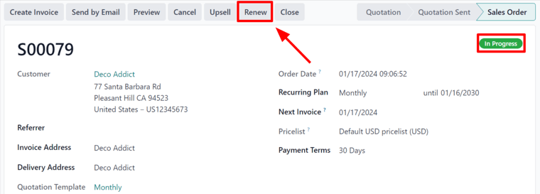
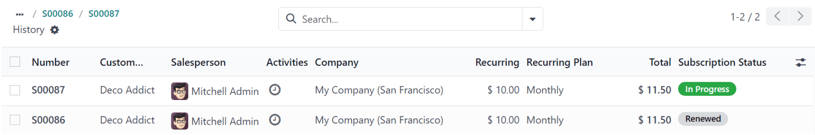

===================
Renew subscriptions
===================

Subscription renewal is the process customers follow when they willingly choose to continue a
subscription product or service. Subscribers go through the renewal process at different intervals
-- weekly, monthly, annually, etc. -- depending on the duration of the agreed-upon contract. Most
companies that offer subscriptions prefer to automate the renewal process for customers. However,
manual subscription renewals are still used in some cases.

With the Odoo **Subscriptions** application, a company can manage all of its subscriptions in one
place. Renewals can be processed automatically or manually, include additional products or upsells
per renewal order, and be filtered in batch views to locate customers who need to renew their
subscriptions.

Create a renewal manually
=========================

In order to create a renewal quotation, there are certain prerequisites that a subscription must
meet.

- A quotation with a subscription product must be confirmed.
- A configured *recurring plan* must be selected.
- Payment from the customer for the initial subscription must be invoiced and registered.

To check if an existing subscription quotation meets the prerequisites, navigate to
:menuselection:`Subscriptions app --> Subscriptions --> Quotations` and select the desired quotation
from the list. Properly configured subscriptions show as being in the :guilabel:`Sales Order` stage,
have an :guilabel:`In Progress` tag, and have the :guilabel:`Renew` button in the row of buttons
directly above the order form.

When the :guilabel:`Renew` button is clicked, Odoo instantly presents a new renewal quotation,
complete with a :guilabel:`Renewal Quotation` tag. Important reference information like the start
date and next invoice date are automatically added to the renewal quotation's chatter.

From here, follow the standard sales flow to :ref:`confirm the quotation
<sales/sales_quotations/send-and-confirm>`, :doc:`invoice the order
<../../sales/sales/invoicing/invoicing_policy>`, and :ref:`register payment
<finance/accounting/register-payment-invoice-bill>`.

Once the renewal quotation is confirmed, it becomes a sales order and a :icon:`fa-usd`
:guilabel:`Sales History` smart button appears at the top of the page. When the :icon:`fa-usd`
:guilabel:`Sales History` smart button is clicked, Odoo loads a new page showcasing the different
sales orders attached to this subscription, along with their individual :guilabel:`Subscription
Status`.

.. important::
   On rare occasions, automatic payments can fail to register properly, which results in a
   :guilabel:`Payment Failure` tag on the sales order and the :guilabel:`Contract in exception`
   checkbox being automatically ticked in the :guilabel:`Subscription` section of the sales order's
   :guilabel:`Other Info` tab.

   Being marked :guilabel:`Contract in exception` prevents scheduled actions from running, which
   keeps the system from accidentally double-charging the customer if the automatic payment actually
   went through. Because the status of the payment failed to register with the system, users must
   manually check if the payment has been made before automatic payments and other scheduled actions
   can resume.

   To do this, navigate to :menuselection:`Subscriptions app --> Subscriptions --> Quotations`.
   Click into the desired subscription, then check the Chatter to see if the payment was made.

   If the payment *was not* made, first enter :doc:`developer mode <../../general/developer_mode>`.
   Then, click the :guilabel:`Other Info` tab, and untick the checkbox next to :guilabel:`Contract
   in exception`. Reload the sales order and confirm that the :guilabel:`Payment Failure` tag is
   gone.

   If the payment *was* made, a new invoice must be made and posted manually. This automatically
   updates the next invoice date of the subscription. Once the invoice is created, enter
   :doc:`developer mode <../../general/developer_mode>` and navigate to the new sales order. Click
   the :guilabel:`Other Info` tab, and untick the checkbox next to :guilabel:`Contract in
   exception`. Reload the sales order and confirm that the :guilabel:`Payment Failure` tag is gone.

   .. figure:: renewals/contract-in-exception.png
      :align: center
      :alt: The contract in exception option selected with the payment failure tag shown.

      The :guilabel:`Contract in exception` option selected with the :guilabel:`Payment Failure` tag
      shown.

   In both cases, once the :guilabel:`Contract in exception` checkbox is no longer ticked, Odoo
   handles renewals automatically again. If the subscription remains in :guilabel:`Payment Failure`,
   it is ignored by Odoo until the sales order is closed.

.. seealso::
   - :doc:`../subscriptions`
   - :doc:`../sales/sales_quotations/create_quotations`
   - :doc:`../sales/sales_quotations/get_paid_to_validate`
