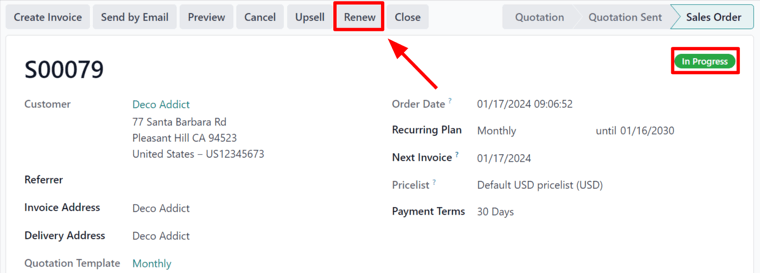
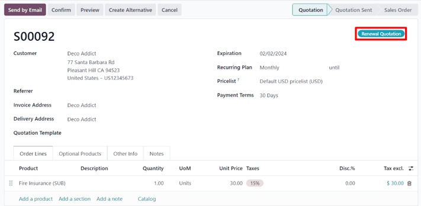
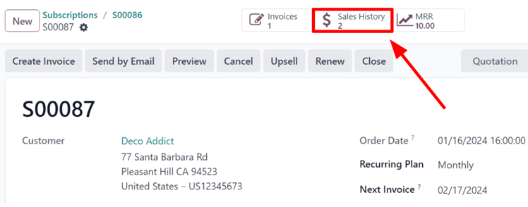
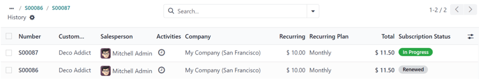
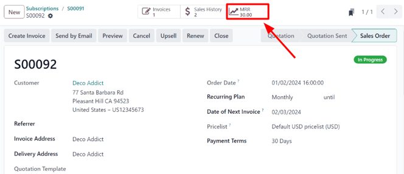

===================
Renew subscriptions
===================

.. meta::
   :description:  Learn how to manually create a renewal quotation for an Odoo subscription, from
                  confirming the order to invoicing and registering payment.

The foundation of any subscription business model is recurring payments. This is when customers
reliably pay a regular amount at specific intervals, in exchange for access to a subscription
product or service.

Subscription renewal is the process customers follow when they willingly choose to continue
participating in, and paying for, a subscription product or service.

Subscribers experience the renewal process at different intervals -- weekly, monthly, annually, etc.
-- depending on the duration of the agreed-upon contract.

Most companies that offer subscriptions prefer to automate the renewal process for customers.
However, manual subscription renewals are still used in some cases.

With the Odoo **Subscriptions** application, a company can manage all of its subscriptions in one
place. Renewals can be processed automatically or manually, and can include additional products or
upsells per renewal order. They can also be filtered in batch views to quickly locate customers who
need to renew their subscriptions.

Subscription renewals
=====================

To renew a subscription, a quotation including both a subscription product and a *Recurring Plan*
must be confirmed.

To open a subscription quotation, navigate to :menuselection:`Subscriptions app --> Subscriptions
--> Quotations`. Select the desired quotation from the list, or create a new one by clicking
:guilabel:`New` to open a new quotation form.

.. note::
   - Only a single product is required.
   - A subscription service counts as a product, as it is considered a recurring product.

Subscription quotations **must** be confirmed, and payment from the customer for the initial
subscription **must** be invoiced and registered in order to successfully open a *renewal
quotation*.

Once the payment from the subscription quotation is confirmed, the quotation turns into a sales
order. An :guilabel:`In Progress` tag is applied to the sales order form, and a series of buttons
also appear at the top of the sales order, including a :guilabel:`Renew` button.

When the :guilabel:`Renew` button is clicked, Odoo instantly presents a new renewal quotation,
complete with a :guilabel:`Renewal Quotation` tag.

From here, a standard sales flow can occur to confirm the quotation. This typically begins by
clicking :guilabel:`Send by Email`, which emails a copy of the quotation to the customer for them to
confirm, and eventually pay for.

.. note::
   In the chatter of the renewal quotation, it is mentioned that this subscription is the renewal of
   the subscription from the original sales order.

Once the renewal quotation is confirmed, it becomes a sales order, and a :guilabel:`Sales History`
smart button appears at the top of the page.

When that :guilabel:`Sales History` smart button is clicked, Odoo reveals a separate page,
showcasing the different sales orders attached to this subscription, along with their individual
:guilabel:`Subscription Status`.

Additionally, once the renewal quotation is confirmed, an :guilabel:`MRR` smart button also appears
at the top of the sales order.

When clicked, Odoo reveals an :guilabel:`MRR Analysis` page, detailing the monthly recurring revenue
related to this specific subscription.

.. seealso::
   - :doc:`../subscriptions`
   - :doc:`../sales/send_quotations/create_quotations`
   - :doc:`../sales/send_quotations/get_paid_to_validate`
