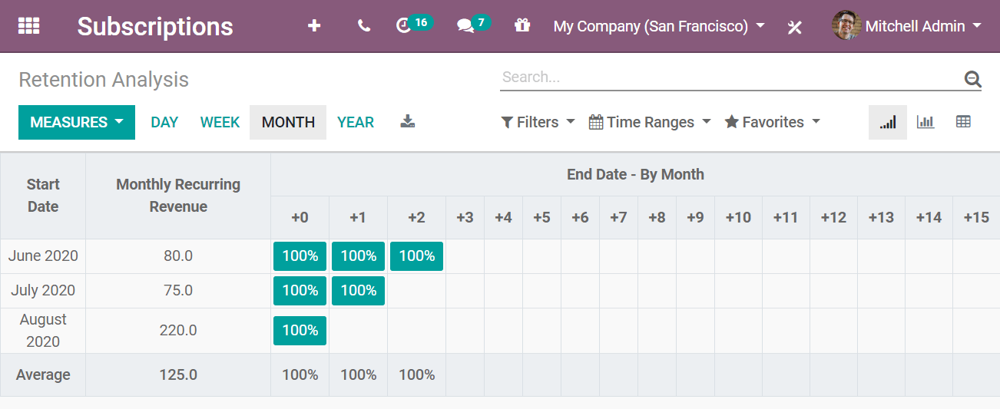
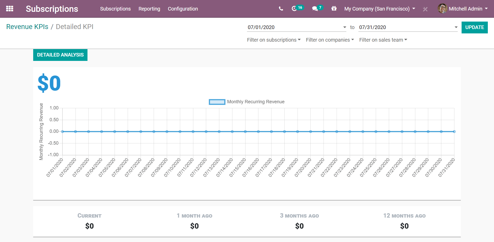

=============================
Generate subscription reports
=============================

As we know, understanding how our business is going, and where it is going, is key to success. And
particularly so when we offer subscription services or products.

Before getting to the heart of the matter, it is very important to recall certain essential
concepts to the proper understanding of the following reports:

- **Monthly Recurring Revenue (MRR)**: MRR is arguably the most important metric for subscription
  businesses. It shows the monthly revenue earned with subscription-based products or services. It
  is a consistent number used to track all recurring revenue over time, in monthly increments.

- **Annual Run-Rate (ARR)**: ARR is the yearly version of MRR, which is based on the current MRR,
  to estimate the coming year's performance. However, this estimation does not take variations and
  growth into account.

.. image:: subscription_reports/difference-between-MRR-and-ARR.png
  :align: center
  :alt: Difference between MRR and ARR in Odoo Subscriptions

- **Non-Recurring Revenue (NRR)**: NRR shows the revenue earned for everything else than
  subscription-based products or services. This includes gains of a rare or unique nature that are
  unlikely to occur in the ordinary course of businesses.

- **Customer Retention**: Practices to engage existing customers to continue buying products or
  services from your business. Customer retention can be a challenge, because you must prove you
  are worthy of your customers' trust.

- **Churn Rate**: Also known as the Rate of Attrition or Customer Churn, the churn rate can be
  defined, in this case, as the percentage of subscribers who discontinued their subscriptions
  within a given time period. We can distinguish two types of Churn:

  - **Logo Churn**: It corresponds to the subscription cancellation rate.

  - **Revenue Churn**: It corresponds to the monthly recurring revenue loss rate.

    .. example::
       Let's imagine a 2$ increase in a subscription service.

       - We lost 3 customers out of the initial 20, which generates a **Logo Churn** of 15%.
       - | Therefore, the 56$ of MRR difference out of the initial 600$ causes a **Revenue Churn**
         | of 9,33%.

       .. image:: subscription_reports/difference-between-logo-churn-and-revenue-churn.png
          :align: center
          :alt: Difference between logo churn and revenue churn in Odoo Subscriptions

       Reminder: even though they seem to evolve in the same direction most of the time, it might
       not be the case all the time.

- **Customer Lifetime Value (CLV)**: Indicates how much revenue can be expected for a customer
  during his/her entire contract. This approach emphasizes the importance of customer retention,
  shifting our focus from a quarterly or yearly approach to a long-term one.

Check out the different kinds of reports you can access from the **Odoo Subscriptions**
application.

Subscriptions analysis report
=============================

Go to :menuselection:`Subscriptions --> Reporting --> Subscriptions`. From there, you can change
the *Measures*. By default, Odoo uses the *Monthly Recurring Revenue*. In addition to that, you
can choose *Quantity*, *Recurring Price*, *Yearly Recurring Revenue* and *Count*. For this example,
*Quantity* is added. This way, you can review both of these measures at the same time. You can even
*Group By Start Date* and, more precisely, by *Week*, to get a clear view of your report.

.. image:: subscription_reports/subscriptions-analysis-report.png
  :align: center
  :alt: Subscriptions analysis report in Odoo Subscriptions

Retention analysis report
=========================

Go to :menuselection:`Subscriptions --> Reporting --> Retention`. The default measure applied is
*Count*, but you can change to the appropriate one for you. For the example below,
*Monthly Recurring Revenue* was chosen, and the *Month* periodicity remains intact.
By using these criteria, you can see the progression of the retention from its start.

Revenue KPIs report
===================

Go to :menuselection:`Subscriptions --> Reporting --> Revenue KPIs`. From there, you can check
different KPIs: *Monthly Recurring Revenue*, *Net Revenue*, *Non-Recurring Revenue*,
*Revenue per Subscription*, *Annual Run-Rate*, *Lifetime Value*, and more. You can also filter this
information on subscriptions, companies, and sales teams. This is useful if you are looking for
specific information.

.. image:: subscription_reports/revenue-KPIs-report.png
  :align: center
  :alt: Revenue KPIs report in Odoo Subscriptions

The example below shows the *Monthly Recurring Revenue* detailed report. At the moment, there is no
data, which is the typical scenario for a new business. But, as your company grows over the months,
these graphs get populated with more and more data. Once again, you can filter these specific KPIs
on subscriptions, companies, and sales teams.

Salesperson dashboard report
============================

Go to :menuselection:`Subscriptions --> Reporting --> Salesperson Dashboard`. This page gives you a
summary of your *Monthly Recurring Revenue*, *Non-Recurring Revenue*, *Subscription modifications*,
and *Non-Recurring Invoices* for each of your salespeople. You can choose the period you want to
apply and the salesperson you want to analyze.

.. image:: subscription_reports/salesperson-dashboard-report.png
  :align: center
  :alt: Salesperson dashboard report in Odoo Subscriptions

.. seealso::
  - :doc:`../../subscriptions/configuration/subscription_templates`
  - :doc:`../../subscriptions/configuration/subscription_products`
  - :doc:`../../subscriptions/sales_flow/create_a_quotation`