====================
Subscription reports
====================

.. |MRR| replace:: :abbr:`MRR (Monthly Recurring Revenue)`
.. |ARR| replace:: :abbr:`ARR (Annual Recurring Revenue)`

The Odoo **Subscriptions** app provides a series of reporting pages to help companies analyze how
subscriptions are performing.

On the *Subscriptions Analysis* reporting page, users can view specific data related to recurring
subscriptions, quantity of subscriptions, in-progress or paused subscriptions, and more.

The *Retention Analysis* reporting page provides an organized table of subscription retention
percentages over any period of time.

The *MRR Breakdown* reporting page clearly divides |MRR| and |ARR| metrics for subscriptions into
various graphs, lists, and charts.

And the *MRR Analysis* reporting page offers a time-based collection of analytics showcasing how
subscription |MRR| and |ARR| have changed over the course of any given period of time.

Reporting page elements
=======================

All subscriptions-based reporting pages can be accessed via the :guilabel:`Reporting` header menu in
the **Subscriptions** app.

The following sections describe elements found on each reporting page.

Filters and Group By
--------------------

*Filters* are used to narrow down metrics to show specific analytics, whereas groupings (via the
*Group By* option) are used to gather the data from specific sections into groups for more
organized analysis.

This section refers to both filters and groupings, as a combination of the two can be saved in the
*Favorites* section.

To modify the results being shown on any reporting page, click the :icon:`fa-caret-down`
:guilabel:`(down arrow)` icon to the right of the search bar. Doing so reveals a drop-down menu of
detailed filter and grouping options.

If desired, a filter or grouping (or combination of filters and/or groupings) can be saved in the
:guilabel:`Favorites` section of that drop-down menu. To do so, click the :icon:`fa-caret-down`
:guilabel:`(down arrow)` icon beside :guilabel:`Save current search`, located beneath the
:guilabel:`Favorites` section.

This reveals a field to assign a title to the favorite filter. Two options are also found beneath
the title field: :guilabel:`Default filter` and :guilabel:`Shared`.

Ticking the checkbox beside :guilabel:`Default filter` makes the newly-favorited filter the default
option for that reporting page.

Ticking the checkbox beside :guilabel:`Shared` makes the newly-favorited filter available to other
users in the database.

.. note::
   The :guilabel:`Default filter` and :guilabel:`Shared` options are **not** required, and only
   *one* of these options can be selected at a time.

To save the filter, click :guilabel:`Save` in the :guilabel:`Favorites` section of the drop-down
filter menu.

When clicked, that saved filter appears beneath the :guilabel:`Favorites` column of the drop-down
filter menu, and a :icon:`fa-star` :guilabel:`(gold star)` icon appears beside the favorite filter's
name in the search bar.

Views
-----

On the :guilabel:`Subscription Analysis`, :guilabel:`MRR Breakdown`, and :guilabel:`MRR Analysis`
reporting pages, three different view options are located in the upper-right corner.

.. note::
   There are *no* other view options available on the :guilabel:`Retention Analysis` reporting page.

The available view options, from left to right, are:

- :guilabel:`Graph`
- :guilabel:`List`
- :guilabel:`Pivot`

.. image:: reports/subscriptions-analysis-page-view-options.png
   :align: center
   :alt: The different view options available on the Subscriptions Analysis page.

Each view has its own series of related view-specific visual options.

Graph view
~~~~~~~~~~

With the graph view selected, the following options appear between the search bar and visual
representation of the data. These graph-specific options are located to the right of the
:guilabel:`Measures` and :guilabel:`Insert in Spreadsheet` buttons.

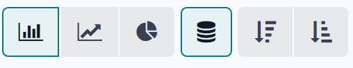

The first three options, from left to right, represent different graph-related views. The remaining
options represent different ways to organize and visualize that specific graph-related data.

From left to right, the specific graph-related view options are:

- :icon:`fa-bar-chart` :guilabel:`Bar Chart`: showcases the data in a bar chart format.
- :icon:`fa-line-chart` :guilabel:`Line Chart`: showcases the data in a line chart format.
- :icon:`fa-pie-chart` :guilabel:`Pie Chart`: showcases the data in a pie chart format.

Each graph view option has its own series of specific visual options, which are represented by the
available buttons that appear to the right of the selected graph-related view option.

When the :icon:`fa-bar-chart` :guilabel:`Bar Chart` graph view is selected, the following visual
options are available:

- :icon:`fa-database` :guilabel:`Stacked`: showcases the data in a stacked visual format.
- :icon:`fa-sort-amount-desc` :guilabel:`Descending`: showcases the data in descending order.
- :icon:`fa-sort-amount-asc` :guilabel:`Ascending`: showcases the data in ascending order.

When the :guilabel:`Line Chart` graph view is selected, the following visual options are available:

- :icon:`fa-database` :guilabel:`Stacked`: showcases the data in a stacked visual format.
- :icon:`fa-signal` :guilabel:`Cumulative`: showcases the data in accumulated, increasing format.
- :icon:`fa-sort-amount-desc` :guilabel:`Descending`: showcases the data in descending order.
- :icon:`fa-sort-amount-asc` :guilabel:`Ascending`: showcases the data in ascending order.

When the :guilabel:`Pie Chart` graph view is selected, there are no additional visual options.

List view
~~~~~~~~~

With the list view selected, the subscription metrics being analyzed are displayed in a simple list,
which can be fully customized by using any of the available filters or groupings in the drop-down
filter menu (accessible via the :icon:`fa-caret-down` :guilabel:`(down arrow)` icon to the right of
the search bar).

.. note::
   With list view selected, the :guilabel:`Measures` drop-down menu and :guilabel:`Insert in
   Spreadsheet` button are *not* available.

Pivot view
~~~~~~~~~~

With the pivot view selected, the subscription metrics are displayed in a data table, which can be
fully customized.

The pivot data table can be customized using the options available in the :guilabel:`Measures`
drop-down menu, and/or the filter grouping options available in the filter drop-down menu
(accessible via the :icon:`fa-caret-down` :guilabel:`(down arrow)` icon to the right of the search
bar).

Three pivot-specific options are available, located to the right of the :guilabel:`Measures`
drop-down menu and :guilabel:`Insert in Spreadsheet` button.

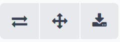

From left to right, those pivot-specific view options are:

- :icon:`fa-exchange` :guilabel:`Flip axis`: the `x` and `y` axis of the pivot data table flip.
- :icon:`fa-arrows` :guilabel:`Expand all`: all the available rows and columns of the pivot data
  table expand fully.
- :icon:`fa-download` :guilabel:`Download .xlsx`: the pivot data table is downloaded as an
  :file:`.xlsx` file.

Measures
--------

The graph and pivot reporting pages have their own metric-specific :guilabel:`Measures` drop-down
menu of data-related options to choose from, located in the upper-left corner, above the visual
representation of metrics.

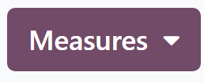

When the :guilabel:`Measures` button is clicked, a series of selectable measures becomes available,
via a drop-down menu. When any of the options are selected from the :guilabel:`Measures` drop-down
menu, the chosen metrics related to that specific measure appear on the reporting page.

.. note::
   For more information on the different measures that can be utilized on each reporting page, refer
   to the :ref:`specific reporting page breakdowns <subscriptions/reports/reporting>` found below in
   this documentation.

Insert in spreadsheet
---------------------

Beside the :guilabel:`Measures` drop-down menu, there is an :guilabel:`Insert in Spreadsheet`
button.

When clicked, the ability to add the configured data currently being showcased on the reporting page
into a new or pre-existing spreadsheet or dashboard becomes available, via a pop-up window.

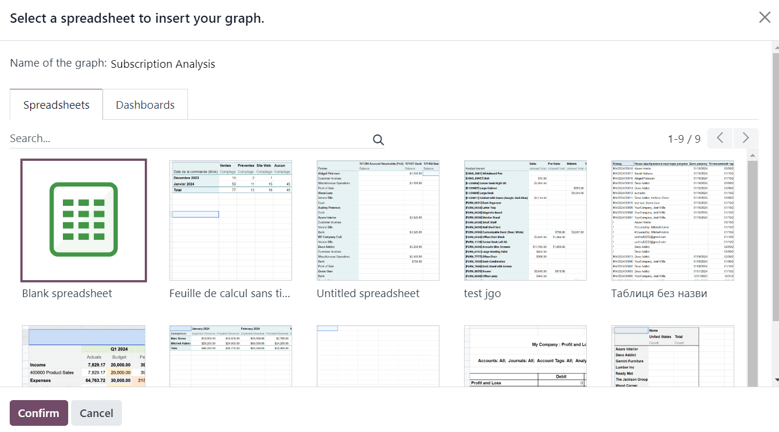

Select the desired option from this pop-up window, then click :guilabel:`Confirm`.

.. _subscriptions/reports/reporting:

Reporting pages
===============

In the Odoo **Subscriptions** app, there are four different reporting pages available.

To access, analyze, and customize various reports related to subscriptions, navigate to
:menuselection:`Subscriptions app`, and click the :guilabel:`Reporting` drop-down menu in the
header to reveal the following reporting pages:

- :guilabel:`Subscriptions`
- :guilabel:`Retention`
- :guilabel:`MRR Breakdown`
- :guilabel:`MRR Timeline`

Clicking any of those options reveals a separate, fully-customizable reporting page focusing on that
particular aspect of subscription data.

The following is a breakdown of those four specific reporting pages.

Subscriptions analysis
----------------------

To access the :guilabel:`Subscriptions Analysis` reporting page, navigate to
:menuselection:`Subscriptions app --> Reporting --> Subscriptions`.

By default, the :guilabel:`Bar Chart` option, in the :guilabel:`Graph` view, is selected on the
:guilabel:`Subscriptions Analysis` reporting page.

The following filters are also present in the search bar: :guilabel:`In Progress or Paused` and
:guilabel:`Recurring`.

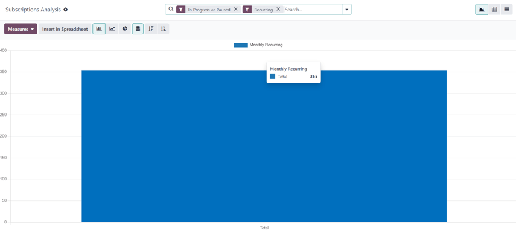

When the :guilabel:`Measures` button on the :guilabel:`Subscriptions Analysis` page is
clicked, a series of metric-related options becomes available as a drop-down menu.

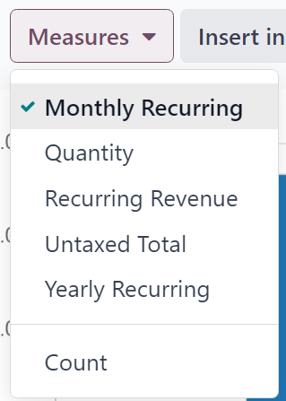

The metric-related options in the :guilabel:`Measures` drop-down menu on the
:guilabel:`Subscriptions Analysis` page are:

- :guilabel:`Monthly Recurring`
- :guilabel:`Quantity`
- :guilabel:`Recurring Revenue`
- :guilabel:`Untaxed Total`
- :guilabel:`Yearly Recurring`
- :guilabel:`Count`

.. note::
   The :guilabel:`Monthly Recurring` measure option is selected by default.

When any of those available measures are clicked, Odoo displays that selected data on the reporting
page for further analysis.

Retention analysis
------------------

To access the :guilabel:`Retention Analysis` reporting page, navigate to
:menuselection:`Subscriptions app --> Reporting --> Retention`.

The :guilabel:`Retention Analysis` reporting page differs from the other **Subscriptions** app
reporting pages, in that it does **not** provide any additional view options. The data on this page
is only presented in a customizable data chart.

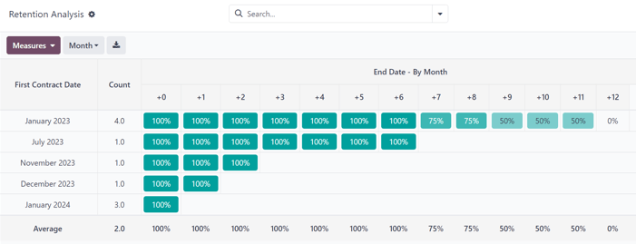

When the :guilabel:`Measures` drop-down menu on the :guilabel:`Retention Analysis` reporting page is
clicked, a series of metric-related options become available.

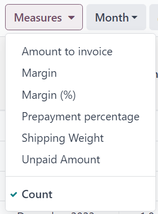

The metric-related options in the :guilabel:`Measures` drop-down menu on the :guilabel:`Retention
Analysis` reporting page are:

- :guilabel:`Amount to invoice`
- :guilabel:`Margin`
- :guilabel:`Margin (%)`
- :guilabel:`Prepayment percentage`
- :guilabel:`Shipping Weight`
- :guilabel:`Unpaid Amount`
- :guilabel:`Count`

.. note::
   The :guilabel:`Count` measure option is selected by default.

To the right of the :guilabel:`Measures` drop-down menu on the :guilabel:`Retention Analysis` page
is an additional drop-down menu containing different time periods. The default time period is
:guilabel:`Month`.

When clicked, a drop-down menu of various time period options become available.

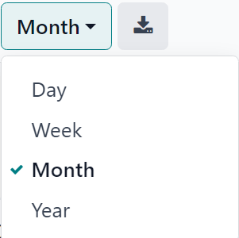

The time period options are:

- :guilabel:`Day`
- :guilabel:`Week`
- :guilabel:`Month`
- :guilabel:`Year`

When a time period option from this drop-down menu is selected, the :guilabel:`Retention Analysis`
reporting page showcases data for the configured measures and filters within that time period.

To the right of the time period drop-down menu, there is a download button, which allows the user to
download the data presented on the :guilabel:`Retention Analysis` page as an Excel file.

MRR breakdown
-------------

To access the :guilabel:`MRR Breakdown` reporting page, navigate to :menuselection:`Subscriptions
app --> Reporting --> MRR Breakdown`.

By default, the data displayed on the :guilabel:`MRR Breakdown` reporting page is in graph view,
with the :guilabel:`Bar Chart` option and :guilabel:`Stacked` option selected.

A default filter is also available in the search bar for :guilabel:`Event Date: Month > Event Type`.

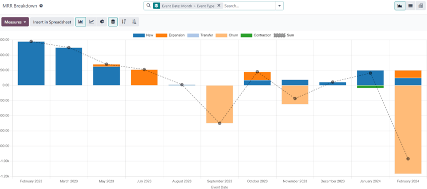

When the :guilabel:`Measures` drop-down menu on the :guilabel:`MRR Breakdown` reporting page is
clicked, a series of metric-related options become available.

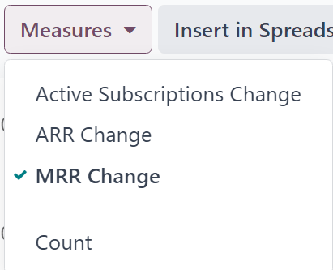

The metric-related options in the :guilabel:`Measures` drop-down menu on the :guilabel:`MRR
Breakdown` reporting page are:

- :guilabel:`Active Subscriptions Change`
- :guilabel:`ARR Change`
- :guilabel:`MRR Change`
- :guilabel:`Count`

.. note::
   The :guilabel:`MRR Change` measure option is selected by default.

.. tip::
   To make a different measure option the default, first, select the desired measure from the
   :guilabel:`Measures` drop-down menu. Then, click the :icon:`fa-caret-down` :guilabel:`(down
   arrow)` icon in the search bar to open the mega menu of filters and groupings.

   In the :guilabel:`Favorites` column, click the :icon:`fa-caret-down` :guilabel:`(down arrow)`
   icon beside :guilabel:`Save current search` to reveal a field, where a title can be entered,
   along with two checkboxes::guilabel:`Default filter` and :guilabel:`Shared`.

   Tick the checkbox for :guilabel:`Default filter`, and click :guilabel:`Save`.

   That newly-chosen measure option is now the default option that appears when this reporting page
   is accessed.

MRR analysis
------------

To access the :guilabel:`MRR Analysis` reporting page, navigate to :menuselection:`Subscriptions
app --> Reporting --> MRR Timeline`.

By default, the data displayed on the :guilabel:`MRR Analysis` reporting page is in graph view, with
the :guilabel:`Line Chart` option, :guilabel:`Stacked` option, and :guilabel:`Cumulative` option
selected.

A default filter is also found in the search bar for :guilabel:`Event Date: Month`.

.. image:: reports/subscriptions-mrr-analysis-default.png
   :align: center
   :alt: The default appearance of the MRR Analysis reporting page in Odoo Subscriptions.

When the :guilabel:`Measures` drop-down menu on the :guilabel:`MRR Analysis` reporting page is
clicked, a series of metric-related options become available.

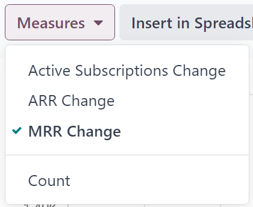

The metric-related options in the :guilabel:`Measures` drop-down menu on the :guilabel:`MRR
Analysis` reporting page are:

- :guilabel:`Active Subscriptions Change`
- :guilabel:`ARR Change`
- :guilabel:`MRR Change`
- :guilabel:`Count`

.. note::
   The :guilabel:`MRR Change` measure option is selected by default.

.. seealso::
   - :doc:`../subscriptions`
   - :doc:`plans`
