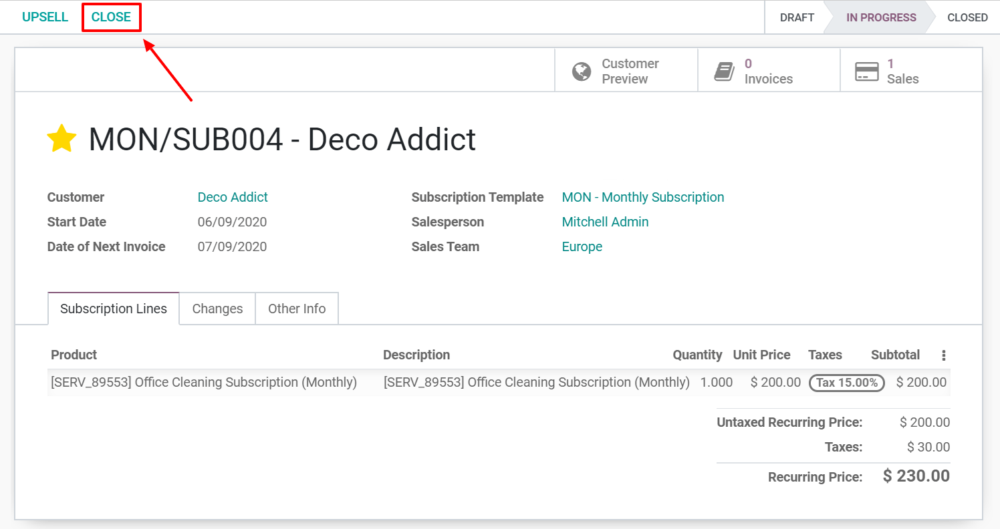
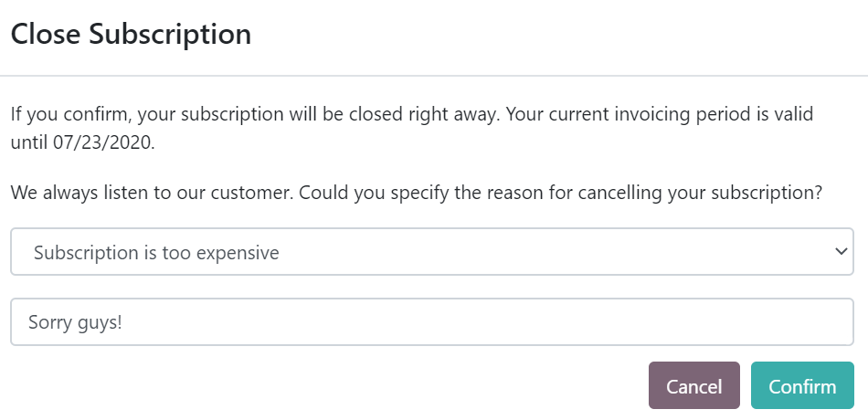

====================
Close a subscription
====================

Losing a customer is always difficult, especially if you put a lot of effort into getting them to
sign up for your products/services. However, many companies come up with dubious methods to reduce
the probability of this happening.

.. raw:: html

   
 <b>What is the right
   way to go?</b> 

1. If you adopt such methods, you are among companies that actively and indirectly spread the
   phobia of subscriptions, who do not think about how negatively dissatisfied customers could impact
   their business and, who frustrate the customers in a way or another. However, at some point, it is
   understandable that you do not want your customers to be involved in your subscription status.

2. If you do not adopt such methods, you are among companies that continue to evolve in a
   long-term subscription business model, especially in an era of ultra-fast communications between
   dissatisfied customers, and who retain their customers by making it easier for them to leave if
   they want to. By giving them the opportunity to close their own subscriptions, your customers do
   not feel trapped because they subscribed to your products/services.

In summary, the **Odoo Subscriptions** application gives you the
**possibility to choose what you want to apply**. Indeed, you can decide whether to give your customers the
option to close their subscriptions whenever they want to or to restrict this possibility. It depends
on you and we will show you how to do that in our amazing application.

Configuration
=============

Go to :menuselection:`Subscriptions --> Configuration --> Subscription templates`. From there, you can
create a new *Subscription template* or modify an existing one. When editing your template, underneath
the Invoicing tab, you have the possibility to activate the option *Closable by customer*.
Once enabled, this option gives your customers the right to close their own subscriptions.

.. image:: closing/configuration-to-close-your-subscriptions.png
  :align: center
  :alt: Configuration to close your subscription with Odoo Subscriptions

.. note::
   Be sure to check out our documentation on
   how to :doc:`Use subscription templates <../../subscriptions/configuration/subscription_templates>`
   to fully understand the importance of this feature in a basic flow using the
   **Odoo Subscriptions** application.

Close your first subscription
=============================

Administrator view
------------------

Once confirmed, a quotation becomes a sales order and a new subscription is automatically created.
Therefore, this subscription has the status *In progress*. From there, you have the possibility to
close the subscription.

By using the smart button *Close*, you have to enter a close reason. For example, "Subscription too
expensive", "Subscription does not meet my requirements", "Subscription reached its end date", etc.
Immediately after confirming your close reason, you can observe that the status of the subscription
is now *Closed* and that the close reason is mentioned on the subscription.

.. image:: closing/use-of-close-reasons.png
  :align: center
  :alt: What happens when you close your subscription with Odoo Subscriptions?

Customer view
-------------

As previously explained in the *Administrator view* part, from the subscription form, you also have
the possibility to visualize what your customers see when managing their subscriptions thanks to the
*Customer preview* button. In this example, the customer has the choice to close his/her subscription
whenever he/she wants to, due to the *Close Subscription* button.

.. image:: closing/close-your-subscriptions-as-a-customer.png
  :align: center
  :alt: Close your subscription from a customer point of view with Odoo Subscriptions

By using this button, the customer can specify the reason for cancelling his/her subscription and
he/she can even leave a message.

By confirming the cancellation, the customer is redirected to his/her portal. The administrator is
informed of this modification. Indeed, the status of the subscription becomes *Closed* and a note
appears in the chatter with the new stage, the end date, the close reason, and the closing text
added by the customer.

.. image:: closing/chatter-history-when-a-customer-closes-a-subscription.png
  :align: center
  :alt: What happens when customers close their subscription in Odoo Subscriptions?

.. note::
   Before closing a subscription, check out our documentation on how to
   :doc:`Create a quotation using subscription products <../../subscriptions/sales_flow/create_a_quotation>`
   to understand how subscriptions are managed in the **Odoo Subscriptions** application.

.. seealso::
  - :doc:`../../subscriptions/configuration/subscription_templates`
  - :doc:`../../subscriptions/configuration/subscription_products`
  - :doc:`../../subscriptions/sales_flow/create_a_quotation`
