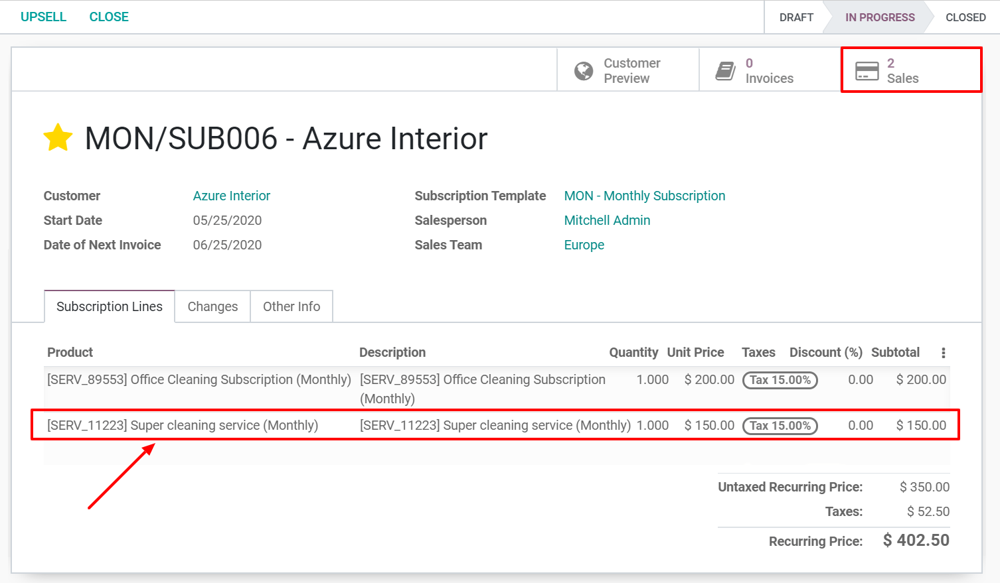
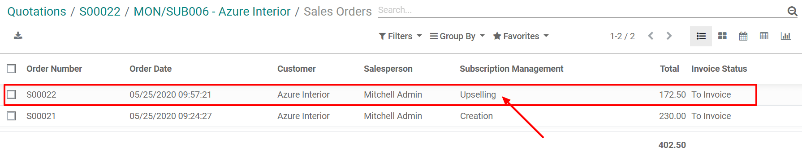

=====================
Upsell a subscription
=====================

Subscriptions are recurrent and go on indefinitely. As time passes by, our customers may want to
modify them. We must then be able to adapt the prices or change the products’ quantities to
accommodate their needs. Two situations can happen:

1. **Loyal customers:** This kind of customers already trust you as a brand. Therefore, you are
   confident regarding what you offer since they keep paying for your products and services.
   Consequently, it is easier to sell them something additional than it would be to a
   new customer.

2. **New customers:** For this kind of customers, you have to come with something new, something
   attractive. What about discounts? Typically, every subscription ends after a certain given time.
   Making these types of offers for new customers strengthens your relationships with them and also
   increases their retention.

.. raw:: html

   
 <b>Upselling can make
   a subscription last longer!</b> 

Configuration
=============

As previously explained, to upsell a subscription to new customers, it is recommended to offer
*Discounts*. To activate this option, go to :menuselection:`Sales --> Configuration --> Settings` and,
under the *Pricing* category, you have the possibility to grant discounts on sales order lines.

.. image:: upselling/configuration-to-upsell-a-subscription.png
  :align: center
  :alt: Activation of the discount option in Odoo Sales

Upsell your first subscription
==============================

Before upselling a subscription, be sure to check out our documentation on how to
:doc:`Create a quotation <../../subscriptions/sales_flow/create_a_quotation>` using subscription
products. Indeed, once confirmed, a quotation becomes a sales order and a new subscription is
automatically created. Therefore, this subscription has the status *In progress*. From there, you
have the possibility to upsell your subscription.

.. image:: upselling/upsell-your-subscription.png
  :align: center
  :alt: Upsell your subscription with Odoo Subscriptions

By using the smart button *Upsell*, you are able to create a new quotation with new subscription
products and send it to your customers for approval.

.. image:: upselling/use-of-the-upsell-button-in-odoo-sales.png
  :align: center
  :alt: Add products to your subscription via the upsell option in Odoo Subscriptions

.. important::
   When the quotation is confirmed by your customers, the products are added to the initial
   subscription. Quotation prices are, then, prorated to the remaining time of the current invoicing
   period.

Of course, before sending this new quotation to your customers, you can change the unit price, taxes,
and, even the discount you want to offer. The smart button *Customer preview* is useful for mimicking
the customer's reaction. In this case, we can confidently say that the customer will *Sign and pay*
this new quotation. When it is done, you have to go back in edit mode, confirm the quotation, and
click on the smart button *Subscriptions* to visualize all updates. From there, you can see that an
additional line has been added to the subscription with the new extra service the customer wanted to
purchase.

In addition, by clicking on the *Sales* button, you have a summary of your sales orders in a list
view.

The only difference between your two sales orders is the description underneath the
*Subscription Management* category. There, you can easily visualize which one is your upselling.

.. seealso::
  - :doc:`../../subscriptions/configuration/subscription_templates`
  - :doc:`../../subscriptions/configuration/subscription_products`
  - :doc:`../../subscriptions/sales_flow/create_a_quotation`