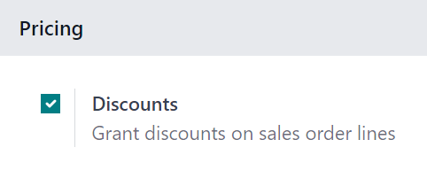
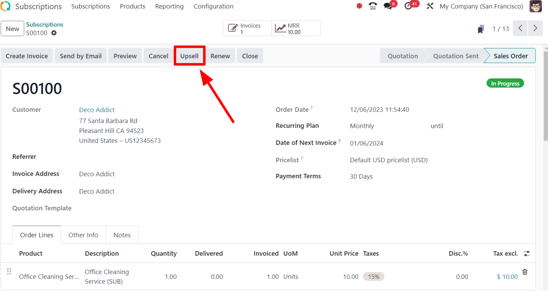
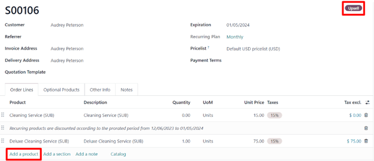
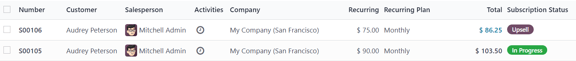

====================
Upsell subscriptions
====================

Subscriptions are recurrent, and go on indefinitely. As time passes, customers may want to modify
them. With that in mind, it's imperative to have the ability to adapt prices, or change quantities,
to accommodate any need. That's where the opportunity to upsell a subscription can come into play.

Upselling may prove beneficial to the following customer types:

#. | *Loyal Customers*
   | These are customers who already trust the company/brand, and because they have established a
     pattern of paying for products/services, there's more confidence behind the attempt to sell
     them a more expensive product/service.
#. | *New Customers*
   | For brand new customers unfamiliar with the company/brand, a new, attractive tactic must be
     employed to entice them to purchase a more expensive product/service.

     In these instances, discounts can be useful. Typically, subscriptions end after a certain period
     of time.

     So, if these more expensive products/services are offered to new customers at a discount, it
     can result in a sale, while establishing a strong sense of trust between the customer and the
     company/brand. In turn, this can increase customer retention, as they'll grow more comfortable
     and trustworthy over time.

Discount configuration
----------------------

In order to have the ability to upsell a subscription to a new customer, with the aid of a discount,
the *Discounts* feature **must** be activated.

To activate the *Discounts* feature, navigate to :menuselection:`Sales app --> Configuration -->
Settings`, scroll to the :guilabel:`Pricing` section, and tick the checkbox beside
:guilabel:`Discounts`. Then, click :guilabel:`Save`.

With that feature activated, the ability to grant discounts on sales order lines.

Upsell subscriptions
====================

Before upselling a subscription, check out our documentation on how to :doc:`Create a quotation
<../subscriptions>` using subscription products.

When a quotation with a subscription is confirmed, it officially becomes a sales order, and a new
subscription is created in the Odoo *Subscriptions* application.

.. note::
   The subscription sales order **must** be invoiced *before* an upsell can occur.

When the subscription sales order is opened, either in the *Sales* or *Subscriptions* application,
the ability to upsell that subscription is available, via the :guilabel:`Upsell` button at the top
of the sales order.

When the :guilabel:`Upsell` button is clicked, a new quotation form appears, with an
:guilabel:`Upsell` status banner in the upper-right corner. The initial subscription product is
already in the :guilabel:`Order Lines` tab.

There is also a warning reminding the user that the recurring products are discounted, according to
the prorated period of time, located beneath the initial subscription product in the
:guilabel:`Order Lines` tab.

From this new upsell quotation form, add new subscription products in the :guilabel:`Order Lines`
tab, by clicking :guilabel:`Add a product`, and selecting the desired subscription product.

Once the desired upsell subscription product(s) have been added, it can be sent to the customer for
approval by clicking the :guilabel:`Send by Email` button.

.. important::
   When the quotation is confirmed by the customer, the upsell products are added to the initial
   subscription. Quotation prices are then prorated to the remaining time of the current invoicing
   period.

.. note::
   Before sending the new quotation to the customer, the unit price, taxes, and even discount can be
   applied.

Once the customer approves, click the :guilabel:`Confirm` button on the quotation, making it a sales
order. When that's clicked, a :guilabel:`Sales History` smart button appears, displaying how many
sales orders are attached to this initial subscription order.

When the :guilabel:`Sales History` smart button is clicked, Odoo reveals a separate page containing
a list of the related sales orders, clearly showcasing their individual :guilabel:`Subscription
Status`.

.. seealso::
   - :doc:`../subscriptions`
   - :doc:`plans`
   - :doc:`products`
