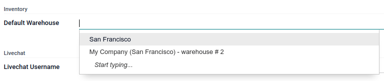

======================
User default warehouse
======================

Setting up a **default warehouse** can be useful for field technicians who keep a supply in their
van or those who always resupply from the same warehouse.

Products in sales orders created during field interventions are always pulled from the same
warehouse, keeping the inventory accurate with the default warehouse feature.

.. seealso::
   :doc:`../../inventory_and_mrp/inventory`

Configuration
=============

To set up a user default warehouse, the :doc:`storage locations
<../../inventory_and_mrp/inventory/management/warehouses/warehouses_locations>` and :ref:`multi-step
routes <use-routes/routes-rules>` features need to be activated. It is also necessary to have more
than one warehouse in your database.

.. seealso::
   - :doc:`../../inventory_and_mrp/inventory/management/warehouses/warehouses_locations`
   - :doc:`../../inventory_and_mrp/inventory/routes/concepts/use_routes`

User account
------------

To set up a default warehouse for a specific user, go to :menuselection:`Settings --> Users -->
Manage users`, open a user, then go to the :guilabel:`Preferences` tab, scroll down to
:guilabel:`Inventory`, and select the default warehouse from the drop-down menu.

Default warehouse in field service tasks
========================================

Once a default warehouse has been configured for a user, the materials used for a sales order linked
to a Field Service task are pulled from that specific warehouse. In the sales order, go to the
:guilabel:`Other Info` tab, then scroll down to :guilabel:`Delivery`. The default warehouse is
applied correctly.
