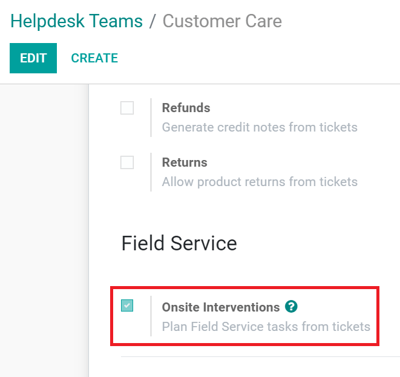

================================================
Plan onsite interventions from helpdesk tickets
================================================
The integration with the Helpdesk app lets your helpdesk team manage intervention requests directly.
Planning field service tasks from tickets speeds up your processes.

Configure the helpdesk team
===========================
Go to :menuselection:`Helpdesk --> Configuration --> Helpdesk Teams`. Select a team and enable
*Onsite Interventions*.

The helpdesk tickets of the team now display the *Plan Intervention* button. Click on it to create a
new task under your field service project.

.. image:: plan_onsite/plan-intervention-from-ticket.png
   :align: center
   :alt: Plan intervention from helpdesk ticket in Odoo Helpdesk
