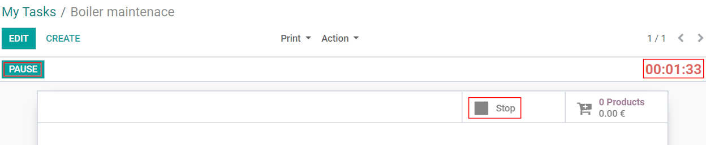
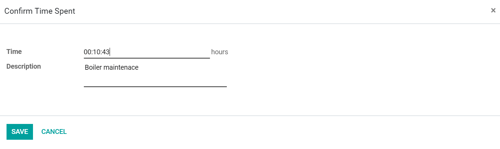
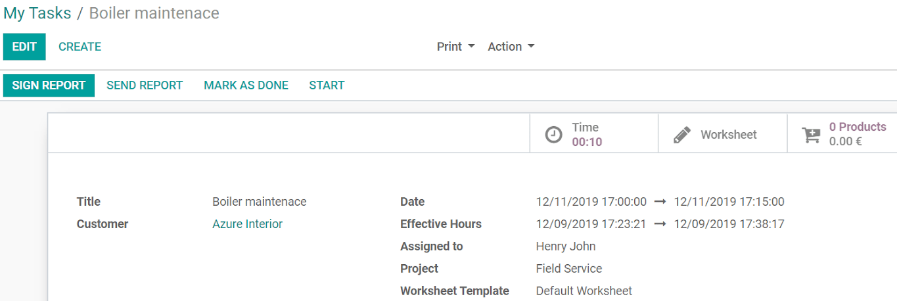
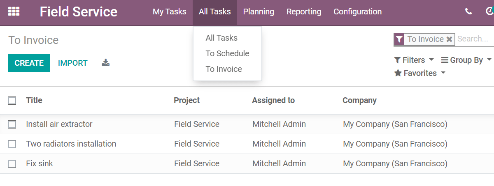
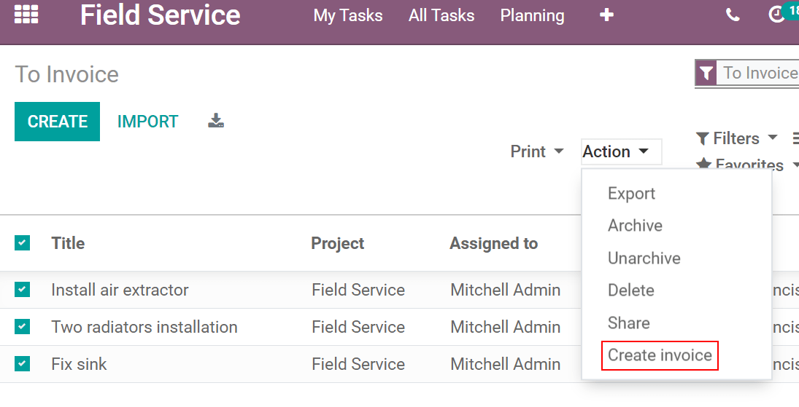

========================================
Invoicing Time and Material to Customers
========================================
Track the exact time spent on a task and give customers the ability to sign their worksheet
report onsite. Invoice customers as soon as the work is complete, leaving you, and the customer,
with the confidence that they will be charged for the exact right hours and material used.

Get the exact time spent on a task
==================================
Click on *Start* to launch the timer. You can *Pause* at any moment and *Resume* when you would like
to continue.

Click on *Stop* once the work is done to confirm the total time spent and add a description.

Sign and send reports & validate stock-picking
==============================================
Now, fill your *Worksheet* and add the used products clicking on *Products*.

Click on *Start* if you need to record additional time for the same activity. The time recorded will
be added to the already created and signed worksheet. Then, create a new invoice for the time added.

*Mark as done* to close the task and to invoice your intervention. It also validates the
stock-picking keeping your inventory up-to-date.

*Sign Report* generates a detailed worksheet report for the customer to sign. Send it through email
clicking on *Send Report*.

Invoice your time and material
===============================
Under :menuselection:`All Tasks --> To Invoice`, find a list of all tasks marked as done but that
have not been invoiced.
Convenient feature as it allows accountants to easily access all finished tasks at once.

.. tip::
   Invoice all tasks at once selecting them all and going to :menuselection:`Action -->
   Create Invoice`.

.. seealso::
   * :doc:`../../../services/project/advanced/feedback`
