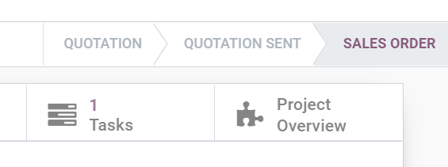

=============================================
Create onsite interventions from sales orders
=============================================
Allowing your sales team to open onsite interventions creates a seamless experience for your
customers. They can receive a quotation they first have to approve before the work even starts.

Configure a product
===================
Go to :menuselection:`Field Service --> Configuration --> Products` and create or edit a product.

#. Under the *General Information* tab, select *Service* as *Product Type*.

#. Under the *Sales* tab, select *Timesheets on tasks* as *Service Invoicing Policy*.

#. Select *Create a task in an existing project* as *Service Tracking*.

#. Select your *Project*.

#. If you use them, select your *Worksheet Template* and then click on *Save*.

.. image:: onsite_tasks_from_sales_orders/product-configuration-tasks-from-sales-orders.png
   :align: center
   :alt: Product configuration to create tasks from sales orders in Odoo Field Service

From the *Sales* app, create a quotation with the product and confirm it. A task is automatically
set up under your Field Service project. It is directly accessible from the sales order.

