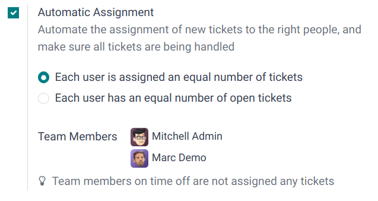
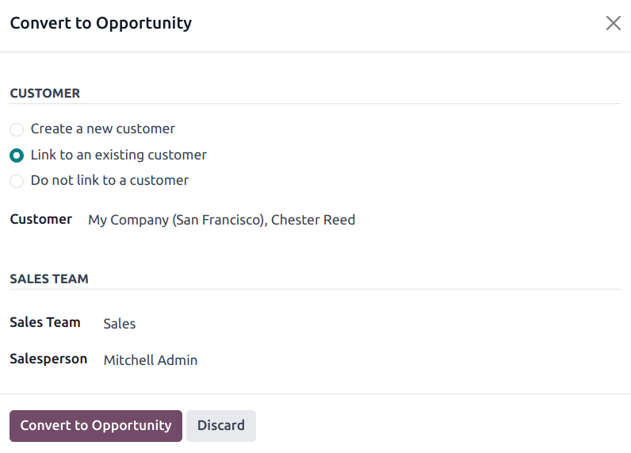

:show-content:
:show-toc:

========
Helpdesk
========

Odoo **Helpdesk** is a ticket-based customer support application. Multiple teams can be configured
and managed in one dashboard, each with their own pipeline for tickets submitted by customers.
Pipelines are organized in customizable stages that enable teams to track, prioritize, and solve
customer issues efficiently.

Create a Helpdesk team
======================

To view or modify **Helpdesk** teams, go to :menuselection:`Helpdesk app --> Configuration -->
Helpdesk Teams`. To create a new team, click the :guilabel:`New` button on the top-left of the
dashboard.

.. image:: helpdesk/helpdesk-teams-list.png
   :alt: View of the Helpdesk teams page in Odoo Helpdesk.

On the blank Helpdesk team form, enter a :guilabel:`Name` for the new team. Then, enter a
description of the team in the field below the team name, if desired. To change the company this
team is assigned to, select it from the :guilabel:`Company` drop-down menu.

.. important::
   The team description is published on the public facing :doc:`website form
   <helpdesk/overview/receiving_tickets>`, where customers and portal users submit tickets. The
   description included in this field should **not** include any information that is for internal
   use only.

   .. image:: helpdesk/team-description-webform.png
      :alt: View of a Helpdesk team's website form displaying the team description.

Visibility & Assignment
-----------------------

The *Visibility* settings alter which internal users and portal users have access to this team and
its tickets. The *Assignment* settings alter how users are assigned to handle each ticket.

Determine team visibility
~~~~~~~~~~~~~~~~~~~~~~~~~

Under the :guilabel:`Visibility` section, select one of the following options to determine who can
view this team and its tickets:

- :guilabel:`Invited internal users (private)`: Internal users can access the team and the tickets
  they are following. This access can be modified on each ticket individually by adding or removing
  the user as a follower. Internal users are considered *invited* once they are added as followers
  to an individual ticket, or :ref:`to the team itself <helpdesk/follow>`.
- :guilabel:`All internal users (company)`: All internal users can access the team and all of its
  tickets.
- :guilabel:`Invited portal users and all internal users (public)`: All internal users can access
  the team and all of its tickets. Portal users can only access the tickets they are following.

.. example::
   A `Customer Support` team, meant to handle general shipping and product issues, would have the
   visibility set on :guilabel:`Invited portal users and all internal users`.

   At the same time, a `Financial Services` team handling tickets related to accounting or tax
   information would only need to be visible to :guilabel:`Invited internal users`.

.. warning::
   A team's visibility can be altered after the initial configuration. However, if the team changes
   from *Invited portal users and all internal users (public)* access to either *Invited internal
   users (private)* or *All internal users (company)*-only access, portal users are removed as
   followers from both the team, and from individual tickets.

.. _helpdesk/follow:

Follow all team's tickets
~~~~~~~~~~~~~~~~~~~~~~~~~

If a user should be notified about any updates regarding tickets for this team, select their name
from the :guilabel:`Followers` drop-down menu, located in the :guilabel:`Follow All Team's Tickets`
field. Multiple users can be selected to follow a single team.

.. important::
   External contacts can be selected in the :guilabel:`Followers` field. If the team's visibility is
   set to :guilabel:`Invited internal users (private)`, followers are notified about updates to the
   team's tickets, but are **not** able to view them in the portal.

Automatically assign new tickets
~~~~~~~~~~~~~~~~~~~~~~~~~~~~~~~~

When tickets are received, they need to be assigned to a member of the team. This is done either
manually on each individual ticket, or through :guilabel:`Automatic Assignment`. Check the
:guilabel:`Automatic Assignment` checkbox to enable this feature for the team.

.. important::
   If an employee has time off scheduled in the **Time Off** application, they are **not** assigned
   tickets during that time. If no employees are currently available, the system looks ahead on the
   calendar until there is a match.

         Helpdesk.

Assign tickets based on workload
********************************

Select one of the following assignment methods, based on how the workload should be allocated across
the team:

- :guilabel:`Each user is assigned an equal number of tickets`: Tickets are assigned to team members
  based on total unassigned ticket count, regardless of the number of open or closed tickets they
  are currently assigned.
- :guilabel:`Each user has an equal number of open tickets`: Tickets are assigned to team members
  based on how many open tickets they are currently assigned.

.. note::
   When :guilabel:`Each user is assigned an equal number of tickets` is selected, the overall number
   of tickets assigned to team members is the same, but it does **not** consider the current
   workload.

   When :guilabel:`Each user has an equal number of open tickets` is selected, it ensures a balanced
   workload among team members, as it takes the current number of active tickets into account.

Add the :guilabel:`Team Members` who are to be assigned tickets for this team. Leave the
field empty to include all employees who have the proper assignments and access rights configured in
their user account settings.

Assign tickets based on expertise
*********************************

To assign tickets to team members based on their expertise, and the associated tag on the tickets,
select :guilabel:`Dispatch tickets based on tags` under :guilabel:`Automatic Assignment`. Then,
click :guilabel:`Configure tags handled by team members`.

Click :guilabel:`New` to create a new :guilabel:`Ticket Tag`, such as `Pricing` or `IT`. Select one
or more :guilabel:`Team Members` from the drop-down list. Click :guilabel:`Save` when finished.

.. important::
   If a ticket has no tag set, the ticket remains unassigned.

.. seealso::
   - :ref:`Manage users <users/add-individual>`
   - :doc:`Access rights <../general/users/access_rights>`

Merge tickets
=============

If duplicate tickets are found in **Helpdesk**, they can be combined into a single ticket using the
*merge* feature.

.. important::
   The *merge* feature is **only** accessible if the :doc:`Data Cleaning
   <../productivity/data_cleaning>` application is installed on the database.

To merge two or more tickets, navigate to :menuselection:`Helpdesk app --> Tickets --> All Tickets`.
Identify the tickets to be merged, and tick the checkbox at the far-left of each ticket to select
them. Then, click the :icon:`fa-cog` :guilabel:`Actions` icon, and select :guilabel:`Merge` from the
drop-down menu. Doing so opens a new page where the selected tickets are listed with their
:guilabel:`Similarity` rating. From here, click either :ref:`Merge <data_cleaning/merge-records>` to
combine the tickets, or :guilabel:`DISCARD`.

Convert tickets to opportunities
================================

Some tickets may be better handled by the sales team, rather than the support team. In this case,
tickets can be converted to *opportunities* and assigned to a sales team for follow-up.

.. important::
   This feature is **only** available if the :doc:`CRM <../sales/crm>` app is installed.

To convert a ticket to an opportunity, first navigate to a ticket, either from a team's pipeline, or
by navigating to :menuselection:`Helpdesk app --> Tickets` and clicking a ticket to open it.

At the top of the ticket, click the :guilabel:`Convert to Opportunity` button.

.. note::
   If :doc:`leads <../sales/crm/acquire_leads/convert>` are enabled on the **CRM** app, tickets are
   converted to *leads*, and the button reads :guilabel:`Convert to Lead`.

This opens the :guilabel:`Convert to Opportunity` pop-up. Fill in or select the following
information on the pop-up:

- :guilabel:`Customer`: Select whether to :guilabel:`Create a new customer`, :guilabel:`Link to an
  existing customer`, or :guilabel:`Do not link to a customer`. If :guilabel:`Link to a customer` is
  chosen, select the appropriate customer name from the :guilabel:`Customer` drop-down.

- :guilabel:`Sales Team`: Specify which :guilabel:`Sales Team` and :guilabel:`Salesperson` this
  created opportunity is assigned to.

After completing the form, click :guilabel:`Convert to Opportunity`. Doing so creates a new
opportunity in the **CRM** app. The original ticket is linked in the chatter of the new opportunity
for traceability.

.. note::
   After the ticket is converted to an opportunity, the ticket is archived.

.. seealso::
   - `Odoo Tutorials: Helpdesk <https://www.odoo.com/slides/helpdesk-51>`_

.. toctree::
   :titlesonly:

   helpdesk/overview
   helpdesk/advanced
