====================
After-Sales services
====================

*After-Sales* services can be configured in the *Helpdesk* application for individual *teams*. Once
enabled, users can issue refunds, process returns, generate coupons, and/or schedule repair and
field service interventions directly from a ticket.

Set up the after-sales services
===============================

Start by enabling the after-sales services on specific *Helpdesk* team(s), by going to
:menuselection:`Helpdesk --> Configuration --> Teams` and selecting which teams(s) these services
should be active on. Then, scroll to the :guilabel:`After-Sales` section on the team's settings
page, and choose which of the following options to enable:

- :guilabel:`Refunds`: issues credit notes to refund a customer, or adjust the remaining amount due
- :guilabel:`Coupons`: offers discounts and free products through an existing coupon program
- :guilabel:`Returns`: initiates a product return from a customer through a reverse transfer
- :guilabel:`Repairs`: creates repair orders for broken or faulty products
- :guilabel:`Field Service`: plans onsite intervention through the *Field Service* application

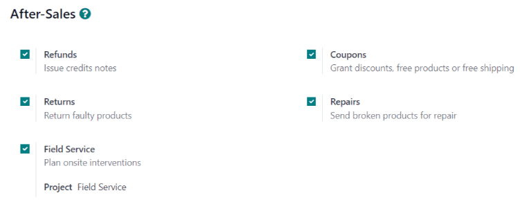

   The services that are enabled can vary based on the type of support a team provides.

.. warning::
   As all of the after-sales services in Odoo require integration with other applications, enabling
   any of them may result in the installation of additional modules or applications. *Installing a
   new application on a One-App-Free database will trigger a 15-day trial. At the end of the trial,
   if a paid subscription has not been added to the database, it will no longer be accessible.*

Issue a refund with a credit note
=================================

A *credit note* is a document issued to a customer informing them that they have been credited a
certain amount of money. They can be used to provide a full refund to a customer, or to adjust any
remaining amount due. While they are usually created through the *Accounting* or *Invoicing*
applications, they can be created through a *Helpdesk* ticket, as well.

.. note::
   Invoices must be posted before a credit note can be generated.

To create a credit note, navigate to a ticket on the :menuselection:`Helpdesk` application, and
click the :guilabel:`Refund` button in the upper-left corner of the ticket dashboard. Then, select
the corresponding invoice from the :guilabel:`Invoices to Refund` drop-down menu.

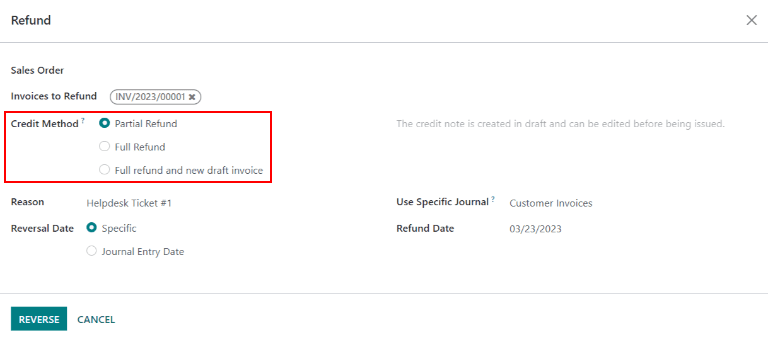

Choose a :guilabel:`Credit Method` from one of the following options:

- :guilabel:`Partial Refund`: the credit note is created in draft and can be edited before being
  issued
- :guilabel:`Full Refund`: the credit note is auto-validated and reconciled with the invoice. *This
  is the option to choose if a validated invoice needs to be canceled*
- :guilabel:`Full refund and new draft invoice`: the credit note is auto-validated and reconciled
  with the invoice. The original invoice is duplicated as a new draft. *This is the option to choose
  if a validated invoice needs to be modified*

.. important::
   The :guilabel:`Credit Method` options will **not** be available for invoices that have already
   been paid.

Make any necessary changes to the details of the credit note and click :guilabel:`Reverse.` Then
click :guilabel:`Confirm` to post the credit note.

Once the credit note has been posted, a :guilabel:`Credit Notes` smart button will be added to the
*Helpdesk* ticket.

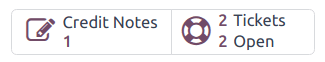

.. seealso::
   :doc:`/applications/finance/accounting/customer_invoices/credit_notes`

Generate coupons from a ticket
==============================

Coupons can be used to alter the price of products or orders. The usage constraints of a coupon are
defined by conditional rules. *Coupon Programs* are configured in the *Sales* or *Website*
applications.

.. note::
   The *eCommerce* module must be installed in order to create coupon codes from the *Website*.

To generate a coupon, open a *Helpdesk* ticket and click on the :guilabel:`Coupon` button in the
upper left corner. Select an option from the :guilabel:`Coupon Program` drop-down menu, then click
:guilabel:`Generate`.

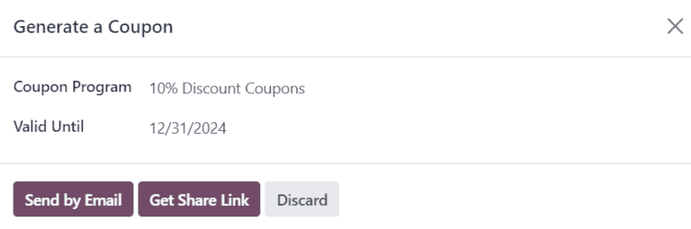

The :guilabel:`Coupon Code` can be copied directly from the pop-up window (by clicking the
:guilabel:`Copy` button), or sent in an email by clicking :guilabel:`Send`.

.. note::
   When emailing a coupon code, all the followers of the ticket will be added as recipients to the
   email. Additional recipients can be added to the email as well, in the :guilabel:`Recipients`
   field of the :guilabel:`Compose Email` pop-up window.

   .. image:: after_sales/after-sales-coupon-email.png
      :align: center
      :alt: View of an email draft window with coupon code.

Once a :guilabel:`Coupon Code` has been generated, a :guilabel:`Coupons` smart button will be added
to the top of the ticket; click the smart button to view the coupon code, expiration date, and
additional information.

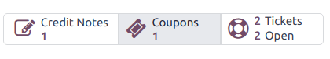

.. seealso::
   `Coupons <https://www.odoo.com/slides/slide/coupon-programs-640?fullscreen=1>`_

Facilitate a product return with a reverse transfer
===================================================

Returns are completed through *reverse transfers*, which generate new warehouse operations for the
returning products. Click the :guilabel:`Return` button in the top-left corner of a ticket to open
the :guilabel:`Reverse Transfer` pop-up window.

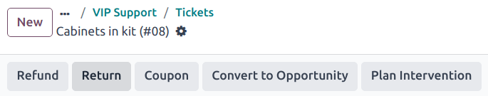

.. note::
   The :guilabel:`Return` button only appears on a ticket if the customer has a recorded delivery in
   the database.

By default, the quantity will match the validated quantity from the delivery order. Update the
:guilabel:`Quantity` field if necessary.

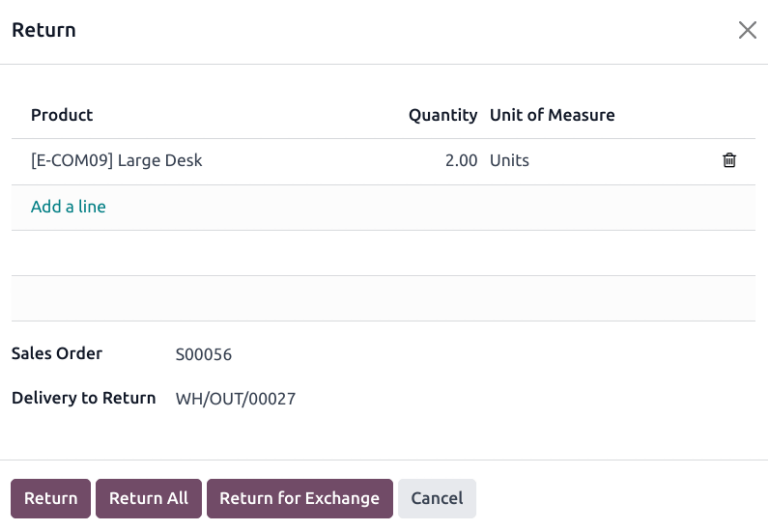

Click :guilabel:`Return` to confirm the return. This generates a new warehouse operation for the
incoming returned product(s). A :guilabel:`Return` smart button will then be added to the top of the
ticket.

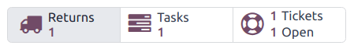

.. seealso::
   :doc:`/applications/sales/sales/products_prices/returns`

Send products for repair from a ticket
======================================

If the ticket is related to an issue with a faulty or broken product, a repair order can be created
from the *Helpdesk* ticket, and managed through the *Repairs* application.

To create a new repair order, open a :menuselection:`Helpdesk` ticket and click on the
:guilabel:`Repair` button in the upper left corner.

Clicking the :guilabel:`Repair` button opens a blank :guilabel:`Repair Reference` form.

.. image:: after_sales/after-sales-repair-reference.png
   :align: center
   :alt: View of a repair reference page.

.. note::
   If a product was specified in the :guilabel:`Product` field on the ticket, it will be added to
   the :guilabel:`Product to Repair` field automatically. If not, click into the field to select a
   product from the drop down.

Fill out the :guilabel:`Repair Description` field with a brief explanation of the issue. Click the
:guilabel:`Sale Order` field and then select the originating :abbr:`SO (Sales Order)` from which the
product is being repaired from. If a return has been initiated for the product, select the reference
number from the drop-down in the :guilabel:`Return` field.

Choose an :guilabel:`Invoice Method` from the drop-down. Select :guilabel:`Before Repair` or
:guilabel:`After Repair` to generate an invoice before or after the work is completed. Selecting
:guilabel:`No Invoice` means that an invoice cannot be generated for this service.

If parts are required for the repair, they can be added in the :guilabel:`Parts` tab. Services can
be added as product lines on the :guilabel:`Operations` tab. Additional information for the internal
repair team can be added to the :guilabel:`Repair Notes` tab. Information for the customer can be
added to the :guilabel:`Quotation Notes` tab, and will be automatically added to the PDF of the
quotations generated from this :guilabel:`Repair Reference`.

A :guilabel:`Repairs` smart button will be added to the ticket, linking to the repair order.

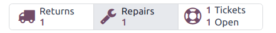

.. note::
   Once a user creates a repair order from a *Helpdesk* ticket, they will be able to access it
   through the ticket's :guilabel:`Repair` smart button, or from a link in the :guilabel:`Chatter`,
   even if they do not have access rights to the *Repair* application.

Create a field service task from a ticket
=========================================

On-site interventions can be planned from a ticket and managed through the *Field Service*
application. Customers with :doc:`portal access </applications/general/users/portal>` will be able
to track the progress of a :guilabel:`Field Service` task just as they would a *Helpdesk* ticket.

To create a new task, navigate to a :menuselection:`Helpdesk` ticket. Click :guilabel:`Create Task`
to open the :guilabel:`Create a Field Service task` pop-up. Confirm or update the task
:guilabel:`Title`.

.. note::
   The :guilabel:`Project` field on the :guilabel:`Create a Field Service task` pop-up will default
   to the same *Field Service* project that was identified on the team's settings page. To change
   the project for this specific task, select one from the :guilabel:`Project` field.

   To change the default *Field Service* project for the team, go to :menuselection:`Helpdesk -->
   Configuration --> Teams` to select a :guilabel:`Team`. Scroll to the :guilabel:`After-Sales`
   section and choose new project under :guilabel:`Field Service`.

Click :guilabel:`Create Task` or :guilabel:`Create & View Task`.

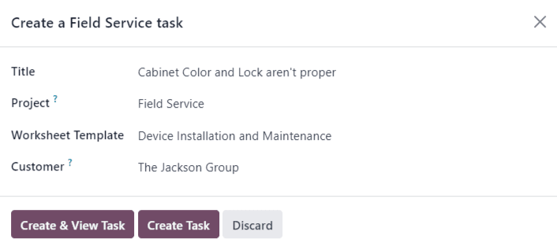

After the task is created, a :guilabel:`Tasks` smart button will be added to the ticket, linking the
:guilabel:`Field Service` task to the ticket.

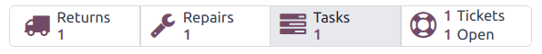

.. seealso::
   `Field Service  <https://www.odoo.com/slides/slide/advanced-settings-862?fullscreen=1>`_
