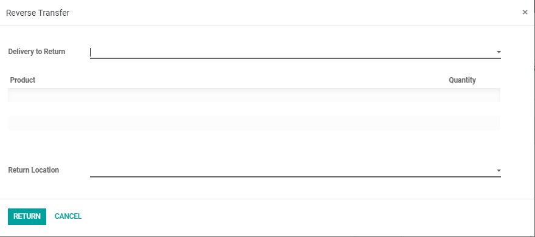
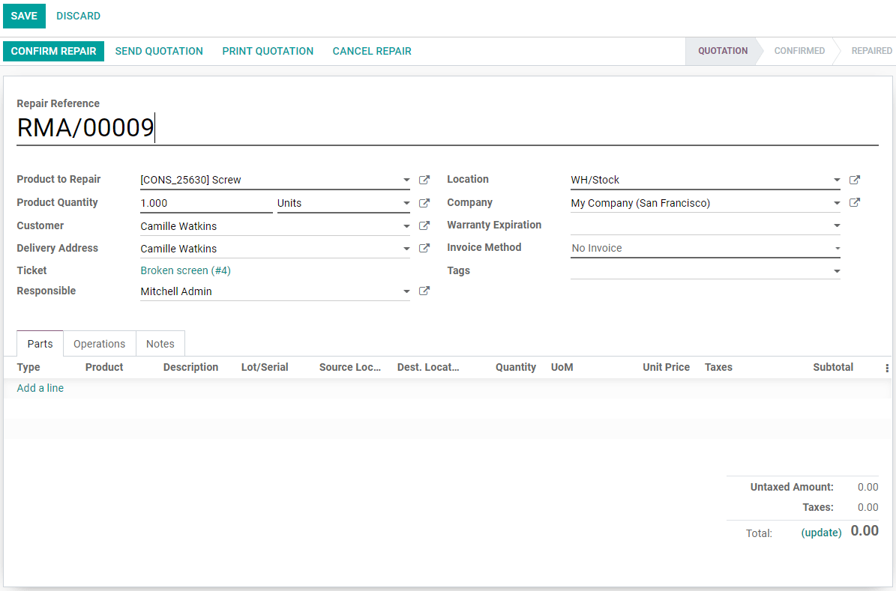

====================
After Sales Features
====================

As your business grows, having the right tool to support your helpdesk team on recording, tracking
and managing issues raised easy and efficiently, is key. Odoo’s Helpdesk application allows you to
generate credit notes, manage returns, products, repairs, grant coupons, and even plan onsite
interventions from a ticket’s page.

Set up the after sales services
===============================

Go to :menuselection:`Helpdesk --> Configuration --> Helpdesk Teams` and enable the after sales
options: *Refunds, Returns, Coupons, Repairs and Onsite Interventions*.

.. image:: after_sales/aftersales1.png
   :align: center

Generate credit notes from tickets
----------------------------------

You can use a credit note to refund a customer or adjust the amount due. For that, simply go to
your ticket page, click on *Refund* and select the corresponding *Invoice*. Clicking on *Reverse*
generates a credit note, and you can *Post* it while still being in the *Helpdesk* app.

.. image:: after_sales/aftersales2.png
   :align: center

Allow product returns from tickets
----------------------------------

The process of a product return from your customer back to your warehouse is taken into action when,
at the ticket page, you choose the option *Return*.

Grant coupons from tickets
--------------------------

First, be sure to have your *Coupon Program* planned in the *Sales* or *Website* application. Then,
in *Helpdesk*, open your ticket, click on *Coupon*, and choose the respective one.

.. image:: after_sales/aftersales4.png
   :align: center

Repairs from tickets
--------------------

Clicking on *Repair* option, on your ticket page, a new repair order form is shown. Fill in the
information as needed and choose the next step.

Plan onsite interventions from tickets
--------------------------------------

At the ticket's page click on *Plan Intervention*, and set up your onsite intervention exactly the
same way as if you were on the *Field Service* application.

.. image:: after_sales/aftersales6.png
   :align: center
   :height: 300

.. seealso::
   - `Coupons <https://www.odoo.com/slides/slide/coupon-programs-640?fullscreen=1>`_
