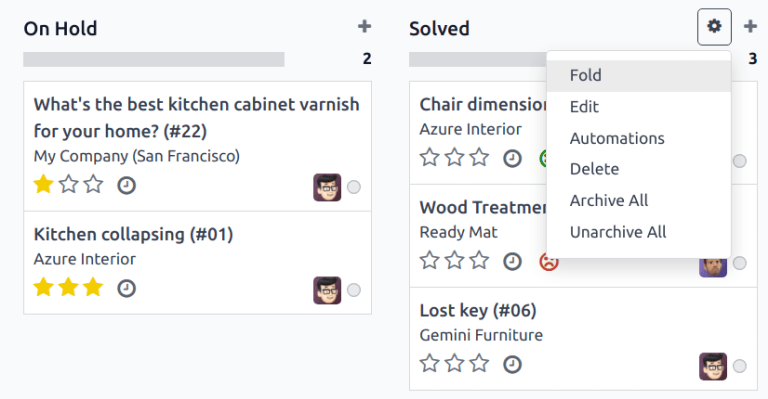
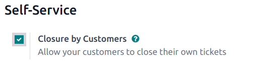
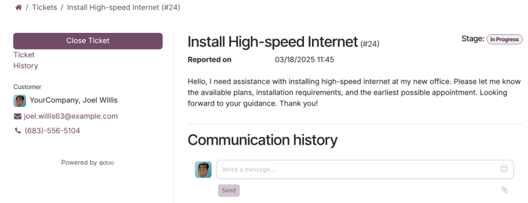

=============
Close tickets
=============

After work has been completed on a ticket in the **Helpdesk** app, there are several ways it can be
closed. Manually closing solved tickets keeps the pipeline up to date, while automatically closing
inactive tickets prevents unnecessary blocking issues. Allowing customers to close their own tickets
minimizes confusion around whether an issue is considered solved or not. This results in increased
operational capacity for support teams, and higher customer satisfaction.

Manually close solved tickets
=============================

As work on a ticket progresses, it is moved along to the next stage in the pipeline. When the issue
is solved, the ticket is moved to a *folded* stage. This marks the ticket as *closed*.

To fold a stage, navigate to the :menuselection:`Helpdesk` dashboard and click on a team to open the
pipeline. Hover over a stage's heading, and then click the :icon:`fa-gear` :guilabel:`(gear)` icon
that appears in the top-right corner of that stage's Kanban column.

.. warning::
   Clicking the gear icon also displays the option to :guilabel:`Fold` the stage. This setting folds
   the stage *temporarily* to simplify the Kanban view. This does **not** close the tickets in this
   stage. It also does not permanently fold the stage. If a stage needs to be folded so the tickets
   can be marked as closed, continue following the steps below.

From the menu that appears, select :guilabel:`Edit`. This opens the stage's settings. Tick the
checkbox labeled :guilabel:`Folded in Kanban`, and then :guilabel:`Save & Close` to confirm the
changes. Now, tickets are *closed* once they reach this folded stage.

   .. image:: close_tickets/closing-folded-setting.png
      :alt: Stage settings page.

Automatically close inactive tickets
====================================

Tickets that are inactive for a set period of time can be automatically closed. At that point, they
are moved to a folded stage.

Go to the team's settings page by going to :menuselection:`Helpdesk --> Configuration --> Helpdesk
Teams`. Under the :guilabel:`Self-Service` section, enable :guilabel:`Automatic Closing`.

If only one of the team's stages is folded in the Kanban view, it is the default selection in the
:guilabel:`Move to Stage` field. If the team has more than one folded stage, the stage that occurs
first in the pipeline is the default for this field. If no stage is folded, the default selection is
the last stage in the pipeline.

The :guilabel:`After days of inactivity` field defaults to `7`, but can be adjusted if necessary.

.. warning::
   The :guilabel:`After days of inactivity` field does **not** take the working calendar into
   account when tracking the amount of time a ticket has been inactive.

If only certain stages should be used to track days of inactivity, they can be added to the
:guilabel:`In Stages` field.

.. example::
   A team's pipeline is created with the following stages:

   - `New`
   - `In Progress`
   - `Customer Feedback`
   - `Closed`

   Tickets can linger in the :guilabel:`Customer Feedback stage`, because once an issue is solved,
   customers may not respond immediately. At that point, the tickets can be closed automatically.
   However, tickets in the :guilabel:`New` and :guilabel:`In Progress` stages may remain inactive
   due to assignment or workload issues. Closing these tickets automatically would result in issues
   going unsolved.

   Therefore, the :guilabel:`Automatic Closing` settings would be configured as below\:\

   - :guilabel:`Automatic Closing`: *checked*
   - :guilabel:`Move to Stage`: `Solved`
   - :guilabel:`After` `7` :guilabel:`days of inactivity`
   - :guilabel:`In Stages`: `Customer Feedback`

   .. image:: close_tickets/closing-automatic-settings-example.png
      :alt: Example of Automatic Closing settings.

Allow customers to close their own tickets
==========================================

Enabling the :guilabel:`Closure by Customers` setting allows customers to close their own tickets
when they determine that their issue has been resolved.

Start by navigating to :menuselection:`Helpdesk --> Configuration --> Helpdesk Teams` and select a
team. On the team's settings page, scroll to the :guilabel:`Self-Service` section and tick the
checkbox for :guilabel:`Closure by Customers`.

After the ticket closing settings are enabled, a :guilabel:`Close Ticket` button is available for
customers when they view their ticket through the customer portal.

.. note::
   Customers are able to view their tickets by clicking the :guilabel:`View the ticket` link they
   receive by email. The link is included in the :guilabel:`Request Acknowledgment` template, which
   is added to the first stage of a team by default. This link does not require a customer to have
   access to the portal to view or respond to their ticket.

   Customers with access to the :doc:`portal <../../../general/users/portal>` are able to view their
   tickets under :menuselection:`My Account --> Tickets`.
