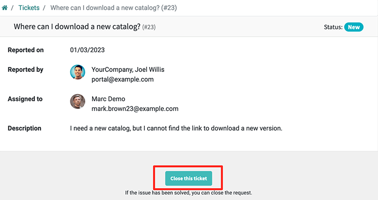

======================================
Allow customers to close their tickets
======================================

Allowing customers to close their own tickets gives them autonomy and minimizes misunderstandings
around when an issue is considered solved or not. This results in operational capacity for support
teams, and higher satisfaction for the customer.

Enable ticket closing
=====================

Start by navigating to :menuselection:`Helpdesk --> Configuration --> Helpdesk Teams` and choose
the appropriate team. Then click :guilabel:`Edit` and enable :guilabel:`Ticket closing` by
checking the field box.

.. image:: close_tickets/close-ticket-settings.png
   :alt: Ticket closing feature in Odoo Helpdesk.

To designate which stage the ticket migrates to once it is closed, navigate to the ticket pipeline
by going to :menuselection:`Helpdesk --> Overview` and clicking :guilabel:`Tickets` on the team's
card.

There are two options: create a new Kanban stage or work with an existing one. For both scenarios,
click the :guilabel:`Settings (gear)` icon next to the stage name, select :guilabel:`Edit Stage`,
and enable :guilabel:`Closing Stage`. After checking the field box, click :guilabel:`Save` to
finish.

.. note::
   If a closing stage is not specified, by default, the ticket is moved to the last stage in the
   kanban. If more than one stage is set as a closing stage, the ticket is placed in the first
   closing stage column.

With the ticket closing settings now complete, customers can now view the option to
:guilabel:`Close this ticket` when they log into their portal.

Get reports on tickets closed by customers
==========================================

To analyze the tickets that have been closed by customers, go to :menuselection:`Helpdesk -->
Reporting --> Tickets`. Then, click on the :guilabel:`Filters` menu and choose :guilabel:`Add
Custom filter`. Next, set the custom filter parameters to :guilabel:`Closed by partner` and
:guilabel:`is true`. Finally, click :guilabel:`Apply`.

.. image:: close_tickets/closed-by-search-filter.png
   :alt: Filter for tickets closed by customers on Odoo Helpdesk's reporting page.
