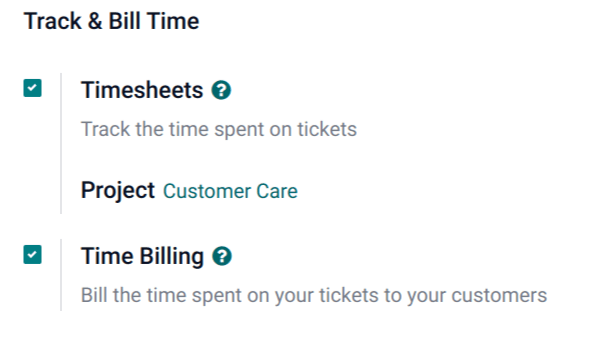
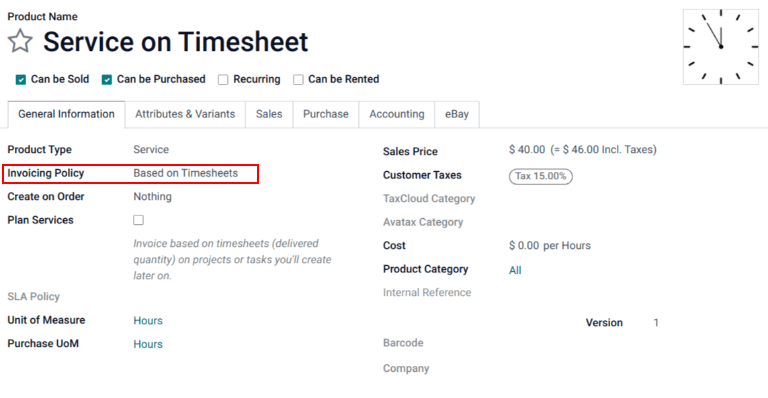
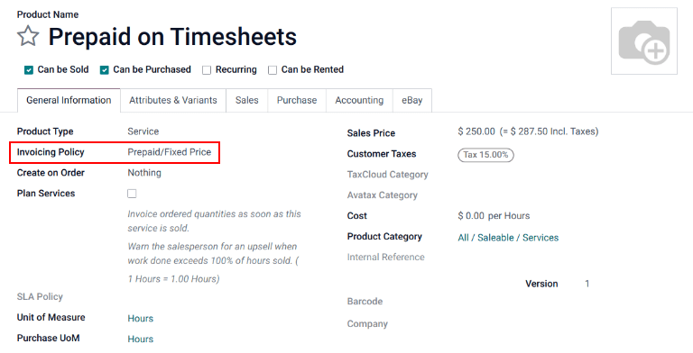
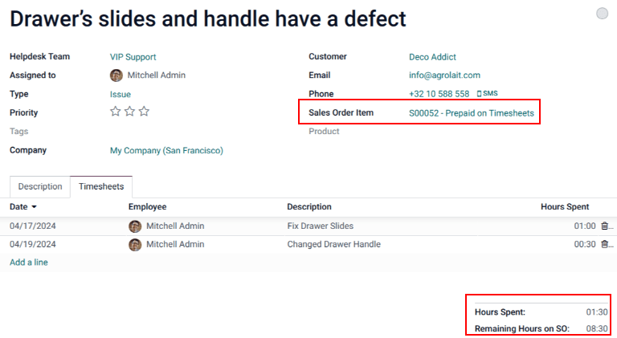
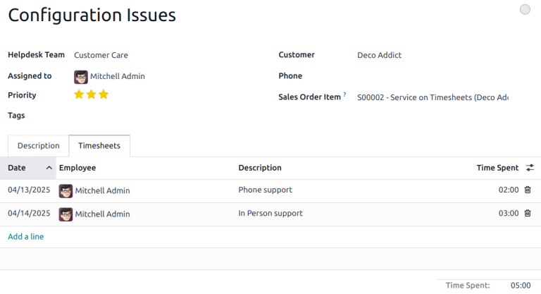
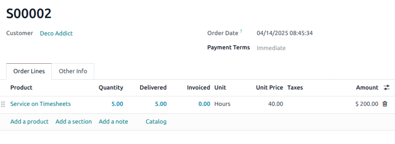
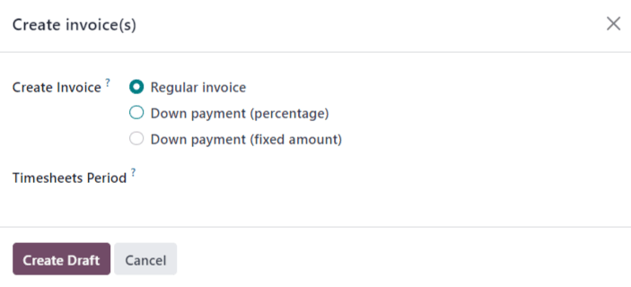

===================
Track and bill time
===================

Odoo *Helpdesk* provides teams with the ability to track the amount of hours spent working on a
ticket, and to bill a customer for that time. Through integrations with the *Sales*, *Timesheets*
and *Accounting* applications, customers can be charged once the work is completed, or before it has
even begun.

.. warning::
   Since the *Track & Bill Time* features require integration with other applications, enabling them
   may result in the installation of additional modules (or applications).

   Installing a new application on a *One-App-Free* database triggers a 15-day trial. At the end of
   the trial, if a paid subscription has not been added to the database, it will no longer be active
   or accessible.

Configure track and bill time features
======================================

Before a customer can be invoiced for support services, the *Track & Bill Time* features must first
be enabled. These features must be enabled on each *Helpdesk* team where they will be utilized.

Enable track and bill time on a helpdesk team
---------------------------------------------

To view and enable the :guilabel:`Track & Bill Time` features on a *Helpdesk* team, first navigate
to :menuselection:`Helpdesk --> Configuration --> Teams`. Then select a team from the list or
:doc:`create a new one </applications/services/helpdesk/overview/getting_started>`. This will reveal
a team's settings page.

On the team's settings page, scroll to the :guilabel:`Track & Bill Time` section. Check the boxes
labeled :guilabel:`Timesheets` and :guilabel:`Time Billing`.

Once the :guilabel:`Timesheets` box is checked, a new field appears, labeled :guilabel:`Project`.

The project selected in this field is where all the timesheets for this team's tickets will be
recorded. Click into the drop-down menu to select a :guilabel:`Project`.

To create a new project where the timesheets will be recorded, click into the drop-down menu, type a
name for the project, and then click :guilabel:`Create`.

.. _helpdesk/advanced/configure-service-products:

Configure service products
--------------------------

When the :guilabel:`Time Billing` feature is enabled, a new product is created in the *Sales* app
called :guilabel:`Service on Timesheets`. This product can be found under :menuselection:`Sales -->
Products --> Products`. Search for `Service on Timesheets` in the :guilabel:`Search...` bar. This is
the product that will be used when invoicing for *post-paid support services* after they have been
completed.

Select :guilabel:`Service on Timesheets` from the product page. This reveals the product detail
form. The product is configured with the :guilabel:`Product Type` set to :guilabel:`Service` and the
:guilabel:`Invoicing Policy` set to :guilabel:`Based on Timesheets`.

In order to invoice for support services before the work has been completed (also known as *prepaid
support services*), a separate product with a different invoicing policy must be created.

To create a new service product, go to :menuselection:`Sales --> Products --> Products` and click
:guilabel:`New`. This will reveal a blank product detail form.

On the new product form, add a :guilabel:`Product Name`, and set the :guilabel:`Product Type` to
:guilabel:`Service`. Then, set the :guilabel:`Invoicing Policy` to :guilabel:`Prepaid/Fixed Price`.
This means an invoice can be generated and payment can be received for this product before any
timesheets entries have been recorded for these services.

Finally, set the :guilabel:`Sales Price`, and confirm that the :guilabel:`Unit of Measure` is set to
:guilabel:`Hours`.

Invoice prepaid support services
================================

When support services are billed on a fixed price, an invoice can be created before any work is
completed on the issue. In this case, a service product with the invoicing policy set to
:guilabel:`Prepaid/Fixed Price` would be used, just like :ref:`the section above
<helpdesk/advanced/configure-service-products>`.

Create a sales order with prepaid product
-----------------------------------------

To invoice a customer for prepaid support services, first create a sales order (SO) with the support
services product. To do this, go to :menuselection:`Sales --> Orders --> Quotations --> New`, which
reveals a blank quotation form.

Then, fill out the quotation form with the customer information.

Go to the :guilabel:`Order Lines` tab of the quotation and click :guilabel:`Add a Product`. Then,
select the *prepaid services product* configured in the steps above. Update the :guilabel:`Quantity`
field with the number of hours.

After updating any other necessary information, :guilabel:`Confirm` the quotation. This converts the
quotation into an :abbr:`SO (sales order)`.

Create and send an invoice for prepaid services
-----------------------------------------------

Once the :abbr:`SO (sales order)` has been confirmed, click the :guilabel:`Create Invoice` button.
This will open a :guilabel:`Create Invoices` pop-up window.

If no down payment will be collected, the :guilabel:`Create Invoice` type can remain as
:guilabel:`Regular Invoice`. If a down payment will be collected, choose between either
:guilabel:`Down payment (percentage)` or :guilabel:`Down payment (fixed amount)`.

When the necessary information has been entered, click :guilabel:`Create Draft Invoice`.

The invoice can then be sent to the customer for payment.

Create helpdesk ticket for prepaid services
-------------------------------------------

To create a *Helpdesk* ticket for prepaid services, navigate to :menuselection:`Helpdesk` and click
the :guilabel:`Tickets` button to reveal a specific team's pipeline. Click :guilabel:`New` to create
a new ticket.

On the blank ticket form, create a ticket :guilabel:`Title`, and enter the :guilabel:`Customer`
information.

When the customer name is added, the :guilabel:`Sales Order Item` field will automatically populate
with the most recent prepaid sales order item that has time remaining.

Track hours on helpdesk ticket
------------------------------

Time spent working on a *Helpdesk* ticket is tracked on the *Timesheets* tab on the specific ticket.

On the ticket detail form, click on the :guilabel:`Timesheets` tab and click :guilabel:`Add a line`.
Choose an :guilabel:`Employee`, add a :guilabel:`Description` of the task, and enter the number of
:guilabel:`Hours Spent`.

As new lines are added to :guilabel:`Timesheets` tab, the :guilabel:`Remaining Hours on SO` field is
automatically updated.

.. note::
   If the number of hours on the :guilabel:`Timesheets` tab exceeds the number of hours sold, the
   :guilabel:`Remaining Hours of SO` will turn red.

As hours are added to the :guilabel:`Timesheets` tab, they are automatically updated in the
:guilabel:`Delivered` field on the :abbr:`SO (sales order)`, as well.

Invoice post-paid support services
==================================

When support services are billed based on the amount of time spent on an issue, an invoice cannot be
created before the total number of hours required to solve the problem have been entered on a
timesheet. In this case, a service product with the invoicing policy set to :guilabel:`Based on
Timesheets` would be used, like the one created above.

Create a sales order with a time-tracked product
------------------------------------------------

To invoice a customer for post-paid support services, first create a sales order (SO) with the
*support services product*. To do this, go to :menuselection:`Sales --> Orders --> Quotations -->
New`.

Fill out the quotation with the customer information.

On the :guilabel:`Order Lines` tab, click :guilabel:`Add a Product`. Select the post-paid services
product configured in the steps above. After updating any other necessary information,
:guilabel:`Confirm` the quotation.

.. note::
   Unlike with the prepaid services quotation, Odoo will not allow an invoice to be created at this
   time. That is because no services have been performed; in other words nothing has been delivered,
   therefore, there is nothing to invoice.

Create a helpdesk ticket for time-tracked services
--------------------------------------------------

To record a *Timesheet* entry for time-tracker services, go to :menuselection:`Helpdesk` and select
the appropriate team for which these services apply.

If there is already an existing ticket for this issue, select it from the kanban view. This will
open the ticket details form. If there is no existing ticket for this customer issue, click
:guilabel:`New` to create a new ticket and enter the necessary customer information on the blank
ticket details form.

After selecting or creating a ticket, go to the :guilabel:`Sales Order Line` drop-down menu. Select
the :abbr:`SO (sales order)` created in the previous step.

Track support hours on a ticket
-------------------------------

In order to create an invoice for a product based on timesheets, hours need to be tracked and
recorded. At this point, the service is considered *delivered*. To record hours for this support
service, click on the :guilabel:`Timesheets` tab of the ticket.

Click :guilabel:`Add a Line` to record a new entry. Select an :guilabel:`Employee` from the
drop-down menu, and record the time spent in the :guilabel:`Hours Spent` column.

Repeat these steps as needed until all time spent on the issues has been recorded.

Create an invoice for hours tracked on a ticket
-----------------------------------------------

After the customer's issue has been solved, and it is determined no new timesheet entries will be
made, an invoice can be created, and the customer can be billed.

To do this, return to the :abbr:`SO (sales order)` by clicking on the :guilabel:`Sales Order` smart
button at the top of the ticket.

Before creating the invoice, confirm that the number in the :guilabel:`Delivered` column matches the
total number of :guilabel:`Hours Spent` listed in the :guilabel:`Timesheets` tab on the ticket.

Then, click :guilabel:`Create Invoice`. This will open a :guilabel:`Create Invoices` pop-up window.
If no down payment will be collected, the :guilabel:`Create Invoice` type can remain as
:guilabel:`Regular Invoice`. If a down payment will be collected, choose between either
:guilabel:`Down payment (percentage)` or :guilabel:`Down payment (fixed amount)`.

.. important::
   Use the :guilabel:`Timesheets Period` field if this invoice should only include timesheets from a
   certain time period. If this field is left blank, *all* applicable timesheets that have not yet
   been invoiced will be included.

When the necessary information has been entered, click :guilabel:`Create Invoice`. The invoice can
then be sent to the customer for payment.

.. seealso::
   :doc:`/applications/inventory_and_mrp/inventory/product_management/product_replenishment/uom`
