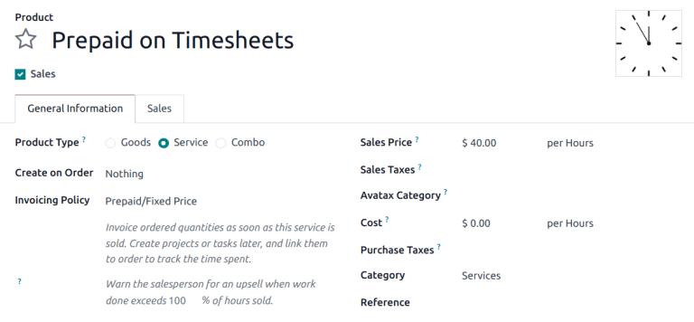
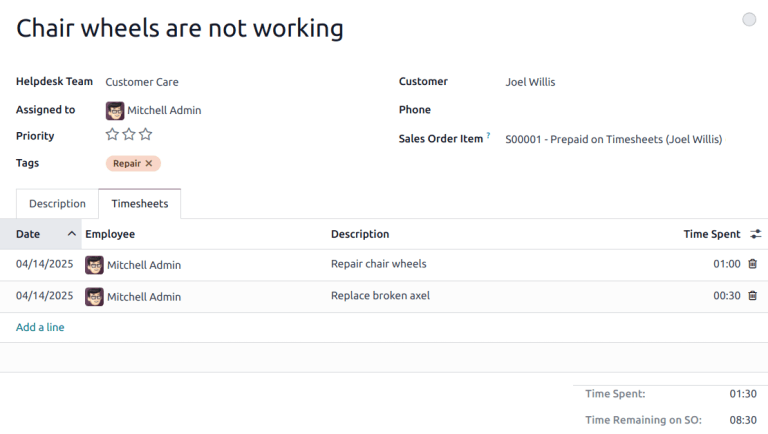

===================
Track and bill time
===================

.. |SO| replace:: :abbr:`SO (sales order)`

Odoo **Helpdesk** provides teams with the ability to track the amount of hours spent working on a
ticket, and to bill a customer for that time. Through integrations with the **Sales**,
**Timesheets**, **Project** and **Accounting** applications, customers can be charged once the work
is completed, or before it has even begun.

.. danger::
   Since the *Track & Bill Time* features require integration with other applications, enabling them
   may result in the installation of additional modules or applications.

   Installing a new application on a *One-App-Free* database triggers a 15-day trial. At the end of
   the trial, if a paid subscription has not been added to the database, it will no longer be active
   or accessible.

Configure track and bill time features
======================================

Before a customer can be invoiced for support services, the *Track & Bill Time* features **must** be
enabled on each **Helpdesk** team individually.

Enable track and bill time on a helpdesk team
---------------------------------------------

To view and enable the *Track & Bill Time* features on a **Helpdesk** team, first navigate to
:menuselection:`Helpdesk app --> Configuration --> Helpdesk Teams`. Then, select a team from the
list, or create a :doc:`new one <../../helpdesk>`. This reveals a team's settings page.

On the team's settings page, scroll to the :guilabel:`Track & Bill Time` section. Check the boxes
labeled :guilabel:`Timesheets` and :guilabel:`Time Billing`.

After the :guilabel:`Timesheets` box is checked, a new field appears, labeled :guilabel:`Project`.

.. note::
   If this is the first time this feature has been enabled on this database, the page may need to be
   manually saved and refreshed before the :guilabel:`Project` field appears.

The project selected in this field represents where all the timesheets for this team's tickets are
recorded. Click into the :guilabel:`Project` drop-down menu to select a project.

To create a new project where the timesheets are recorded, click into the :guilabel:`Project`
drop-down menu, type a name for the project, and then click :guilabel:`Create` from the drop-down
menu beneath.

.. image:: track_and_bill/track-bill-enable-settings.png
   :alt: View of a helpdesk team settings page emphasizing the track and bill time settings.

.. _helpdesk/configure-service-products:

Configure service products
~~~~~~~~~~~~~~~~~~~~~~~~~~

When the :guilabel:`Time Billing` feature is enabled, a new product is created in the **Sales** app
called *Service on Timesheets*. This product can be found under :menuselection:`Sales app-->
Products --> Products`. Then, search for `Service on Timesheets` in the search bar. This is the
product that is used when invoicing for *post-paid support services* **after** they have been
completed.

Select :guilabel:`Service on Timesheets` from the product page. This reveals the product detail
form. The product is configured with the :guilabel:`Product Type` set to :guilabel:`Service` and the
:guilabel:`Invoicing Policy` set to :guilabel:`Based on Timesheets`. Make any necessary changes to
the product record, such as the :guilabel:`Cost` or :guilabel:`Sales Price`.

.. image:: track_and_bill/track-bill-product-based-on-timesheets.png
   :alt: View of a service product with the invoicing policy set to 'Based on timesheets'.

In order to invoice for support services **before** the work has been completed (also known as
*prepaid support services*), a separate product with a different invoicing policy must be created.

To create a new service product, go to :menuselection:`Sales app --> Products --> Products`, and
click :guilabel:`New`. This reveals a blank product detail form.

On the new product form, add a :guilabel:`Product Name`, and set the :guilabel:`Product Type` to
:guilabel:`Service`. Then, set the :guilabel:`Invoicing Policy` to :guilabel:`Prepaid/Fixed Price`.
This means an invoice can be generated and payment can be received for this product before any
timesheets entries have been recorded for these services.

Finally, set the :guilabel:`Sales Price`, and confirm that the unit of measure is set to
:guilabel:`Hours`.

Invoice prepaid support services
================================

When support services are billed on a fixed price, an invoice can be created before any work is
completed on the issue. In this case, a service product with the :guilabel:`Invoicing Policy` set to
*Prepaid/Fixed Price* is used, like :ref:`the section above <helpdesk/configure-service-products>`.

Create a sales order with prepaid product
-----------------------------------------

To invoice a customer for prepaid support services, first create a sales order (SO) with the support
services product. To do this, go to :menuselection:`Sales app --> Orders --> Quotations`. Then,
click :guilabel:`New` to reveal a blank quotation form.

Then, fill out the quotation form with the customer information.

Go to the :guilabel:`Order Lines` tab of the quotation and click :guilabel:`Add a product`. Then,
select the *prepaid services product* when :ref:`configuring the service product
<helpdesk/configure-service-products>`. Update the :guilabel:`Quantity` field with the number of
hours.

After updating any other necessary information, :guilabel:`Confirm` the quotation. This converts the
quotation into an |SO|.

Create and send an invoice for prepaid services
-----------------------------------------------

After the |SO| has been confirmed, click the :guilabel:`Create Invoice` button. This opens a
:guilabel:`Create invoice(s)` pop-up window.

If no down payment is collected, the :guilabel:`Create Invoice` type can remain as
:guilabel:`Regular Invoice`. If a :doc:`down payment <../../../sales/sales/invoicing/down_payment>`
is collected, choose between either :guilabel:`Down payment (percentage)` or :guilabel:`Down payment
(fixed amount)`.

When the necessary information has been entered, click :guilabel:`Create Draft`.

The invoice can then be sent to the customer for payment.

Create helpdesk ticket for prepaid services
-------------------------------------------

To create a **Helpdesk** ticket for prepaid services, navigate to :menuselection:`Helpdesk` and
click the :guilabel:`Tickets` button to reveal a specific team's pipeline. Click :guilabel:`New` to
create a new ticket.

On the blank ticket form, create a ticket :guilabel:`Title`, and enter the :guilabel:`Customer`
information.

When the customer name is added, the :guilabel:`Sales Order Item` field automatically populates with
the most recent prepaid sales order item that has time remaining.

Track hours on helpdesk ticket
------------------------------

Time spent working on a **Helpdesk** ticket is tracked on the **Timesheets** tab on the specific
ticket.

On the ticket detail form, click on the :guilabel:`Timesheets` tab and click :guilabel:`Add a line`.
Choose an :guilabel:`Employee`, add a :guilabel:`Description` of the task, and enter the number of
:guilabel:`Hours Spent`.

As new lines are added to :guilabel:`Timesheets` tab, the :guilabel:`Remaining Hours on SO` field,
at the bottom-right of the tab, is automatically updated.

.. note::
   If the number of hours on the :guilabel:`Timesheets` tab exceeds the number of hours sold, the
   :guilabel:`Remaining Hours of SO` turns red.

   .. image:: track_and_bill/exceeded-hours-sold.png
      :alt: An example of a ticket with the number of hours exceeding the hours remaining.

As hours are added to the :guilabel:`Timesheets` tab, they are automatically updated in the
:guilabel:`Delivered` field on the |SO|, as well.

Invoice post-paid support services
==================================

When support services are billed based on the amount of time spent on an issue, an invoice cannot be
created before the total number of hours required to solve the problem have been entered on a
timesheet. In this case, a service product with the :guilabel:`Invoicing Policy` set to
:guilabel:`Based on Timesheets` is used, like the one that is automatically created after :ref:`the
Time Billing <helpdesk/configure-service-products>` feature is enabled.

Create a sales order with a time-tracked product
------------------------------------------------

To invoice a customer for post-paid support services, first create a |SO| with the *Service on
Timesheets* product. To do this, go to :menuselection:`Sales app --> Orders --> Quotations`. Then,
click :guilabel:`New` to reveal a blank quotation form.

Fill out the quotation with the customer information.

On the :guilabel:`Order Lines` tab, click :guilabel:`Add a product`. Select the :guilabel:`Service
on Timesheets` product. After updating any other necessary information, :guilabel:`Confirm` the
quotation.

.. important::
   Unlike with the prepaid services quotation, Odoo does **not** allow an invoice to be created at
   this time. Since services were **not** performed, nothing was delivered, so there is nothing to
   invoice.

Create a helpdesk ticket for time-tracked services
--------------------------------------------------

To record a timesheet entry for time-tracked services, go to the :menuselection:`Helpdesk` app, and
select the appropriate team for which these services apply.

If there is already an existing ticket for this issue, select it from the Kanban view. This opens
the ticket details form. If there is no existing ticket for this customer issue, click
:guilabel:`New` to create a new ticket and enter the necessary customer information on the blank
ticket details form.

After selecting or creating a ticket, go to the :guilabel:`Sales Order Item` drop-down menu. Select
the |SO| created in the previous step.

Track support hours on a ticket
-------------------------------

In order to create an invoice for a product based on timesheets, hours need to be tracked and
recorded. At this point, the service is considered *delivered*. To record hours for this support
service, click on the :guilabel:`Timesheets` tab of the ticket.

Click :guilabel:`Add a Line` to record a new entry. Select an :guilabel:`Employee` from the
drop-down menu, and record the time spent in the :guilabel:`Hours Spent` column.

Repeat these steps until all timesheet entries have been recorded.

.. image:: track_and_bill/track-bill-record-timesheet-hours.png
   :alt: View of the timesheets tab on a helpdesk ticket.

Create an invoice for hours tracked on a ticket
-----------------------------------------------

If no new timesheets are needed, then create an invoice and send it to the customer.

To do this, return to the |SO| by clicking on the :guilabel:`Sales Order` smart button at the top of
the ticket.

Before creating the invoice, confirm that the number in the :guilabel:`Delivered` column matches the
total number of :guilabel:`Hours Spent` listed in the :guilabel:`Timesheets` tab on the ticket.

.. image:: track_and_bill/track-bill-delivered-timesheet-hours.png
   :alt: View of a sales order with emphasis on the delivered column.

Then, click :guilabel:`Create Invoice`. This opens a :guilabel:`Create invoice(s)` pop-up window.

If no down payment is collected, the :guilabel:`Create Invoice` type can remain as
:guilabel:`Regular Invoice`. If a down payment is collected, choose between either :guilabel:`Down
payment (percentage)` or :guilabel:`Down payment (fixed amount)`.

.. important::
   Use the :guilabel:`Timesheets Period` field if this invoice should **only** include timesheets
   from a certain time period. If this field is left blank, **all** applicable timesheets that have
   not yet been invoiced are included.

When the necessary information has been entered, click :guilabel:`Create Draft`. The invoice can
then be reviewed, edited, and sent to the customer for payment.

.. seealso::
   - :doc:`../../../inventory_and_mrp/inventory/product_management/configure/uom`
   - :doc:`../../../sales/sales/invoicing/down_payment`
