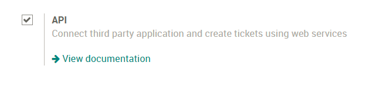
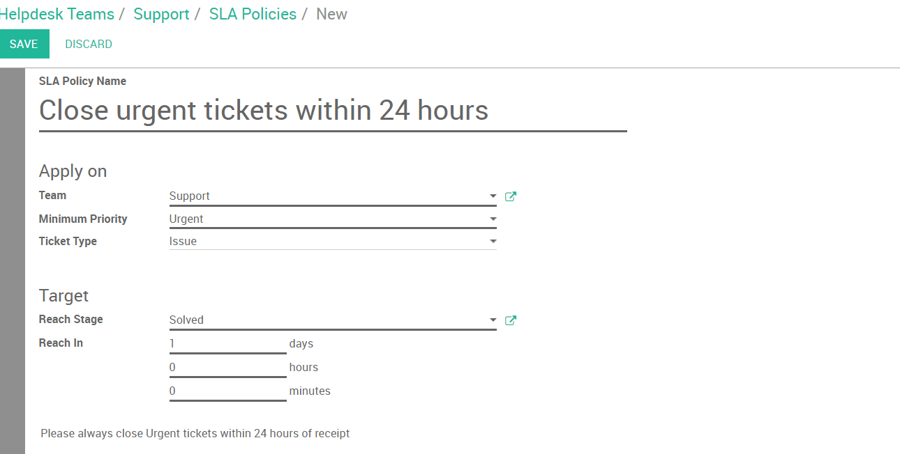

==============================
Get started with Odoo Helpdesk
==============================

Overview
========

Getting started with Odoo Helpdesk
----------------------------------

Installing Odoo Helpdesk:

Open the Apps module, search for "Helpdesk", and click install

.. image:: media/helpdesk01.png
   :align: center

Set up Helpdesk teams
---------------------

By default, Odoo Helpdesk comes with a team installed called "Support"

.. image:: media/helpdesk02.png
   :align: center

To modify this team, or create additional teams, select "Configuration"
in the purple bar and select "Settings"

.. image:: media/helpdesk03.png
   :align: center

Here you can create new teams, decide what team members to add to this
team, how your customers can submit tickets and set up SLA policies and
ratings. For the assignation method you can have tickets assigned
randomly, balanced, or manually.

How to set up different stages for each team
--------------------------------------------

First you will need to activate the developer mode. To do this go to
your settings module, and select the link for "Activate the developer
mode" on the lower right-hand side.

.. image:: media/helpdesk04.png
   :align: center

Now, when you return to your Helpdesk module and select "Configuration"
in the purple bar you will find additional options, like "Stages". Here
you can create new stages and assign those stages to 1 or multiple teams
allowing for customizable stages for each team!

Start receiving tickets
=======================

How can my customers submit tickets?
------------------------------------

Select "Configuration" in the purple bar and select "Settings", select
your Helpdesk team. Under "Channels you will find 4 options:

.. image:: media/helpdesk05.png
   :align: center

Email Alias allows for customers to email the alias you choose to create
a ticket. The subject line of the email with become the Subject on the
ticket.

.. image:: media/helpdesk06.png
   :align: center

Website Form allows your customer to go to
yourwebsite.com/helpdesk/support-1/submit and submit a ticket via a
website form - much like odoo.com/help!

.. image:: media/helpdesk07.png
   :align: center

Live Chat allows your customers to submit a ticket via Live Chat on your
website. Your customer will begin the live chat and your Live Chat
Operator can create the ticket by using the command /helpdesk Subject of
Ticket.

The final option to submit tickets is thru an API connection. View the
documentation
`*here* <https://www.odoo.com/documentation/12.0/webservices/odoo.html>`__.

Tickets have been created, now what?
------------------------------------

Now your employees can start working on them! If you have selecting a
manual assignation method then your employees will need to assign
themselves to tickets using the "Assign To Me" button on the top left of
a ticket or by adding themselves to the "Assigned to" field.

.. image:: media/helpdesk09.png
   :align: center

If you have selected "Random" or "Balanced" assignation method, your
tickets will be assigned to a member of that Helpdesk team.

From there they will begin working on resolving the tickets! When they
are completed, they will move the ticket to the solved stage.

How do I mark this ticket as urgent?
------------------------------------

On your tickets you will see stars. You can determine how urgent a
ticket is but selecting one or more stars on the ticket. You can do this
in the Kanban view or on the ticket form.

.. image:: media/helpdesk10.png
   :align: center

To set up a Service Level Agreement Policy for your employees, first
activate the setting under "Settings"

.. image:: media/helpdesk11.png
   :align: center

From here, select "Configure SLA Policies" and click "Create".

You will fill in information like the Helpdesk team, what the minimum
priority is on the ticket (the stars) and the targets for the ticket.

What if a ticket is blocked or is ready to be worked on?
--------------------------------------------------------

If a ticket cannot be resolved or is blocked, you can adjust the "Kanban
State" on the ticket. You have 3 options:

- Grey - Normal State

- Red - Blocked

- Green - Ready for next stage

Like the urgency stars you can adjust the state in the Kanban or on the
Ticket form.

.. image:: media/helpdesk13.png
   :align: center

How can my employees log time against a ticket?
-----------------------------------------------

First, head over to "Settings" and select the option for "Timesheet on
Ticket". You will see a field appear where you can select the project
the timesheets will log against.

.. image:: media/helpdesk14.png
   :align: center

Now that you have selected a project, you can save. If you move back to
your tickets, you will see a new tab called "Timesheets"

Here you employees can add a line to add work they have done for this
ticket.

How to allow your customers to rate the service they received
-------------------------------------------------------------

First, you will need to activate the ratings setting under "Settings"

.. image:: media/helpdesk16.png
   :align: center

Now, when a ticket is moved to its solved or completed stage, it will
send an email to the customer asking how their service went.
