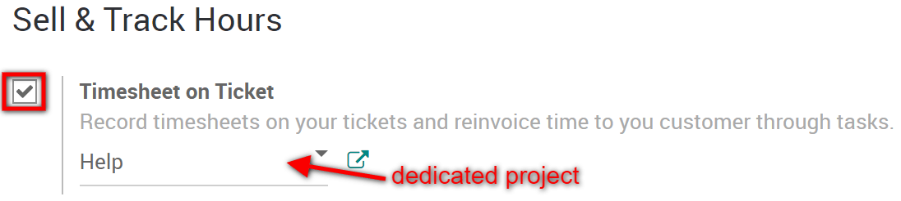
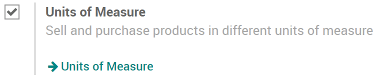
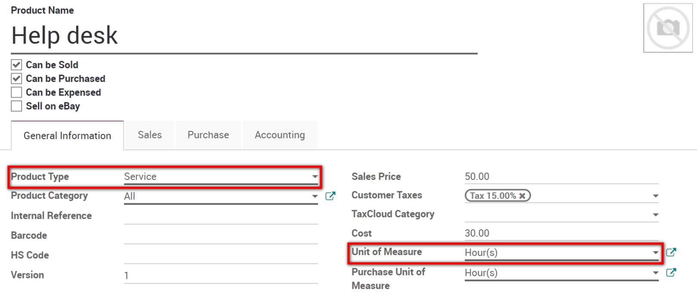
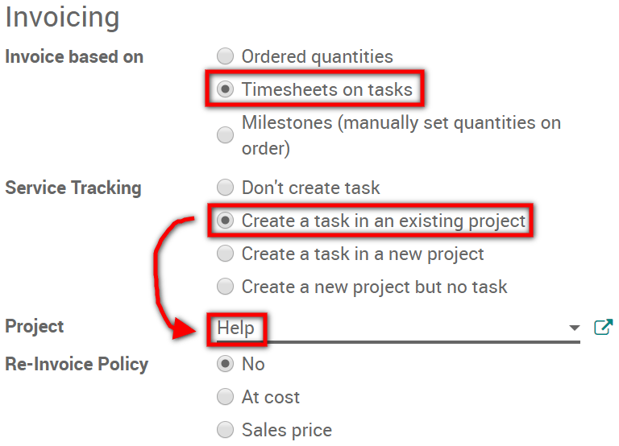
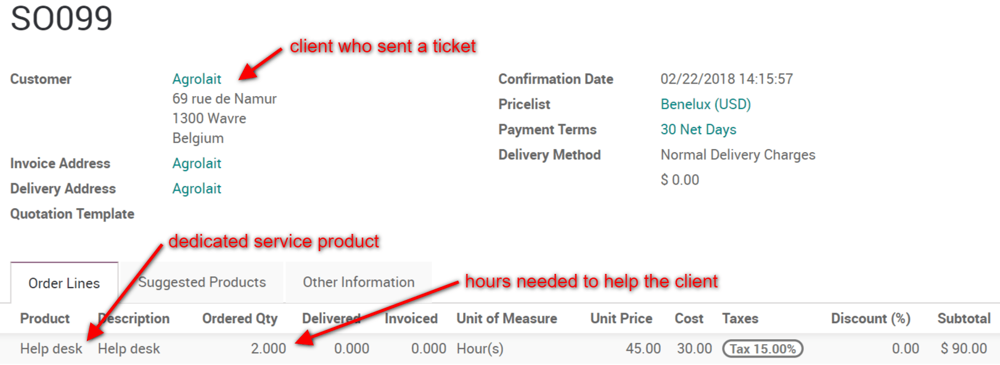
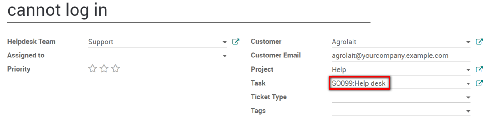
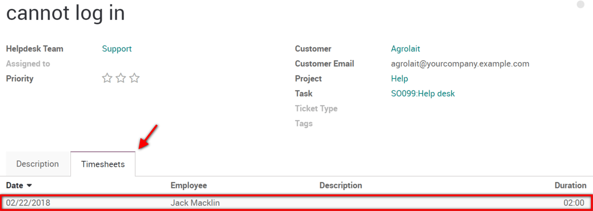
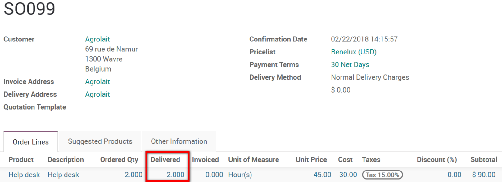

===================================
Record and invoice time for tickets
===================================

You may have service contracts with your clients to provide them
assistance in case of a problem. For this purpose, Odoo will help you
record the time spent fixing the issue and most importantly, to invoice
it to your clients.

The modules needed
==================

In order to record and invoice time for tickets, the following modules
are needed : Helpdesk, Project, Timesheets, Sales. If you are missing
one of them, go to the Apps module, search for it and then click on
*Install*.

Get started to offer the helpdesk service
=========================================

Step 1 : start a helpdesk project
---------------------------------

To start a dedicated project for the helpdesk service, first go to
:menuselection:`Project --> Configuration --> Settings` and make sure
that the *Timesheets* feature is activated.

Then, go to your dashboard, create the new project and allow timesheets
for it.

Step 2 : gather a helpdesk team
-------------------------------

To set a team in charge of the helpdesk, go to :menuselection:`Helpdesk
--> Configuration --> Helpdesk Teams` and create a new team or select
an existing one. On the form, tick the box in front of *Timesheet on
Ticket* to activate the feature. Make sure to select the helpdesk
project you have previously created as well.

Step 3 : launch the helpdesk service
------------------------------------

Finally, to launch the new helpdesk service, first go to
:menuselection:`Sales --> Configuration --> Settings` and make sure
that the *Units of Measure* feature is activated.

Then, go to :menuselection:`Products --> Products` and create a new
one. Make sure that the product is set as a service.

.. note::
   Here, we suggest that you set the *Unit of Measure* as
   *Hour(s)*, but any unit will do.

Finally, select the invoicing management you would like to have under
the *Sales* tab of the product form. Here, we recommend the following
configuration :

Now, you are ready to start receiving tickets !

Solve issues and record time spent
==================================

Step 1 : place an order
-----------------------

You are now in the Helpdesk module and you have just received a ticket
from a client. To place a new order, go to :menuselection:`Sales -->
Orders --> Orders` and create one for the help desk service product you
have previously recorded. Set the number of hours needed to assist the
client and confirm the sale.

Step 2 : link the task to the ticket
------------------------------------

If you access the dedicated helpdesk project, you will notice that a new
task has automatically been generated with the order. To link this task
with the client ticket, go to the Helpdesk module, access the ticket in
question and select the task on its form.

Step 3 : record the time spent to help the client
-------------------------------------------------

The job is done and the client's issue is sorted out. To record the
hours performed for this task, go back to the ticket form and add them
under the *Timesheets* tab.

.. tip::
   The hours recorded on the ticket will also automatically appear
   in the Timesheet module and on the dedicated task.

Step 4 : invoice the client
---------------------------

To invoice the client, go back to the Sales module and select the order
that had been placed. Notice that the hours recorded on the ticket form
now appear as the delivered quantity.

All that is left to do, is to create the invoice from the order and then
validate it. Now you just have to wait for the client's payment !
