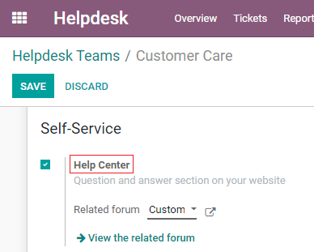
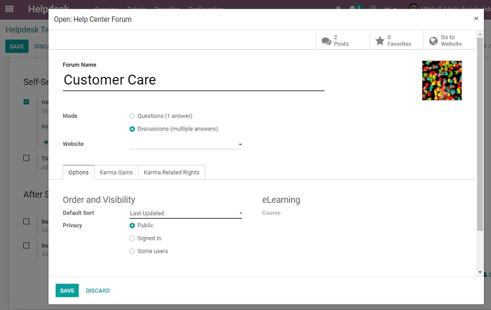
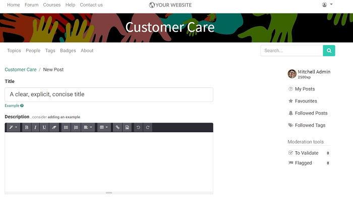
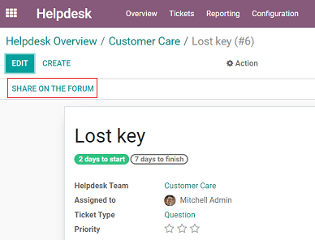
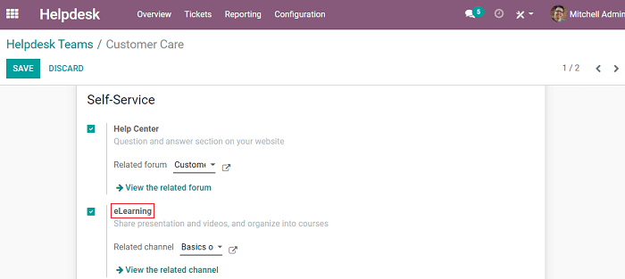
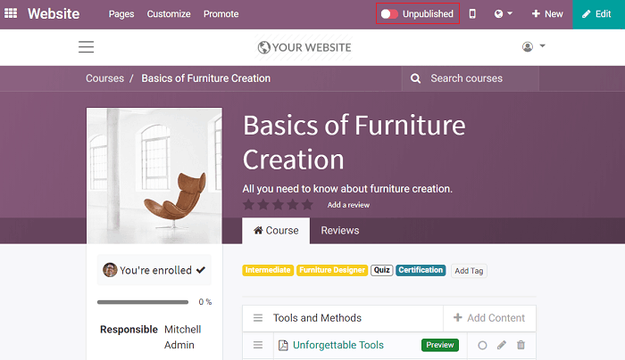
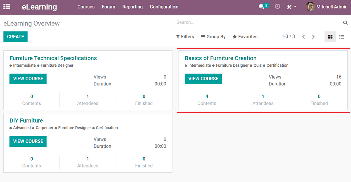

===================
Forum and eLearning
===================

Forum
=====

Phone lines, email support, and live chat are necessary for excellent customer service, but
adding a support forum can improve satisfaction rates and build a loyal community. A forum
encourages customer engagement, knowledge sharing, and brand trust. By providing a space for
questions and conversation, you'll gain valuable business insights, and your
customers will be happier.

Set up
------

Go to :menuselection:`Helpdesk --> Configuration --> Helpdesk Team`, select a Helpdesk Team, and
turn on *Help Center* under Self-Service.

         Odoo Helpdesk

Click on the external link to create or edit a forum. Among the editing options, choose
if you would like the *Forum Mode* to be *Questions* (only one answer is allowed per question) or
*Discussions* (multiple answers are allowed per question).

After clicking *Save*, logged in users can now start their discussions. To keep track of posts,
go to
:menuselection:`Website --> Forum --> Posts`.

Turn tickets into forum posts by simply clicking *Share on the Forum* on the ticket form.

eLearning
=========

In addition to a forum, online courses can improve customer experience and save your support team
valuable time. Your customers can find answers themselves through tutorials, and your team
can send links to helpful content rather than writing out lengthy emails.

Set up
------

Go to :menuselection:`Helpdesk --> Configuration --> Helpdesk Teams`, select a Helpdesk Team, and
enable *eLearning* under Self-Service.

         Odoo Helpdesk

Click on the external link to create or edit an eLearning channel.

.. image:: forum_and_elearning/customer-care-basics-furniture-creation.png
   :align: center
   :alt: Overview of the settings page of an eLearning course emphasizing the feature elearning in
         Odoo Helpdesk

Once the structure and content of your course are ready, *Publish* by clicking on *Unpublished*.

Use the *eLearning app* for an overview of all your courses and to keep track of course
statistics, attendees, views, reviews, and more.

.. todo:: DETAILS/INFO SHOULD COME FROM ELEARNING DOCS. THEREFORE, LINK DOCS ONCE AVAILABLE!