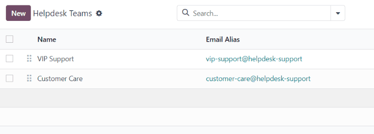
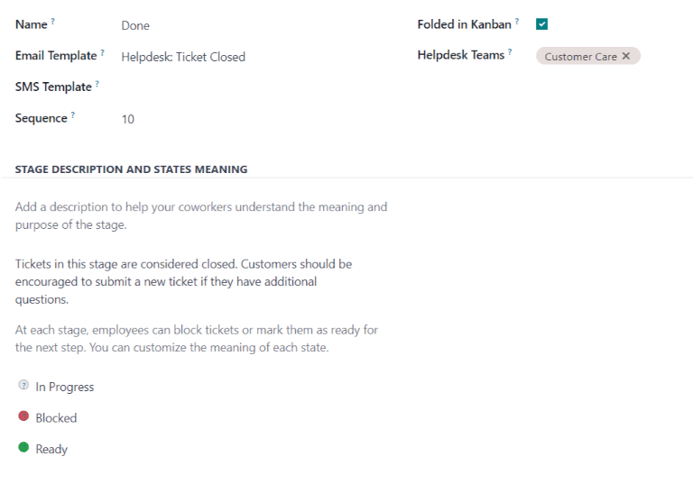
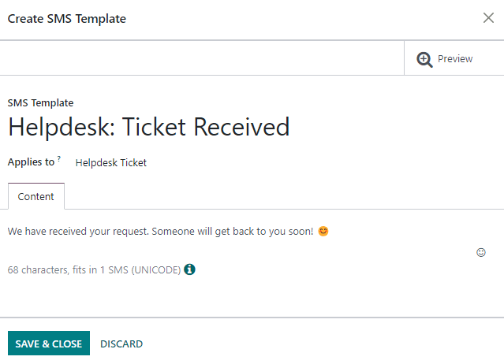
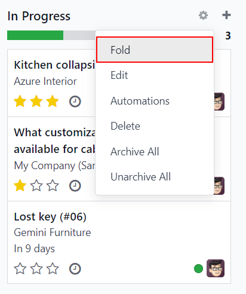

=============================
Getting started with Helpdesk
=============================

Odoo *Helpdesk* is a ticketing-based customer support application. Multiple teams can be configured
and managed in one dashboard, each with their own pipeline for tickets submitted by customers.
Pipelines are organized in customizable stages that enable teams to track, prioritize, and solve
customer issues quickly and efficiently.

Create a Helpdesk team
======================

To view or modify *Helpdesk* teams, go to :menuselection:`Helpdesk app --> Configuration -->
Helpdesk Teams`. To create a new team, click the :guilabel:`New` button in the top-left of the
dashboard.

On the blank Helpdesk team form, enter a :guilabel:`Name` for the new team. Then, enter a
description of the team in the field below the team name, if desired. To change the company this
team is assigned to, select it from the :guilabel:`Company` drop-down menu.

.. important::
   The team description is published on the public facing :doc:`website form <receiving_tickets>`,
   where customers and portal users submit tickets. The description included in this field should
   **not** include any information that is for internal use only.

   .. image:: getting_started/team-description-webform.png
      :align: center
      :alt: View of a Helpdesk team's website form displaying the team description.

Visibility & Assignment
-----------------------

The *Visibility* settings alter which internal users and portal users have access to this team and
its tickets. The *Assignment* settings alter how users are assigned to handle each ticket.

Determine team visibility
~~~~~~~~~~~~~~~~~~~~~~~~~

Under the :guilabel:`Visibility` section, select one of the following options to determine who can
view this team and its tickets:

- :guilabel:`Invited internal users (private)`: internal users can access the team and the tickets
  they are following. This access can be modified on each ticket individually by adding or removing
  the user as a follower. Internal users are considered *invited* once they are added as followers
  to an individual ticket, or :ref:`to the team itself <helpdesk/getting_started/follow>`.
- :guilabel:`All internal users (company)`: all internal users can access the team and all of its
  tickets.
- :guilabel:`Invited portal users and all internal users (public)`: all internal users can access
  the team and all of its tickets. Portal users can only access the tickets they are following.

.. example::
   A `Customer Support` team, meant to handle general shipping and product issues, would have the
   visibility set on :guilabel:`Invited portal users and all internal users`.

   At the same time, a `Financial Services` team handling tickets related to accounting or tax
   information would only need to be visible to :guilabel:`Invited internal users`.

.. warning::
   A team's visibility can be altered after the initial configuration. However, if the team changes
   from public access to either private or company-only access, portal users are removed as
   followers from both the team, and from individual tickets.

.. _helpdesk/getting_started/follow:

Follow all team's tickets
~~~~~~~~~~~~~~~~~~~~~~~~~

If a user should be notified about any updates regarding tickets for this team, select their name
from the :guilabel:`Followers` drop-down menu, located in the :guilabel:`Follow All Team's Tickets`
field. Multiple users can be selected to follow a single team.

.. important::
   External contacts can be selected in the :guilabel:`Followers` field. If the team's visibility is
   set to :guilabel:`Invited internal users (private)`, followers are notified about updates to the
   team's tickets, but are **not** able to view them in the portal.

Automatically assign new tickets
~~~~~~~~~~~~~~~~~~~~~~~~~~~~~~~~

When tickets are received, they need to be assigned to a member of the team. This is done either
manually on each ticket individually, or through :guilabel:`Automatic Assignment`. Check the
:guilabel:`Automatic Assignment` checkbox to enable this feature for the team.

.. image:: getting_started/helpdesk-visibility-assignment.png
   :align: center
   :alt: View of a Helpdesk team settings page emphasizing the automatic assignment features in Odoo
         Helpdesk.

As soon as :guilabel:`Automatic Assignment` has been enabled, additional fields appear.

Select one of the following assignment methods, based on how the workload should be allocated across
the team:

- :guilabel:`Each user is assigned an equal number of tickets`: tickets are assigned to team members
  based on total ticket count, regardless of the number of open or closed tickets they are
  currently assigned.
- :guilabel:`Each user has an equal number of open tickets`: tickets are assigned to team members
  based on how many open tickets they are currently assigned.

.. note::
   When :guilabel:`Each user is assigned an equal number of tickets` is selected, the overall number
   of tickets assigned to team members is the same, but it does **not** consider the current
   workload.

   When :guilabel:`Each user has an equal number of open tickets` is selected, it ensures a balanced
   workload among team members, as it takes the current number of active tickets into account.

Finally, add the :guilabel:`Team Members` who are to be assigned tickets for this team. Leave the
field empty to include all employees who have the proper assignments and access rights configured in
their user account settings.

.. important::
   If an employee has time off scheduled in the *Time Off* application, they are **not** assigned
   tickets during that time. If no employees are available, the system looks ahead until there is a
   match.

.. seealso::
   - :ref:`Manage users <users/add-individual>`
   - :doc:`Access rights <../../../general/users/access_rights>`

Create or modify stages
=======================

*Stages* are used to organize the *Helpdesk* pipeline and track the progress of tickets. Stages are
customizable, and can be renamed to fit the needs of each team.

.. important::
   :ref:`Developer mode <developer-mode>` **must** be activated to access the stages menu. To
   activate developer mode, go to :menuselection:`Settings app --> General Settings --> Developer
   Tools`, and click :guilabel:`Activate the developer mode`.

To view or modify *Helpdesk* stages, go to :menuselection:`Helpdesk app --> Configuration -->
Stages`.

The default list view on the :guilabel:`Stages` page displays the stages currently available in
*Helpdesk*. They are listed in the order they appear in the pipeline.

To change the order of the stages, click the :guilabel:`(six square)` icon, to the left of the stage
name, and drag it to the desired place on the list.

.. image:: getting_started/stages-list-buttons.png
   :align: center
   :alt: View of the stage list page emphasizing the buttons used to change the order the stages
         appear in the list.

.. tip::
   Change the stage order on the Kanban view of a *Helpdesk* team's pipeline by dragging and
   dropping individual columns.

To create a new stage, click the :guilabel:`New` button at the top-left of the stage list. Doing so
reveals a blank stage form.

Choose a :guilabel:`Name` for the new stage, and add a description, if desired. Then, proceed to
fill out the remaining fields following the steps below.

Add email and SMS templates to stages
-------------------------------------

When an :guilabel:`Email Template` is added to a stage, an email is automatically sent to the
customer when a ticket reaches that specific stage in the pipeline. Likewise, adding an
:guilabel:`SMS Template` triggers an SMS text message to send to the customer.

.. important::
   SMS Text Messaging is an :doc:`In-App Purchase (IAP) <../../../general/in_app_purchase/>` service
   that requires prepaid credits to work. Refer to `SMS Pricing FAQ
   <https://iap-services.odoo.com/iap/sms/pricing>`_ for additional information.

To select an existing email template, select it from the :guilabel:`Email Template` field. Click on
the :guilabel:`→ (Internal Link)` icon to the right of the field to edit the chosen template.

To create a new template, click the field, and enter a title for the new template. Then, select
:guilabel:`Create and edit` from the drop-down menu that appears, and complete the form details.

Follow the same steps to select, edit, or create an :guilabel:`SMS Template`.

.. seealso::
   :doc:`../../../general/email_communication/email_template`

Assign stages to a team
-----------------------

Make a selection in the :guilabel:`Helpdesk Teams` field on the :guilabel:`Stages` form. More than
one team may be selected, since the same stage can be assigned to multiple teams.

Fold a stage
------------

By default, stages are unfolded in the Kanban view of either tickets dashboard: :guilabel:`My
Tickets` (:menuselection:`Helpdesk app --> Tickets --> My Tickets`) or :guilabel:`All Tickets`
(:menuselection:`Helpdesk app --> Tickets --> All Tickets`).

Tickets in an unfolded stage are visible in the pipeline under the stage name, and are considered
*open*.

Stages can be configured to be folded in the Kanban view of a tickets page (:guilabel:`My Tickets`
or :guilabel:`All Tickets`).

The name of the folded stages are still visible, though the tickets in the stage are no longer
immediately visible.

To fold a stage, check the :guilabel:`Folded in Kanban` box on the :guilabel:`Stages` form.

.. warning::
   Tickets that reach a *folded* stage are considered *closed*. Closing a ticket before the work is
   completed can result in reporting and communication issues. This setting should **only** be
   enabled for stages that are considered *closing* stages.

Stages can be temporarily folded in the Kanban view of the tickets pipeline, as well.

View a specific team's pipeline by navigating to :menuselection:`Helpdesk app`, and clicking the
team's Kanban card.

Select a stage to fold temporarily, then click the :guilabel:`⚙️ (gear)` icon, and select
:guilabel:`Fold`.

.. important::
   Manually folding a stage from the Kanban view is temporary and does **not** close the tickets in
   the stage.
