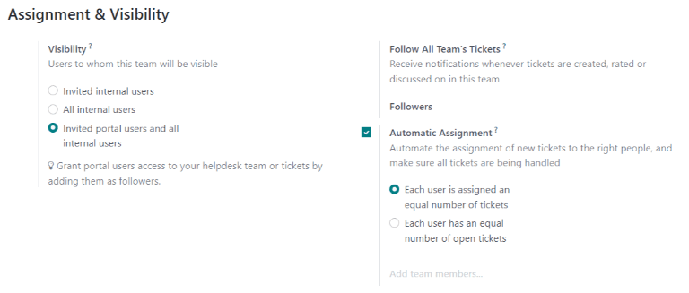
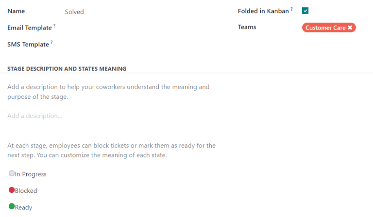

=============================
Getting started with Helpdesk
=============================

Odoo :guilabel:`Helpdesk` is a ticket-based customer support application. Teams can track,
prioritize, and solve customer issues from their pipeline, which is organized in customizable
stages. Multiple teams can be configured and managed in one dashboard.

Create Helpdesk teams
=====================

Setting up multiple teams allows for tickets to be grouped by location or by support type.

To view or modify *Helpdesk* teams, go to :menuselection:`Helpdesk --> Configuration --> Teams`. To
create a new team, click on the :guilabel:`New` button in the top left of the dashboard. From there,
name the new team, and fill out the remaining fields as defined in the following sections on the
form.

.. image:: getting_started/helpdesk-teams-list.png
   :align: center
   :alt: View of the Helpdesk teams page in Odoo Helpdesk

Assignment & Visibility
-----------------------

Determine to whom the team will be visible
~~~~~~~~~~~~~~~~~~~~~~~~~~~~~~~~~~~~~~~~~~

Under the :guilabel:`Visibility` section, determine who can view this team and its tickets.

- :guilabel:`Invited internal users` have access to the team and tickets they are following. This
  can be modified on each individual ticket.
- :guilabel:`All internal users` have access to the team and all of its tickets without being a
  follower.
- :guilabel:`Invited portal users and all internal users` have access to the team without being a
  follower. Portal users will only be able to access tickets that they are following.

.. example::
   A `Customer Support` team intended to handle general issues with shipping and product issues
   would have the visibility setting :guilabel:`Invited portal users and all internal users`.
   However, a `Financial Services` team handling tickets related to accounting or tax information
   would only need to be visible to :guilabel:`Invited internal users`.

Automatically assign new tickets
~~~~~~~~~~~~~~~~~~~~~~~~~~~~~~~~

When tickets are received, they will need to be assigned to a member of the support team. This can
be done manually on each ticket individually, or through :guilabel:`Automatic Assignment`. Check the
box next to :guilabel:`Automatic Assignment` to enable the feature for this team.

         in Odoo Helpdesk

Select one of the following assignment methods, based on how workload should be allocated across
the team:

- :guilabel:`Each user is assigned an equal number of tickets` assigns tickets to team members
   based on total ticket count, regardless of the number of open or closed tickets they are
   currently assigned.
- :guilabel:`Each user has an equal number of open tickets` assigned tickets to team members based
   on how many open tickets they are currently assigned. This option is useful for automatically
   delegating a heavier workload to high-performers who tend to close tickets quickly.

Finally, add the :guilabel:`Team Members` who will be assigned tickets for this team. Leave the
field empty to include all employees who have the proper assignments and access rights configured in
their user account settings.

.. note::
   If an employee has time off scheduled in the :guilabel:`Time Off` application, they will not be
   assigned tickets during that time. If no employees are available, the system will look ahead
   until there is a match.

.. seealso::
   - :ref:`Manage users <users/add-individual>`
   - :doc:`Access rights </applications/general/users/access_rights>`

Create or modify kanban stages
==============================

:guilabel:`Stages` are used to organize the *Helpdesk* pipeline and track the progress of tickets.
Stages are customizable, and can be renamed to fit the needs of each team.

To view or modify *Helpdesk* stages, go to :menuselection:`Helpdesk --> Configuration --> Stages`.

.. important::
   :ref:`Developer mode <developer-mode>` must be activated in order to access the stages menu. To
   activate developer mode go to :menuselection:`Settings --> General Settings --> Developer Tools`
   and click on :guilabel:`Activate the developer mode`.

The list view shows an overview of all the stages currently available in Helpdesk. They are listed
in the order they appear in the pipeline. To change the order of the stages, use the arrow buttons
on the left side of the list.

.. tip::
   Change the stage order on the kanban view by dragging and dropping individual columns.

.. image:: getting_started/stages-create-new.png
   :align: center
   :alt: View of the stage list page emphasizing the option to create a new stage

To create a new stage, click on the :guilabel:`New` button in the top left of the dashboard.
Next, choose a name for the new stage, and add a description (though it is not required).
Fill out the remaining fields following the steps below.

Add email and SMS templates to stages
-------------------------------------

When an :guilabel:`Email Template` is added to a stage, an email is automatically sent to the the
customer when a ticket reaches that specific stage in the helpdesk pipeline. Likewise, adding an
:guilabel:`SMS Template` will result in an SMS text message being sent to the customer.

.. important::
   SMS Text Messaging is an In-App Purchase (IAP) service that requires prepaid credits to work.
   Refer to `SMS Pricing FAQ <https://iap-services.odoo.com/iap/sms/pricing>`_ for additional
   information.

To select an existing email template, select it from the :guilabel:`Email Template` field. Click on
the arrow key to the right of the field to edit the template.

To create a new template, click the field and begin typing a new template title. Then select
:guilabel:`Create and edit`, and complete the form details.

Follow the same steps to select, edit, or create an :guilabel:`SMS Template`.

.. image:: getting_started/sms-template.png
   :align: center
   :alt: View of an SMS template setup page in Odoo Helpdesk

.. seealso::
   :doc:`/applications/general/companies/email_template`

Assign stages to a team
-----------------------

Make a selection in the :guilabel:`Teams` field on the :guilabel:`Stages` form. More than one team
may be selected, since the same stage(s) can be assigned to multiple teams.

 .. image:: getting_started/stages-settings-sharing.png
   :align: center
   :alt: View of stage setup emphasizing teams field

Fold a stage
------------

Check the :guilabel:`Folded in Kanban` box on the :guilabel:`Stages` form to display this stage as
*folded* by default in the kanban view for this team.

.. warning::
   Tickets that reach a *folded* stage are considered closed. Closing a ticket before the work is
   completed can result in reporting and communication issues. This setting should only be enabled
   for stages that are considered *closing* stages.

Alternatively, stages can be temporarily folded in the kanban view, by clicking on the settings
icon and selecting :guilabel:`Fold`.

.. note::
   Manually folding a stage from the kanban view will not close the tickets in the stage.
