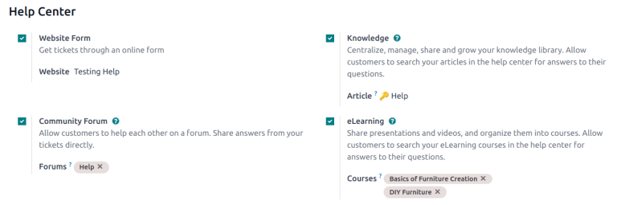
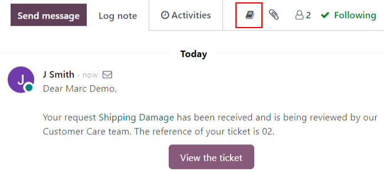
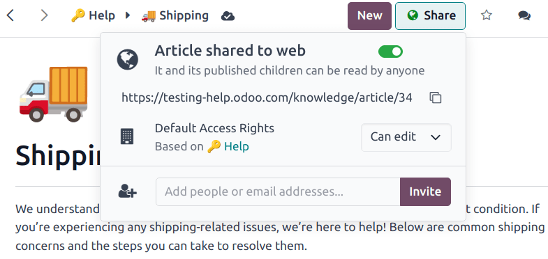
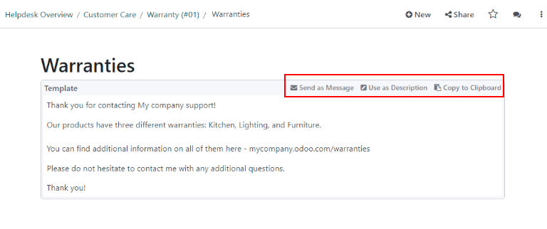
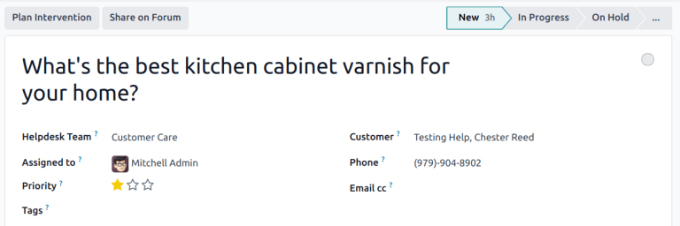
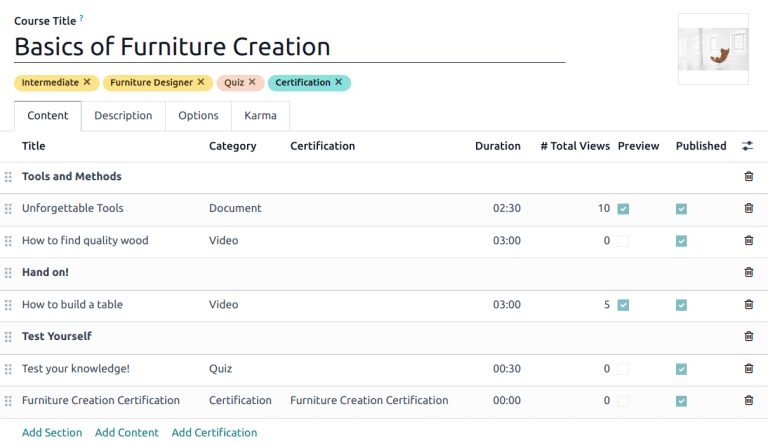
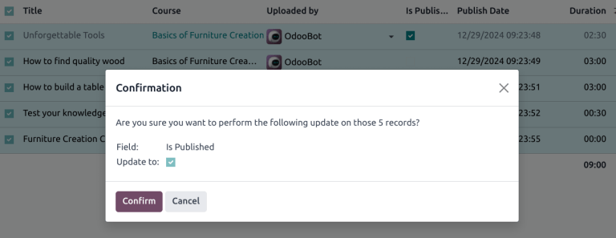

===========
Help center
===========

Odoo *Helpdesk* integrates with the *Forum*, *eLearning*, and *Knowledge* apps to create the *help
center*.

The *help center* is a centralized location where teams and customers can search for and share
detailed information about products and services.

.. note::
   In order to activate any of these features on a *Helpdesk* team, (*Forums*, *eLearning*, or
   *Knowledge*), the :guilabel:`Visibility` of the team has to be set to :guilabel:`Invited portal
   users and all internal users`. See :doc:`Getting Started
   </applications/services/helpdesk/overview/getting_started>` for more information on *Helpdesk*
   team settings and configuration.

.. warning::
   Since all of the *help center* features require integration with other applications, enabling any
   of them may result in the installation of additional modules or applications.

   Installing a new application on a *One-App-Free* database will trigger a 15-day trial. At the end
   of the trial, if a paid subscription has not been added to the database, it will no longer be
   active or accessible.

Knowledge
=========

Odoo's *Knowledge* application is a collaborative library where users can store, edit, and share
information. The *Knowledge* app is represented throughout the database by a *book* icon.

Enable Knowledge on a Helpdesk team
-----------------------------------

To enable the *Knowledge* feature on a *Helpdesk* team, go to :menuselection:`Helpdesk -->
Configuration --> Teams` and select a team, or create a :doc:`new one
</applications/services/helpdesk/overview/getting_started>`.

When a team has been selected or created, Odoo displays that team's detail form.

On the team's detail form, scroll down to the :guilabel:`Self-Service` section. Click the box next
to :guilabel:`Knowledge` to activate the *Knowledge* feature. When clicked, a new field labeled
:guilabel:`Article` appears.

Clicking the :guilabel:`Article` field reveals a drop-down menu. At first, there is only one option
in the drop-down menu titled :guilabel:`Help`, which Odoo provides by default. Select
:guilabel:`Help` from the drop-down menu to choose this article.

.. tip::
   To create a new article, go to the :menuselection:`Knowledge app`, then hover the cursor next to
   the :guilabel:`Workspace` section heading, located in the left sidebar. Moving the cursor there
   reveals a hidden :guilabel:`➕ (plus sign)` icon.

   Click the :guilabel:`➕ (plus sign)` to create a new article in the :guilabel:`Workspace`. In the
   upper right corner of the page, click the :guilabel:`Share` button, and slide the
   :guilabel:`Share to Web` toggle switch until it reads :guilabel:`Article Published`. It can then
   be added to a *Helpdesk* team.

Once an article has been created and assigned to a *Helpdesk* team, content can be added and
organized through the *Knowledge* app.

.. seealso::
   :doc:`Editing Knowledge articles </applications/productivity/knowledge/articles_editing>`

Search articles from a Helpdesk ticket
--------------------------------------

When members of a *Helpdesk* team are trying to solve a ticket, they can search through the content
in the *Knowledge* app for more information on the issue.

To search *Knowledge* articles, open a ticket — either from the *Helpdesk* app dashboard, or by
going to :menuselection:`Helpdesk app --> Tickets --> All Tickets`, and selecting a
:guilabel:`Ticket` from the list.

When a :guilabel:`Ticket` is selected, Odoo reveals that ticket's detail form.

Click the :guilabel:`Knowledge (book)` icon, located above the chatter to open a search window.

.. image:: help_center/help-center-knowledge-search.png
   :align: center
   :alt: View of knowledge search window from a helpdesk ticket.

.. tip::
   *Knowledge* articles can also be searched by pressing :command:`Ctrl + K` to open the command
   palette, then typing :command:`?`, followed by the name of the desired article.

When Odoo reveals the desired article, click it, or highlight the :guilabel:`Article` title, and
press :command:`Enter`. This will open the article in the :guilabel:`Knowledge` application.

To open the article in a new tab, press :command:`Ctrl + Enter`.

.. tip::
   If a more in-depth search is required, press :command:`Alt + B`. That will reveal a separate
   page, in which a more detailed search can occur.

Share articles to the help center
~~~~~~~~~~~~~~~~~~~~~~~~~~~~~~~~~

In order for a *Knowledge* article to be available to customers and website visitors, it has to be
published.

.. note::
   Even though the *Help* article has been enabled on a team, Odoo will not share all the nested
   articles to the web. Individual articles intended for customers **must** be published for them to
   be viewable on the website.

To publish an article, navigate to the desired article, by following the above steps, and click
the :guilabel:`Share` icon in the upper-right corner. This will reveal a menu. Slide the toggle
button labeled :guilabel:`Share to Web` to read :guilabel:`Article Published`.

Solve tickets with templates
----------------------------

*Template* boxes can be added to *Knowledge* articles to allow content to be reused, copied, sent as
messages, or added to the description on a ticket. This allows teams to maintain consistency when
answering customer tickets, and minimize the amount of time spent on responding to repeat questions.

Add templates to articles
~~~~~~~~~~~~~~~~~~~~~~~~~

To create a template, go to :menuselection:`Knowledge --> Help`. Click on an existing nested article
or create a new one by clicking the :guilabel:`➕ (plus sign)` icon next to *Help*.

Type `/` to open the :guilabel:`Powerbox` and view a list of :doc:`commands
</applications/productivity/knowledge/articles_editing>`. Select or type `template`. A gray template
block will be added to the page. Add any necessary content to this block.

.. note::
   Templates will only display the :guilabel:`Use as description` or :guilabel:`Send as Message`
   options if they are accessed directly from *Helpdesk*.

Use templates in tickets
~~~~~~~~~~~~~~~~~~~~~~~~

Templates can be used to respond directly to a *Helpdesk* ticket as a message, or to add information
to the ticket's description.

To use templates in a *Helpdesk* ticket, first, open a ticket, either from the :guilabel:`Helpdesk`
dashboard or by going to :menuselection:`Helpdesk --> Tickets --> All Tickets` and selecting a
:guilabel:`Ticket` from the list.

Click on the :guilabel:`Knowledge (book)` icon above the chatter for the ticket. This opens a search
window. In this search window, select, or search for the desired article. Doing so reveals that
article page in the Odoo *Knowledge* application.

To use a template to respond to a ticket, click :guilabel:`Send as message` in the upper right
corner of the template box, located in the body of the article.

Doing so opens a :guilabel:`Compose email` pop-up window. In this window, select the recipients,
make any necessary additions or edits to the template, then click :guilabel:`Send`.

.. tip::
   To use a template to add information to a ticket's description, click :guilabel:`Use as
   description` in the upper right corner of the template box, located in the body of the article.
   Doing so will not replace the existing text in a ticket's description. The template will be added
   as additional text.

.. _helpdesk/forum:

Community Forum
===============

A *Community Forum* provides a space for customers to answer each other's questions and share
information. By integrating a forum with a *Helpdesk* team, tickets submitted by customers can be
converted to posts and shared.

Enable forums on a Helpdesk team
--------------------------------

To enable :guilabel:`Community Forums` on a *Helpdesk* team, start by navigating to
:menuselection:`Helpdesk app --> Configuration --> Teams` and select a team, or create a :doc:`new
one </applications/services/helpdesk/overview/getting_started>`.

Selecting or creating a team reveals that team's detail form. Scroll down to the
:guilabel:`Self-Service` section of features, and enable :guilabel:`Community Forum`, by checking
the box beside it.

When activated, a new field labeled :guilabel:`Forums` appears beneath.

Click the empty :guilabel:`Forums` field to reveal a drop-down menu. By default, there is only one
option to begin with, labeled :guilabel:`Help`. That is the option Odoo automatically created when
the :guilabel:`Community Forums` feature was enabled. Select :guilabel:`Help` from the drop-down
menu to enable that forum.

To create a new forum, type a name into the blank :guilabel:`Forums` field, then click the
:guilabel:`Create and Edit` option. Multiple forums can be selected in this field.

.. seealso::
   Check out the :doc:`Forum documentation <../../../websites/forum>` to learn how to configure,
   use, and moderate a forum.

Create a forum post from a Helpdesk ticket
------------------------------------------

When a *Helpdesk* team has a *Forum* enabled, tickets submitted to that team can be converted to
forum posts.

To do that, select a ticket, either from a team's pipeline or from :menuselection:`Tickets --> All
Tickets` in the :guilabel:`Helpdesk` application.

At the top of the ticket detail form, click the :guilabel:`Share on Forum` button.

When clicked, a pop-up appears. Here, the post and title can be edited to correct any typos, or
modified to remove any proprietary or client information. :guilabel:`Tags` can also be added to
help organize the post in the forum, making it easier for users to locate during a search. When all
adjustments have been made, click :guilabel:`Create and View Post`.

eLearning
=========

Odoo *eLearning* courses offer customers additional training and content in the form of videos,
presentations, and certifications/quizzes. Providing additional training enables customers to work
through issues and find solutions on their own. They can also develop a deeper understanding of the
services and products they are using.

Enable eLearning courses on a Helpdesk team
-------------------------------------------

To enable *eLearning* courses on a *Helpdesk* team, go to :menuselection:`Helpdesk --> Configuration
--> Teams` and select a team, or create a :doc:`new one
</applications/services/helpdesk/overview/getting_started>`.

On the team's settings page, scroll to the :guilabel:`Self-Service` section, and check the box next
to :guilabel:`eLearning`. A new field will appear below, labeled :guilabel:`Courses`.

Click the empty field next to :guilabel:`Courses` beneath the :guilabel:`eLearning` feature to
reveal a drop-down menu. Select an available course from the drop-down menu, or type a title into
the field, and click :guilabel:`Create and edit` to create a new course from this page. Multiple
courses can be assigned to a single team.

Create an eLearning course
--------------------------

A new *eLearning* course can be created from the :guilabel:`Helpdesk` team's settings page, as in
the step above, or from the *eLearning* app.

To create a course directly through the *eLearning* application, navigate to
:menuselection:`eLearning --> New`. This reveals a blank course template that can be customized and
modified as needed.

On the course template page, add a :guilabel:`Course Title`, and below that, :guilabel:`Tags`.

Click on the :guilabel:`Options` tab. Under :guilabel:`Access Rights`, choose the :guilabel:`Enroll
Policy`. This determines which users will be allowed to take the course. Under :guilabel:`Display`,
choose the course :guilabel:`Type` and :guilabel:`Visibility`. The :guilabel:`Visibility` setting
determines whether the course will be available to public site visitors or members.

Add content to an eLearning course
~~~~~~~~~~~~~~~~~~~~~~~~~~~~~~~~~~

To add content to a course, click the :guilabel:`Content` tab and select :guilabel:`Add Content`.
Choose the :guilabel:`Content Type` from the drop-down menu and upload the file, or paste the link,
where instructed. Click :guilabel:`Save` when finished. Click :guilabel:`Add Section` to organize
the course in sections.

.. note::
   In order to add a certification to a course, go to :menuselection:`eLearning --> Configuration
   --> Settings`, check the box labeled :guilabel:`Certifications`, and :guilabel:`Save` to activate
   the setting.

.. seealso::
   `Odoo Tutorials: eLearning <https://www.odoo.com/slides/elearning-56>`_

Publish an eLearning course
---------------------------

To allow customers to enroll in a course, both the course and the contents need to be published.

If the course is published, but the contents of the course are not published, customers can enroll
in the course on the website, but they won't be able to view any of the course content. Knowing
this, it may be beneficial to publish the course first if the course contents are intended to be
released over time, such as classes with a weekly schedule.

To make the entire course available at once, each piece of course content must be published first,
then the course can be published.

To publish a course, choose a course from the *eLearning* dashboard. On the course template page,
click the :guilabel:`Go to Website` smart button.

This will reveal the front end of the course's web page. At the top of the course web page, move
the :guilabel:`Unpublished` toggle switch to :guilabel:`Published`.

Publish eLearning course contents from the back-end
~~~~~~~~~~~~~~~~~~~~~~~~~~~~~~~~~~~~~~~~~~~~~~~~~~~

To publish *eLearning* course content from the back-end, choose a course from the *eLearning*
dashboard. On the course template page, click the :guilabel:`Published Contents` smart button.

Doing so reveals a separate page displaying all the published content related to that course. Remove
the default :guilabel:`Published` filter from the search bar in the upper-right corner, to reveal
all the content related to the course - even the non-published content.

Click the :guilabel:`≣ (List View)` icon in the upper-right corner, directly beneath the search bar
to switch to list view.

While in :guilabel:`List View`, there is a checkbox on the far left of the screen, above the listed
courses, to the left of the :guilabel:`Title` column. When that checkbox is clicked, all the course
contents are selected at once.

With all the course content selected, double click any of the boxes in the :guilabel:`Is Published`
column. This reveals a pop-up window, asking for confirmation that all selected records are intended
to be published. Click :guilabel:`OK` to automatically publish all course content.

