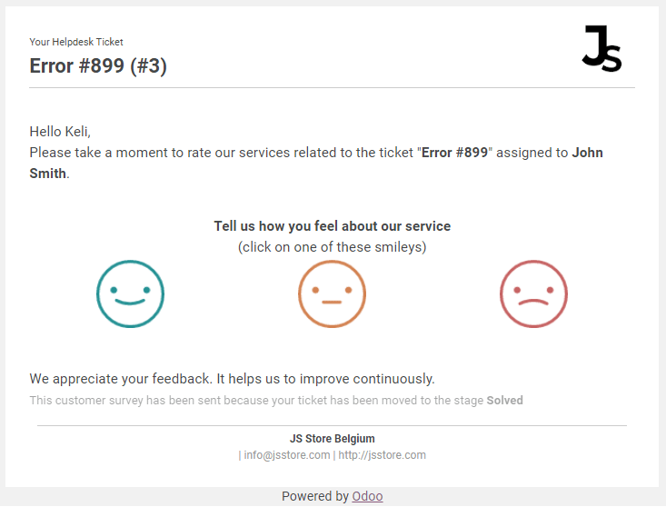

=======
Ratings
=======

Allow customers to rate their experience with your helpdesk teams to strengthen your credibility and
gain their trust. Reviews can also influence a customer’s decision and open space for feedback that
can help you improve the quality of your services.

Set up
======

Go to :menuselection:`Helpdesk --> Configuration --> Helpdesk Teams` and enable *Ratings on
tickets*. The feature automatically adds a default email template on the non-folded *closing
stage(s)* of that team.

.. image:: ratings/ratings_on_tickets.png
   :align: center
   :alt: Overview of the settings page of a helpdesk team emphasizing the rating on ticket feature
         in Odoo Helpdesk

To edit the email template and the stage(s) set as the closing ones, go to the Kanban view of your
helpdesk team and click on *Settings*, then on *Edit Stage*.

.. image:: ratings/edit_stage.png
   :align: center
   :alt: Overview of a helpdesk team kanban view emphasizing the menu edit stage in Odoo Helpdesk

Now, once a ticket reaches the stage(s) designated as the *Closing Stage*, an email is sent to the
customer.

Ratings can be seen on the chatter of each ticket, under the *See Customer Satisfaction* link on the
main dashboard, and through *Reporting*.

Ratings visible on the customer portal
--------------------------------------

Go to :menuselection:`Helpdesk --> Configuration --> Helpdesk Teams` and enable *Display Rating on
Customer Portal*. Now, by clicking on the helpdesk team’s name on their ticket, customers can see
its ratings.

.. image:: ratings/customer_portal.png
   :align: center
   :alt: View of the helpdesk ticket from a user’s portal emphasizing the link to the helpdesk team
         in Odoo Helpdesk

.. seealso::
   - :doc:`../advanced/close_tickets`
