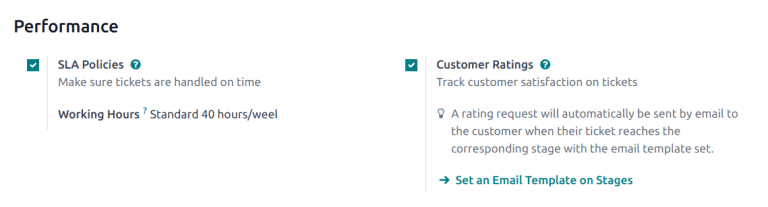

================
Customer ratings
================

.. |smile| replace:: green :icon:`fa-smile-o` :guilabel:`(smile)` icon
.. |meh| replace:: yellow :icon:`fa-meh-o` :guilabel:`(neutral)` icon
.. |frown| replace:: red :icon:`fa-frown-o` :guilabel:`(frown)` icon

Asking customers to rate the support they received from a **Helpdesk** team provides an opportunity
to gauge team performance and track customer satisfaction.

.. _helpdesk/enable-ratings:

Enable customer ratings on Helpdesk teams
=========================================

To enable *customer ratings* on a helpdesk team, navigate to :menuselection:`Helpdesk app -->
Configuration --> Helpdesk Teams`. Click on a team from the list to open the settings page. Scroll
to the :guilabel:`Performance` section, and tick the :guilabel:`Customer Ratings` checkbox.

         in Odoo Helpdesk.

Set a ratings request email template on a stage
===============================================

To automatically request ratings from customers once their tickets have closed, an email template
needs to be added to the appropriate stage.

After the :guilabel:`Customer Ratings` :ref:`setting has been enabled <helpdesk/enable-ratings>` on
the team's settings page, click the :guilabel:`Set an Email Template on Stages` link. Select a stage
from the list, or click :guilabel:`New` to create a new stage.

.. important::
   Customers should only be asked to rate tickets once an issue has been resolved and their ticket
   is *closed*. Therefore, a *ratings request* email should **only** be added to a stage that is
   folded in the Kanban, as tickets in a *folded stage* are considered closed.

On the stage's settings page, select the template, `Helpdesk: Ticket Rating Request` in the
:guilabel:`Email Template` field. This template has been preconfigured with ratings customers can
use to provide feedback. To view the template, click the arrow button to the right of the field.

After the template is added to the stage, it automatically sends a message when a ticket is moved to
that stage. Customers are then asked to rate the support they received with colored icons.

 - **Satisfied** - |smile|
 - **Okay** - |meh|
 - **Dissatisfied** - |frown|

After selecting a rating, customers are taken to a webpage where they can provide specific written
feedback to support their rating. The rating is then submitted, and the rating, as well as any
additional comments, are added to the chatter on the ticket.

.. tip::
   Customer ratings can also be viewed through the :guilabel:`Customer Ratings` report. To view this
   report, go to :menuselection:`Helpdesk app --> Reporting --> Customer Ratings`.

.. seealso::
   - :doc:`../../../general/companies/email_template`
   - :doc:`../advanced/close_tickets`
   - :doc:`reports`
