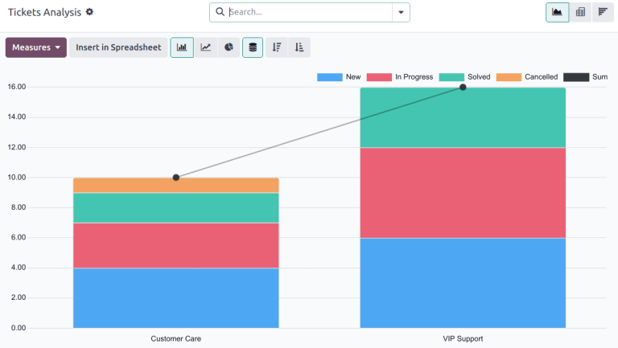
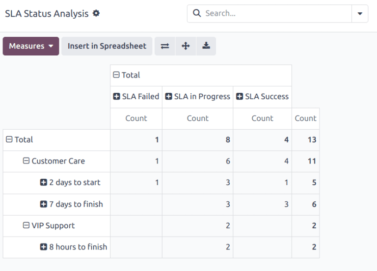
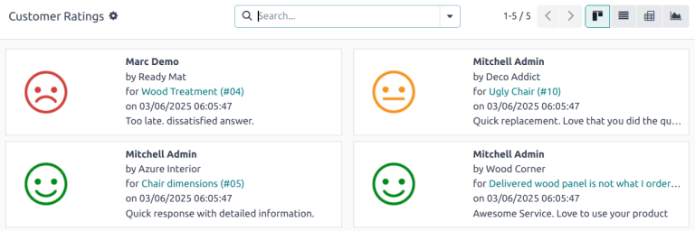
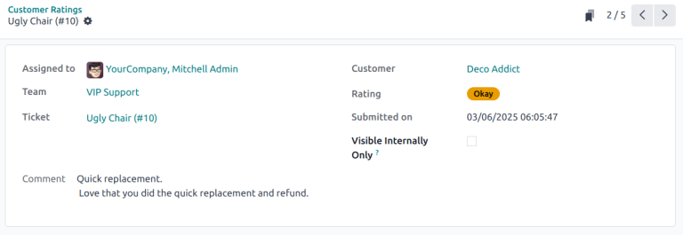
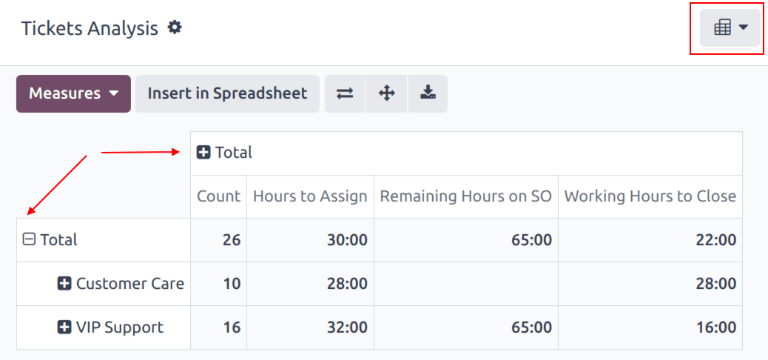
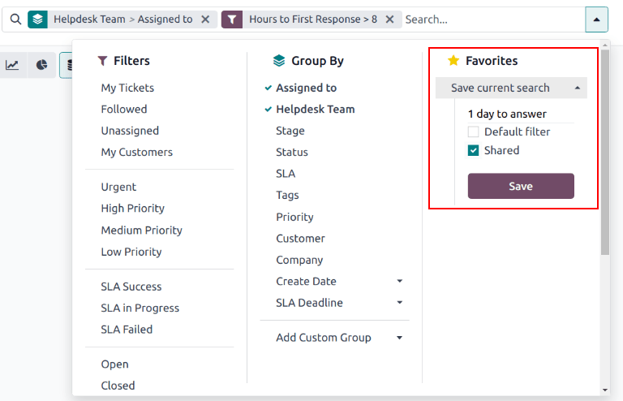

=========
Reporting
=========

.. |SLA| replace:: :abbr:`SLA (Service Level Agreement)`
.. |SLAs| replace:: :abbr:`SLAs (Service Level Agreements)`

Reports in Odoo *Helpdesk* provide the opportunity to manage employee workloads, identify areas for
improvement, and confirm if customer expectations are being met.

Available reports
=================

Details about the reports available in Odoo *Helpdesk* can be found below. To view the different
reports, go to :menuselection:`Helpdesk app --> Reporting`, and select one of the following:
:guilabel:`Tickets Analysis`, :guilabel:`SLA Status Analysis`, or :guilabel:`Customer Ratings`.

Tickets Analysis
----------------

The *Tickets Analysis* report (:menuselection:`Helpdesk app --> Reporting --> Tickets Analysis`)
provides an overview of every customer support ticket in the database.

This report is useful for identifying where teams are spending the most time, and helps determine if
there is an uneven workload distribution among the support staff. The default report counts the
number of tickets per team and groups them by stage.

Alternative measures can be selected to track where the most time is spent at different points in
the workflow. To change the measures used for the report that is currently displayed, or to add
more, click the :guilabel:`Measures` button, and select one or more options from the drop-down
menu:

- :guilabel:`Average Hours to Respond`: average number of working hours between a message sent from
  the customer and the response from the support team. *This does not include messages sent when
  the ticket was in a folded stage.*
- :guilabel:`Hours Open`: number of hours between the date the ticket was created and the closed
  date. If there is no closed date on the ticket, the current date is used. **This measure is not
  specific to working hours.**
- :guilabel:`Hours Spent`: number of *Timesheet* hours logged on a ticket. *This
  measure is only available if Timesheets are enabled on a team, and the current user has the access
  rights to view them.*
- :guilabel:`Hours to Assign`: number of working hours between the date the ticket was created and
  when it was assigned to a team member.
- :guilabel:`Hours to Close`: number of working hours between the date the ticket was created and
  the date it was closed.
- :guilabel:`Hours to First Response`: number of working hours between the date the ticket was
  received and the date on which the first message was sent. *This does not include email sent
  automatically when a ticket reaches a stage.*
- :guilabel:`Hours until SLA Deadline`: number of working hours remaining to reach the last |SLA|
  deadline on a ticket.
- :guilabel:`Rating (/5)`: number out of five to represent customer feedback (Dissatisfied = 1,
  Okay/Neutral = 3, Satisfied = 5).
- :guilabel:`Remaining Hours on SO`: hours remaining on a linked sales order.
- :guilabel:`Count`: number of tickets in total.

.. note::
   *Working hours* are calculated based on the default working calendar. To view or change the
   working calendar, go to the :menuselection:`Settings` application and select
   :menuselection:`Employees --> Company Working Hours`.

SLA Status Analysis
-------------------

The *SLA Status Analysis* report (:menuselection:`Helpdesk app --> Reporting --> SLA Status
Analysis`) :ref:`analyzes the performance <helpdesk/analyze-sla-performance>` of individual SLA
(Service Level Agreement) policies.

By default, this report is filtered to show the number of |SLAs| failed, in progress, and the number
that have been successful. The results are grouped by teams.

To change the measures used for the report that is currently displayed, or to add more, click the
:guilabel:`Measures` button, and select one or more options from the drop-down menu:

- :guilabel:`Number of SLA Failed`: number of tickets that have failed at least one |SLA|.
- :guilabel:`Rating (/5)`: number value representing customer feedback (Dissatisfied = 1,
  Okay/Neutral = 3, Satisfied = 5).
- :guilabel:`Remaining Hours on SO`: hours remaining on a linked sales order.
- :guilabel:`Working Hours to Assign`: number of working hours between the date the ticket was
  created and when it was assigned to a team member.
- :guilabel:`Working Hours to Close`: number of working hours between the date the ticket was
  created and the date it was closed.
- :guilabel:`Working Hours to Reach SLA`: number of working hours between the date the ticket was
  created and the date the |SLA| was satisfied.
- :guilabel:`Count`: number of tickets in total.

.. seealso::
   :doc:`Service Level Agreements (SLA) <sla>`

Customer Ratings
----------------

The *Customer Ratings* report (:menuselection:`Helpdesk app--> Reporting --> Customer Ratings`)
displays an overview of the ratings received on individual support tickets, as well as any
additional comments submitted with the rating.

Click on an individual rating to see additional details about the rating submitted by the customer,
including a link to the original ticket.

.. tip::
   On the rating's details page, tick the :guilabel:`Visible Internally Only` checkbox to hide the
   rating from the customer portal.

The *Customer Ratings* report is displayed in a Kanban view by default, but can also be displayed
in graph, list, or pivot view.

.. seealso::
   :doc:`Ratings <ratings>`

View and filter options
=======================

On any Odoo report, the view and filter options vary, depending on what data is being analyzed,
measured, and grouped. See below for additional information on the available views for the
*Helpdesk* reports.

.. note::
   Only one measure may be selected at a time for graphs, but pivot tables can include multiple
   measures.

Pivot view
----------

The *pivot* view presents data in an interactive manner. All three *Helpdesk* reports are available
in pivot view.

The pivot view can be accessed on any report by selecting the :icon:`oi-view-pivot`
:guilabel:`(pivot)` icon at the top-right of the screen.

To add a group to a row or column to the pivot view, click the :icon:`fa-plus-square`
:guilabel:`(plus)` icon next to :guilabel:`Total`, and then select one of the groups. To remove one,
click the :icon:`fa-minus-square-o` :guilabel:`(minus)` icon, and de-select the appropriate option.

Graph view
----------

The *graph* view presents data in either a *bar*, *line*, or *pie* chart.

Switch to the graph view by selecting the :icon:`fa-area-chart` :guilabel:`(area chart)` icon at the
top-right of the screen. To switch between the different charts, select the *related icon* at the
top-left of the chart, while in graph view.

.. tabs::

   .. tab:: Bar chart

      .. image:: reports/bar-chart.png
         :align: center
         :alt: View of the SLA status analysis report in bar view.

   .. tab:: Line chart

      .. image:: reports/line-chart.png
         :align: center
         :alt: View of the Customer Ratings report in line view.

   .. tab:: Pie chart

      .. image:: reports/pie-chart.png
         :align: center
         :alt: View of the Ticket analysis report in pie chart view.

.. tip::
   Both the *bar chart* and *line chart* can utilize the *stacked* view option. This presents two
   or more groups of data on top of each other, instead of next to each other, making it easier to
   compare data. While viewing either a bar chart or line chart, click the :icon:`fa-database`
   :guilabel:`(stacked)` icon to toggle the stacked view option on or off.

Save and share a favorite search
--------------------------------

The *Favorites* feature found on *Helpdesk* reports allows users to save their most commonly used
filters, without having to reconstruct them every time they are needed.

To create and save a new *Favorites* configuration on a report, follow the steps below:

#. Set the necessary parameters using the :guilabel:`Filters`, :guilabel:`Group By` and
   :guilabel:`Measures` options.
#. Click the :icon:`fa-caret-down` :guilabel:`(down)` icon next to the :guilabel:`Search...` bar to
   open the drop-down menu.
#. Under the :guilabel:`Favorites` heading, click :guilabel:`Save current search`.
#. If desired, enter a new name for the report.
#. Tick the :guilabel:`Default Filter` checkbox to have these filter settings automatically
   displayed when the report is opened. Otherwise, leave it blank.
#. Tick the :guilabel:`Shared` checkbox to make this filter configuration available to all other
   database users. If this checkbox is not ticked, only the user who creates the filter can access
   it.
#. Click :guilabel:`Save` to preserve the configuration for future use.

.. seealso::
   - :doc:`Start receiving tickets <receiving_tickets>`
   - :doc:`Odoo reporting <../../../essentials/reporting>`
