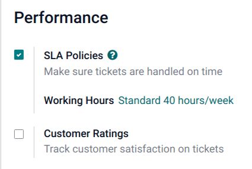
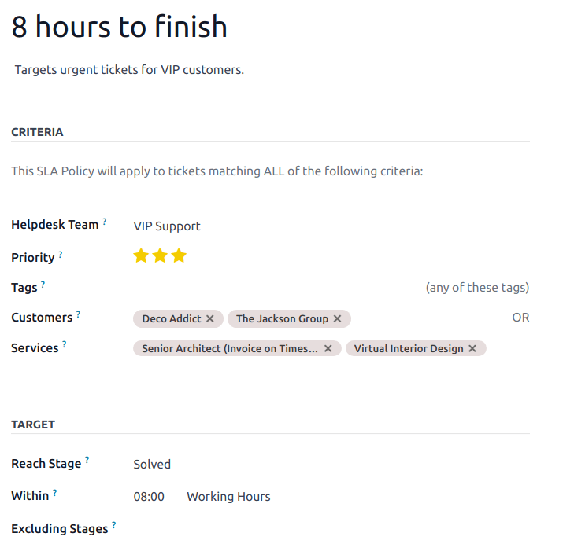

==============================
Service Level Agreements (SLA)
==============================

A Service Level Agreement (SLA) defines the level of service a customer can expect from a supplier.
SLAs provide a timeline that tells customers when they can expect results, and keeps the support
team on target.

Create a new SLA policy
=======================

To create a new :abbr:`SLA (Service Level Agreement)` Policy, navigate to the team's page under
:menuselection:`Helpdesk --> Configuration --> Teams`. Select a team, scroll to the
:guilabel:`Performance` section, and then check the selection box next to :guilabel:`SLA Policies`
to enable it for that specific team.

.. note::
   The value indicated next to the :guilabel:`Working Hours` field is used to determine the
   deadline for :abbr:`SLA (Service Level Agreement)` policies. By default, this is determined by
   the value set in the :guilabel:`Company Working Hours` field under :menuselection:`Settings app
   --> Employees --> Work Organization`.

To create a new policy, click the smart button on the team`s settings page or go to
:menuselection:`Helpdesk -->  Configuration --> SLA Policies`, and click :guilabel:`New`. Start by
entering a :guilabel:`Title` and a :guilabel:`Description` for the new policy, and proceed to fill
out the form using the steps below.

Define the criteria for an SLA policy
-------------------------------------

The :guilabel:`Criteria` section is used to identify what tickets this policy will be applied to.
Fill out the following fields to adjust the selection criteria:

- :guilabel:`Team`: a policy can only be applied to one team. *This field is required.*
- :guilabel:`Priority`: the priority level for a ticket is identified by selecting the number of
  stars representing the priority level on the kanban card or the ticket itself. The :abbr:`SLA
  (Service Level Agreement)` will only be applied once the priority level has been updated on the
  ticket to match the :abbr:`SLA (Service Level Agreement)` criteria. If no selection is made in
  this field, this policy will only apply to tickets marked as `Low Priority` (zero stars).
- :guilabel:`Types`: ticket types can be helpful when indicating when a ticket is a
  customer question, that can be solved with a quick response, or an issue, that may require
  additional investigation. Multiple ticket types can be selected for this field. If no
  selection is made, this policy will apply to all ticket types.
- :guilabel:`Tags`: tags are applied to briefly indicate what the ticket is about. Multiple tags
  can be applied to a single ticket.
- :guilabel:`Customers`: individual contacts or companies may be selected in this field.
- :guilabel:`Sales Order Items`: this field is available only if a team has the *Timesheets* app
  enabled. This allows the ticket to tie directly to a specific line on a sales order, which must
  be indicated on the ticket in the :guilabel:`Sales Order Item` field.

.. note::
   Unless otherwise indicated, multiple selections can be made for each field. (i.e. multiple
   :guilabel:`Tags` can be included in a policy, but only one :guilabel:`Priority` level)

Establish a target for an SLA policy
------------------------------------

The :guilabel:`Target` is the stage a ticket needs to reach, and the time alloted to reach that
stage, in order to satisfy the :abbr:`SLA (Service Level Agreement)` policy. Any stage assigned to a
team may be selected for the :guilabel:`Reach Stage` field. Time spent in stages selected in
:guilabel:`Excluding Stages` will not be included in the calculation of the :abbr:`SLA (Service
Level Agreement)` deadline.

.. example::
   An :abbr:`SLA (Service Level Agreement)` titled `8 Hours to Close` tracks the working time before
   a ticket is completed, and would have `Solved` as the :guilabel:`Reach Stage`. However, if the
   :abbr:`SLA (Service Level Agreement)` was titled `2 Days to Start`, it tracks the working time
   before work on a ticket has begun, and would have `In Progress` as the :guilabel:`Reach Stage`.

Meeting SLA deadlines
=====================

Once it is determined that a ticket fits the criteria of an :abbr:`SLA (Service Level Agreement)`
policy, a deadline is calculated. The deadline is based on the creation date of the ticket, and the
targeted working hours. The deadline is then added to the ticket, as well as a white tag indicating
the name of the :abbr:`SLA (Service Level Agreement)` applied.

.. image:: sla/sla-open-deadline.png
   :align: center
   :alt: View of a ticket's form emphasizing an open SLA deadline on a ticket in Odoo Helpdesk

.. important::
   If a ticket fits the criteria for more than one :abbr:`SLA (Service Level Agreement)`, the
   earliest occurring deadline will be displayed on the ticket. Once that deadline has passed, the
   next deadline will be displayed.

Once a ticket satisfies an :abbr:`SLA (Service Level Agreement)` policy, the :abbr:`SLA (Service
Level Agreement)` tag turns green, and the :guilabel:`Deadline` field disappears from view on the
ticket.

.. image:: sla/sla-deadline.png
   :align: center
   :alt: View of a ticket's form emphasizing a satisfied SLA in Odoo Helpdesk

If the :abbr:`SLA (Service Level Agreement)` deadline passes and the ticket has not moved to the
:guilabel:`Reach Stage`, the :abbr:`SLA (Service Level Agreement)` tag will turn red. Once the
:abbr:`SLA (Service Level Agreement)` has failed, the red tag will stay on the ticket, even after
the ticket is moved to the :guilabel:`Reach Stage`.

.. image:: sla/sla-passing-failing.png
   :align: center
   :alt: View of a ticket's form with a failing and passing SLA in Odoo Helpdesk

Analyzing SLA performance
=========================

The :guilabel:`SLA Status Analysis` report tracks how quickly an :abbr:`SLA (Service Level
Agreement)` is fulfilled, as well as the success rate of individual policies. Navigate to the report
and corresponding pivot table by going to :menuselection:`Helpdesk --> Reporting --> SLA Status
Analysis`.

Using the Pivot view
--------------------

By default, the report is displayed in a :guilabel:`Pivot` view, and is filtered to show the number
of SLAs failed and the failure rate over the last 30 days, grouped by team.

.. image:: sla/sla-status-analysis.png
   :align: center
   :alt: View of the SLA status analysis report in Odoo Helpdesk

To add the number of SLAs passed or in progress, click the :guilabel:`Measures` button to reveal a
drop-down menu of reporting criteria, and choose from the options available based on the
measurements preferred. Whenever a measurement is picked, a check mark will appear in the drop-down
menu to indicate that that measurement is included, and a corresponding new column will emerge in
the pivot table to show the relevant calculations.

To add a group to a row or column, click the plus :guilabel:` + ` button next to
:guilabel:`Total`, and then select one of the groups. To remove one, click the minus :guilabel:` - `
button and deselect.

Using the Graph view
--------------------

The :guilabel:`Status Analysis` report can also be viewed as a :guilabel:`Bar`, :guilabel:`Line`, or
:guilabel:`Pie` Chart. Toggle between these views by selecting the appropriate icon at the top of
the chart.

.. tabs::

   .. tab:: Bar Chart

       .. image:: sla/sla-report-bar.png
          :align: center
          :alt: View of the SLA status analysis report in bar view

   .. tab:: Line Chart

       .. image:: sla/sla-report-line.png
          :align: center
          :alt: View of the SLA status analysis report in line view

   .. tab:: Pie Chart

       .. image:: sla/sla-report-pie.png
          :align: center
          :alt: View of the SLA status analysis report in pie chart view

.. tip::
   Both the :guilabel:`Bar Chart` and :guilabel:`Line Chart` can be viewed :guilabel:`Stacked`.
   This presents two or more groups to appear on top of each other instead of next to each other,
   making it easier to compare data.

Using the Cohort view
---------------------

The :guilabel:`Cohort` view is used to track the changes in data over a period of time. To display
the :guilabel:`Status Analysis` report in a :guilabel:`Cohort` view, click the icon in the top right
corner above the chart.

.. image:: sla/sla-report-cohort.png
   :align: center
   :alt: View of the SLA status analysis report in cohort view

.. seealso::
   - :ref:`Reporting views <reporting/views>`
   - :doc:`Allow customers to close their tickets
     </applications/services/helpdesk/advanced/close_tickets>`
