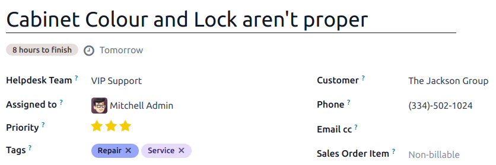
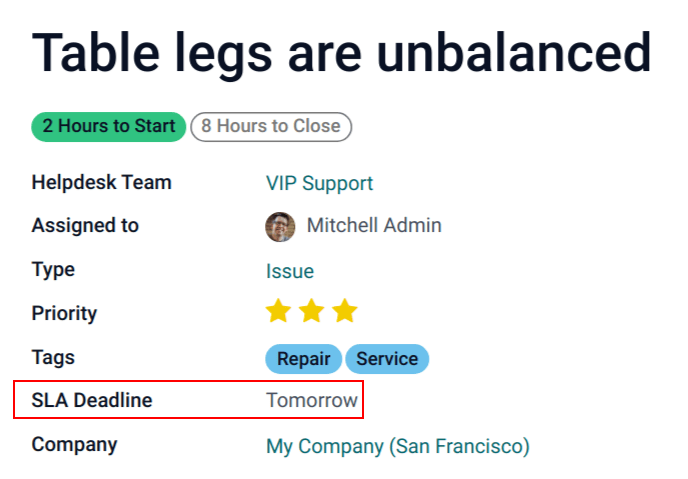
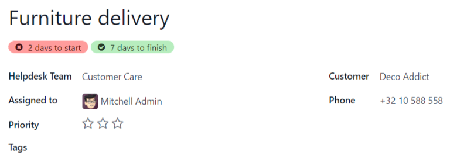
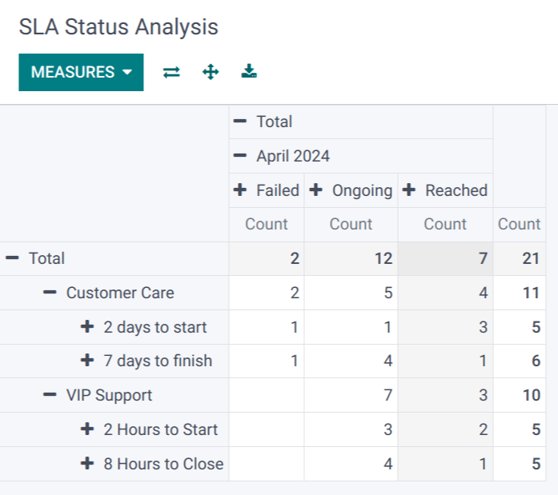
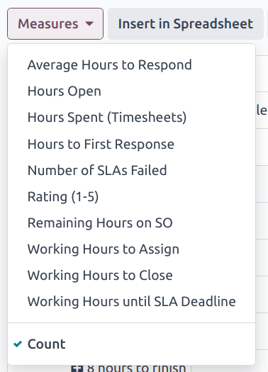
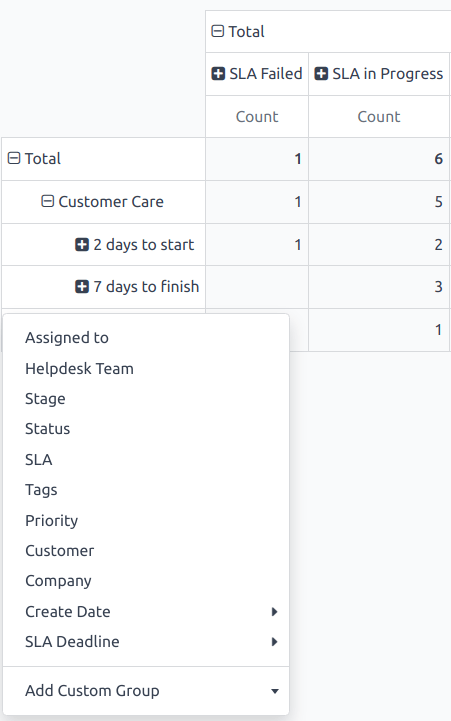
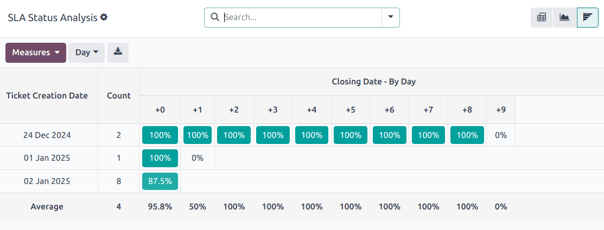

==============================
Service level agreements (SLA)
==============================

.. |SLAs| replace:: :abbr:`SLAs (Service Level Agreements)`
.. |SLA| replace:: :abbr:`SLA (Service Level Agreements)`

A *service level agreement* (SLA) defines the level of support a customer can expect from a service
provider. |SLAs| provide a timeline that tells customers when they can expect results and keeps the
support team on target.

.. note::
   The *SLA Policies* feature is enabled by default on newly created **Helpdesk** teams.

   To turn off the feature, or edit the working hours, navigate to :menuselection:`Helpdesk app -->
   Configuration --> Helpdesk Teams`. Click on a team to open that team's configuration page.

   From here, scroll to the :guilabel:`Performance` section. To turn off the |SLAs| feature for the
   team, clear the :guilabel:`SLA Policies` checkbox.

   .. image:: sla/sla-enable.png
      :alt: View of a team page in Helpdesk focusing on the SLA Policies setting.

Create a new SLA policy
=======================

To create a new policy, go to :menuselection:`Helpdesk app --> Configuration --> SLA Policies`, and
click :guilabel:`New`.

Alternatively, go to :menuselection:`Helpdesk app --> Configuration --> Helpdesk Teams`, and click
on a team. Then, click the :guilabel:`SLA Policies` smart button at the top of the team's settings
page, and click :guilabel:`New`.

On the blank |SLA| policy form, enter a :guilabel:`Title` and a :guilabel:`Description` for the new
policy, and proceed to fill out the form using the steps below.

Define the criteria for an SLA policy
-------------------------------------

The :guilabel:`Criteria` section is used to identify which tickets this policy is applied to.

Fill out the following fields to adjust the selection criteria:

.. note::
   Unless otherwise indicated, multiple selections can be made for each field.

- :guilabel:`Helpdesk Team`: A policy can only be applied to one team. *This field is required.*
- :guilabel:`Priority`: The priority level for a ticket is identified by selecting one, two, or
  three of the :icon:`fa-star-o` :guilabel:`(star)` icons, representing the priority level on the
  Kanban card or on the ticket itself. The |SLA| is **only** applied after the priority level has
  been updated on the ticket to match the |SLA| criteria. If no selection is made in this field,
  this policy only applies to tickets marked as `Low Priority`, meaning those with zero
  :icon:`fa-star-o` :guilabel:`(star)` icons.
- :guilabel:`Tags`: Tags are used to indicate what the ticket is about. Multiple tags can be applied
  to a single ticket.
- :guilabel:`Customers`: Individual contacts or companies may be selected in this field.
- :guilabel:`Services`: This field is available only if a team has the **Timesheets** app enabled.
  This allows the ticket to link directly to a specific line on a sales order, which must be
  indicated on the ticket in the :guilabel:`Sales Order Items` field.

.. example::
   A support team needs to address urgent issues for VIP customers within one business day.

   The new policy, titled `8 Hours to close`, is assigned to the `VIP Support` team. It **only**
   applies to tickets that are assigned three :icon:`fa-star-o` :guilabel:`(star)` icons, which
   equates to an `Urgent` priority level.

   At the same time, the tickets can be related to multiple issues, so the policy applies to tickets
   with `Repair`, `Service`, or `Emergency` tags.

   .. image:: sla/sla-create-new.png
      :alt: View of a new SLA policy record with all the relevant information entered.

Establish a target for an SLA policy
------------------------------------

A *target* is the stage a ticket needs to reach, and the time allotted to reach that stage, in order
to satisfy the |SLA| policy. Any stage assigned to a team may be selected for the :guilabel:`Reach
Stage` field.

Time spent in stages selected in the :guilabel:`Excluding Stages` field are **not** included in the
calculation of the |SLA| deadline.

.. example::
   An |SLA| titled `8 Hours to Close` tracks the working time before
   a ticket is completed, and would have `Solved` as the :guilabel:`Reach Stage`. Simultaneously, an
   |SLA| titled `2 Days to Start` tracks the working time before
   work on a ticket has begun, and would have `In Progress` as the :guilabel:`Reach Stage`.

Meet SLA deadlines
==================

As soon as it is determined that a ticket fits the criteria of an |SLA| policy, a deadline is
calculated. The deadline is based on the creation date of the ticket, as well as the targeted
working hours.

.. note::
   The value indicated next to the :guilabel:`Working Hours` field of an |SLA| policy is used to
   determine the deadline. By default, this is determined by the value set in the :guilabel:`Company
   Working Hours` field under :menuselection:`Settings app --> Employees --> Work Organization`.

The deadline is then added to the ticket, as well as a tag indicating the name of the |SLAs|
applied.

When a ticket satisfies an |SLA| policy, the |SLA| tag turns green, and the deadline disappears
from view on the ticket.

.. important::
   If a ticket fits the criteria for more than one |SLA|, the earliest occurring deadline is
   displayed on the ticket. After that deadline has passed, the next deadline is displayed.

If the |SLA| deadline passes and the ticket has not moved to the :guilabel:`Reach Stage`, the |SLA|
tag turns red. After the |SLA| has failed, the red tag stays on the ticket, even after the ticket is
moved to the :guilabel:`Reach Stage`.

.. _helpdesk/analyze-sla-performance:

Analyze SLA performance
=======================

The :guilabel:`SLA Status Analysis` report tracks how quickly an |SLA| is fulfilled, as well as the
performance of individual team members. Navigate to the report, and corresponding pivot table, by
going to :menuselection:`Helpdesk app --> Reporting --> SLA Status Analysis`.

Pivot view
----------

By default, the report displays in a :guilabel:`Pivot` view. Any |SLA| policies in the database with
tickets that failed to fulfill a policy, are in progress, or have satisfied a policy are listed. By
default, they are grouped by team and ticket count.

   The pivot view aggregates data, which can be manipulated by adding measures and filters.

To change the display, or add additional measurements, click the :guilabel:`Measures` button to
reveal a drop-down menu of reporting criteria, and choose from the options available.

Whenever a measurement is picked, a :icon:`fa-check` :guilabel:`(check)` icon appears in the
drop-down menu to indicate that the measurement is included, and a corresponding new column emerges
in the pivot table to show the relevant calculations.

To add a group to a row or column, click the :icon:`fa-plus-square` :guilabel:`(plus)` icon next to
the policy name and then select one of the groups. To remove one, click the
:icon:`fa-minus-square-o` :guilabel:`(minus)` icon next to the policy name.

Graph view
----------

Switch to the graph view by selecting the :icon:`fa-area-chart` :guilabel:`(graph view)` icon at the
top of the screen. To switch between the different charts, select the *related icon* at the top of
the chart, while in graph view.

.. tabs::

   .. tab:: Bar Chart

       .. figure:: sla/sla-report-bar.png
          :alt: View of the SLA status analysis report in bar view.

          A bar chart can deal with larger data sets and compare data across several categories.

   .. tab:: Line Chart

       .. figure:: sla/sla-report-line.png
          :alt: View of the SLA status analysis report in line view.

          A line chart can visualize data trends or changes over time.

   .. tab:: Pie Chart

       .. figure:: sla/sla-report-pie.png
          :alt: View of the SLA status analysis report in pie chart view.

          A pie chart compares data among a small number of categories.

.. tip::
   Both the *bar chart* and *line chart* can utilize the *stacked* view option. This presents two
   or more groups of data on top of each other, instead of next to each other, making it easier to
   compare data. While viewing either a bar chart or line chart, click the :icon:`fa-database`
   :guilabel:`(stacked)` icon to toggle the stacked view option on or off.

   .. image:: sla/sla-report-stacked.png
      :alt: View of the SLA status analysis report in bar view, stacked.

Cohort view
-----------

The *cohort* view is used to track the changes in data over a period of time. To display the
:guilabel:`SLA Status Analysis` report in a cohort view, click the :icon:`oi-view-cohort`
:guilabel:`(cohort)` icon, next to the other view options.

   The cohort view examines the life cycle of data over time.

.. seealso::
   - :ref:`Reporting views <reporting/views>`
   - :doc:`Allow customers to close their tickets
     </applications/services/helpdesk/advanced/close_tickets>`
