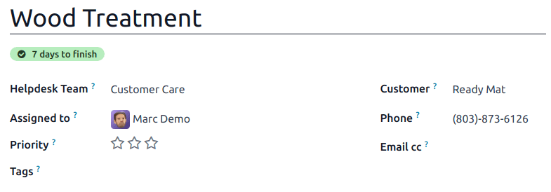

==============================
Service level agreements (SLA)
==============================

A *service level agreement* (SLA) defines the level of service a customer can expect from a
supplier. :abbr:`SLAs (Service Level Agreements)` provide a timeline that tells customers when they
can expect results, and keeps the support team on target.

.. note::
   The *SLA Policies* feature is enabled by default on newly created *Helpdesk* teams.

   To turn off the feature, or edit the working hours, navigate to :menuselection:`Helpdesk app -->
   Configuration --> Helpdesk Teams`. Click on a team to open that team's configuration page.

   From here, scroll to the :guilabel:`Performance` section. To turn off the :abbr:`SLAs (Service
   Level Agreements)` feature for the team, clear the :guilabel:`SLA Policies` checkbox.

   .. image:: sla/sla-enable.png
      :align: center
      :alt: View of a team page in Helpdesk focusing on the SLA Policies setting.

Create a new SLA policy
=======================

To create a new policy, go to :menuselection:`Helpdesk app --> Configuration --> SLA Policies`, and
click :guilabel:`New`.

Alternatively, go to :menuselection:`Helpdesk app --> Configuration --> Helpdesk Teams`, and click
on a team. Then, click the :guilabel:`SLA Policies` smart button at the top of the team's settings
page, and click :guilabel:`New`.

On the blank :abbr:`SLA (Service Level Agreement)` policy form, enter a :guilabel:`Title` and a
:guilabel:`Description` for the new policy, and proceed to fill out the form using the steps below.

Define the criteria for an SLA policy
-------------------------------------

The :guilabel:`Criteria` section is used to identify which tickets this policy is applied to.

Fill out the following fields to adjust the selection criteria:

.. note::
   Unless otherwise indicated, multiple selections can be made for each field.

- :guilabel:`Helpdesk Team`: a policy can only be applied to one team. *This field is required.*
- :guilabel:`Priority`: the priority level for a ticket is identified by selecting one, two, or
  three of the :guilabel:`⭐ (star)` icons, representing the priority level on the Kanban card or on
  the ticket itself. The :abbr:`SLA (Service Level Agreement)` is **only** applied after the
  priority level has been updated on the ticket to match the :abbr:`SLA (Service Level Agreement)`
  criteria. If no selection is made in this field, this policy only applies to tickets marked as
  `Low Priority`, meaning those with zero :guilabel:`⭐ (star)` icons.
- :guilabel:`Tags`: tags are used to indicate what the ticket is about. Multiple tags can be applied
  to a single ticket.
- :guilabel:`Customers`: individual contacts or companies may be selected in this field.
- :guilabel:`Sales Order Items`: this field is available only if a team has the *Timesheets* app
  enabled. This allows the ticket to link directly to a specific line on a sales order, which must
  be indicated on the ticket in the :guilabel:`Sales Order Items` field.

.. example::
   A support team needs to address urgent issues for VIP customers within one business day.

   The new policy, titled `8 Hours to close`, is assigned to the `VIP Support` team. It **only**
   applies to tickets that are assigned three :guilabel:`⭐ (star)` icons, which equates to an
   `Urgent` priority level.

   At the same time, the tickets can be related to multiple issues, so the policy applies to tickets
   with `Repair`, `Service`, or `Emergency` tags.

   .. image:: sla/sla-create-new.png
      :align: center
      :alt: View of a new SLA policy record with all the relevant information entered.

Establish a target for an SLA policy
------------------------------------

A *target* is the stage a ticket needs to reach, and the time allotted to reach that stage, in order
to satisfy the :abbr:`SLA (Service Level Agreement)` policy. Any stage assigned to a team may be
selected for the :guilabel:`Reach Stage` field.

Time spent in stages selected in the :guilabel:`Excluding Stages` field are **not** included in the
calculation of the :abbr:`SLA (Service Level Agreement)` deadline.

.. example::
   An :abbr:`SLA (Service Level Agreement)` titled `8 Hours to Close` tracks the working time before
   a ticket is completed, and would have `Solved` as the :guilabel:`Reach Stage`. Simultaneously, an
   :abbr:`SLA (Service Level Agreement)` titled `2 Days to Start` tracks the working time before
   work on a ticket has begun, and would have `In Progress` as the :guilabel:`Reach Stage`.

Meet SLA deadlines
==================

As soon as it is determined that a ticket fits the criteria of an :abbr:`SLA (Service Level
Agreement)` policy, a deadline is calculated. The deadline is based on the creation date of the
ticket, and the targeted working hours.

.. note::
   The value indicated next to the :guilabel:`Working Hours` field of an :abbr:`SLA (Service Level
   Agreement)` policy is used to determine the deadline. By default, this is determined by the value
   set in the :guilabel:`Company Working Hours` field under :menuselection:`Settings app -->
   Employees --> Work Organization`.

The deadline is then added to the ticket, as well as a tag indicating the name of the :abbr:`SLA
(Service Level Agreement)` applied.

When a ticket satisfies an :abbr:`SLA (Service Level Agreement)` policy, the :abbr:`SLA (Service
Level Agreement)` tag turns green, and the deadline disappears from view on the ticket.

.. important::
   If a ticket fits the criteria for more than one :abbr:`SLA (Service Level Agreement)`, the
   earliest occurring deadline is displayed on the ticket. After that deadline has passed, the next
   deadline is displayed.

If the :abbr:`SLA (Service Level Agreement)` deadline passes and the ticket has not moved to the
:guilabel:`Reach Stage`, the :abbr:`SLA (Service Level Agreement)` tag turns red. After the
:abbr:`SLA (Service Level Agreement)` has failed, the red tag stays on the ticket, even after the
ticket is moved to the :guilabel:`Reach Stage`.

.. image:: sla/sla-passing-failing.png
   :align: center
   :alt: View of a ticket's form with a failing and passing SLA in Odoo Helpdesk.

Analyze SLA performance
=======================

The :guilabel:`SLA Status Analysis` report tracks how quickly an :abbr:`SLA (Service Level
Agreement)` is fulfilled, as well as the performance of individual team members. Navigate to the
report, and corresponding pivot table, by going to :menuselection:`Helpdesk app --> Reporting -->
SLA Status Analysis`.

Pivot view
----------

By default, the report displays in a :guilabel:`Pivot` view. Any :abbr:`SLA (Service Level
Agreement)` policies in the database with tickets that failed to fulfill a policy, are in progress,
or have satisfied a policy are listed. By default, they are grouped by team and ticket count.

.. figure:: sla/sla-status-analysis.png
   :align: center
   :alt: View of the SLA status analysis report in Odoo Helpdesk.

   The pivot view aggregates data, which can be manipulated by adding measures and filters.

To change the display, or add additional measurements, click the :guilabel:`Measures` button to
reveal a drop-down menu of reporting criteria, and choose from the options available.

Whenever a measurement is picked, a :guilabel:`✔️ (checkmark)` icon appears in the drop-down menu to
indicate that the measurement is included, and a corresponding new column emerges in the pivot table
to show the relevant calculations.

To add a group to a row or column, click the :guilabel:`➕ (plus)` icon next to the policy name and
then select one of the groups. To remove one, click the :guilabel:`➖ (minus)` icon next to the
policy name.

Graph view
----------

The :guilabel:`SLA Status Analysis` report can also be viewed as a :guilabel:`Bar Chart`,
:guilabel:`Line Chart`, or :guilabel:`Pie Chart`. Toggle between these views by first selecting the
:guilabel:`Graph` button at the top-right of the dashboard. Then, select the appropriate chart icon
at the top-left of the graph.

.. tabs::

   .. tab:: Bar Chart

       .. figure:: sla/sla-report-bar.png
          :align: center
          :alt: View of the SLA status analysis report in bar view.

          A bar chart can deal with larger data sets and compare data across several categories.

   .. tab:: Line Chart

       .. figure:: sla/sla-report-line.png
          :align: center
          :alt: View of the SLA status analysis report in line view.

          A line chart can visualize data trends or changes over time.

   .. tab:: Pie Chart

       .. figure:: sla/sla-report-pie.png
          :align: center
          :alt: View of the SLA status analysis report in pie chart view.

          A pie chart compares data among a small number of categories.

.. tip::
   Both the :guilabel:`Bar Chart` and :guilabel:`Line Chart` views can be :guilabel:`Stacked` by
   selecting the :guilabel:`Stacked` icon. This displays two or more groups on top of each other
   instead of next to each other, making it easier to compare data.

   .. image:: sla/sla-report-stacked.png
      :align: center
      :alt: View of the SLA status analysis report in bar view, stacked.

Cohort view
-----------

The :guilabel:`Cohort` view is used to track the changes in data over a period of time. To display
the :guilabel:`SLA Status Analysis` report in a :guilabel:`Cohort` view, click the
:guilabel:`Cohort` button, represented by :guilabel:`(four cascading horizontal lines)`, in the
top-right corner, next to the other view options.

   The cohort view examines the life cycle of data over time.

.. seealso::
   - :ref:`Reporting views <reporting/views>`
   - :doc:`Allow customers to close their tickets
     </applications/services/helpdesk/advanced/close_tickets>`
