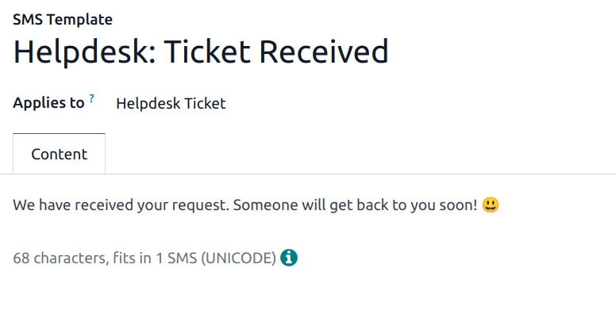

======
Stages
======

*Stages* are used to organize the **Helpdesk** pipeline and track the progress of tickets. Stages
are customizable, and can be renamed to fit the needs of each team.

Create or modify stages
=======================

.. important::
   :ref:`Developer mode <developer-mode>` **must** be activated to access the stages menu. To
   activate developer mode, go to :menuselection:`Settings app --> General Settings --> Developer
   Tools`, and click :guilabel:`Activate the developer mode`.

To view or modify **Helpdesk** stages, go to :menuselection:`Helpdesk app --> Configuration -->
Stages`.

The default list view on the :guilabel:`Stages` page displays the stages currently available in the
**Helpdesk** app. They are listed in the order they appear in the pipeline.

To change the order of the stages, click the :icon:`oi-draggable` :guilabel:`(draggable)` icon, to
the left of the stage name, and drag it to the desired place on the list.

.. image:: stages/stages-list-buttons.png
   :alt: View of the stage list page emphasizing the buttons used to change the order the stages
         appear in the list.

.. tip::
   Change the stage order on the Kanban view of a **Helpdesk** team's pipeline by dragging and
   dropping individual columns.

To create a new stage, click the :guilabel:`New` button at the top-left of the stage list. Doing so
reveals a blank stage form.

Choose a :guilabel:`Name` for the new stage.

.. image:: stages/new-stage-details.png
   :alt: View of a stage's settings page in Odoo Helpdesk.

Add email and SMS templates to stages
=====================================

When an :guilabel:`Email Template` is added to a stage, a preconfigured email is automatically sent
to the customer when a ticket reaches that specific stage in the pipeline. Likewise, adding an
:guilabel:`SMS Template` triggers a preconfigured SMS text message to send to the customer.

.. important::
   SMS text messaging is an :doc:`In-App Purchase (IAP) </applications/essentials/in_app_purchase/>`
   service that requires prepaid credits to work. Refer to `SMS Pricing FAQ
   <https://iap-services.odoo.com/iap/sms/pricing>`_ for additional information.

To select an existing email template, select it from the :guilabel:`Email Template` field. After
choosing a template, click on the :icon:`oi-arrow-right` :guilabel:`(right arrow)` icon to the right
of the field to edit the chosen template.

To create a new template from this form, click the field, and enter a title for the new template.
Then, select :guilabel:`Create and edit` from the drop-down menu that appears, and complete the form
details.

Follow the same steps to select, edit, or create an :guilabel:`SMS Template`.

.. seealso::
   :doc:`/applications/general/companies/email_template`

Fold a stage
============

By default, stages are unfolded in the Kanban view of either tickets dashboard: :guilabel:`My
Tickets` (:menuselection:`Helpdesk app --> Tickets --> My Tickets`) or :guilabel:`All Tickets`
(:menuselection:`Helpdesk app --> Tickets --> All Tickets`).

Tickets in an unfolded stage are visible in the pipeline under the stage name, and are considered
*open*.

Stages can be configured to be folded in the Kanban view of a tickets page.

The name of the folded stages are still visible, but the tickets in the stage are hidden from view.

To fold a stage, tick the :guilabel:`Folded in Kanban` checkbox on the :guilabel:`Stages` form.

.. warning::
   Tickets that reach a *folded* stage are considered *closed*. Closing a ticket before the work is
   completed can result in reporting and communication issues. This setting should **only** be
   enabled for stages that are considered *closing* stages.

Temporarily fold a stage
------------------------

Stages can be temporarily folded in the Kanban view of the tickets pipeline, as well.

View a specific team's pipeline by navigating to :menuselection:`Helpdesk app`, and clicking the
team's Kanban card.

Hover the cursor at the top of the desired stage to fold temporarily, then click the :icon:`fa-gear`
:guilabel:`(gear)` icon that appears, and select :guilabel:`Fold` from the drop-down menu.

.. image:: stages/fold-stage-kanban.png
   :alt: Kanban view of a Helpdesk stage, with the temporary fold option emphasized.

.. important::
   Manually folding a stage from the Kanban view is temporary and does **not** close the tickets in
   the stage.

Assign stages to a team
=======================

Make a selection in the :guilabel:`Helpdesk Teams` field on the :guilabel:`Stages` form. More than
one team may be selected, since the same stage can be assigned to multiple teams.
