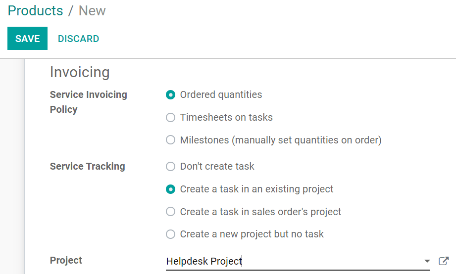
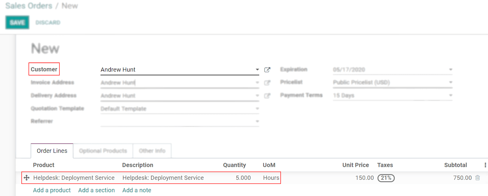

========================================================
Invoice Time Spent on Tickets (Prepaid Support Services)
========================================================

Have the option to work with prepaid support services, meaning that a sales order and a
corresponding invoice are issued and, once the service is done, you can deduct the time spent. Odoo
allows it to happen because the applications are fully integrated, resulting in faster responses
to your customer needs.

Set up
======

Step 1: Set up a helpdesk team
------------------------------

| Go to :menuselection:`Helpdesk --> Configuration --> Helpdesk Teams`, create or edit an existing
  team, and enable *Timesheet on Ticket* and *Time Reinvoicing*.
| Select or create a project under *Timesheet on Ticket*. The selected/created is
  the one at which employees timesheet on by default. However, it can be ultimately modified on
  each ticket.

.. image:: invoice_time/sell_track_hours.png
   :align: center
   :alt: View of a helpdesk team settings page emphasizing the timesheet on ticket and time
         reinvoicing features in Odoo Helpdesk

Step 2: Set up a service
------------------------

| Go to :menuselection:`Sales --> Configuration --> Settings` and enable *Units of Measure* to
  optionally be able to choose *hours* (for example) as the unit of measure of your service.
| Then, go to :menuselection:`Sales --> Products --> Products`, create or edit an existing one, and
  set its *Product Type* as *Service*.

.. image:: invoice_time/product_type_unit.png
   :align: center
   :alt: View of a product's form emphasizing the product type and unit of measure fields in Odoo
         Sales

Now, select the invoicing management you would like to have under the *Sales* tab. We recommend the
following configuration:

This configuration ensures that the customer is invoiced by the number of hours predicted in the
sales order, meaning that less or extra hours recorded are not taken into account. It also ensures
that every time a sales order is confirmed, a new task is created under the right project,
automating the process.

.. tip::
   We recommend setting up a specific project, as it was done for this flow example. The important
   thing to remember is that the sales order item needs to be set on the corresponding project or
   task, in order to reinvoice the time spent on a ticket.

Prevision an invoice and record time
====================================

Step 1: Place an order
----------------------

Go to :menuselection:`Sales --> Orders --> Orders` and create one for the helpdesk service product
you have previously set up, with the customer who needs the ticket to be opened. Set the number of
hours needed to assist the customer and *Confirm* the order.

Step 2: Invoice the customer
----------------------------

In *Sales*, select the respective sales order to *Create Invoice*.

.. image:: invoice_time/create_invoice.png
   :align: center
   :height: 330
   :alt: View of a sales order emphasizing the create invoice button in Odoo Sales

Step 3: Link the task to the ticket
-----------------------------------

Now, in *Helpdesk*, create or edit the respective ticket and link it to the task created by the
confirmation of the sales order.

.. image:: invoice_time/helpdesk_task.png
   :align: center
   :alt: View of a helpdesk ticket emphasizing the field task in Odoo Helpdesk

Step 4: Record the time spent
-----------------------------

Still on the respective helpdesk ticket, record the hours performed under the *Timesheets* tab.

.. image:: invoice_time/helpdesk_timesheet.png
   :align: center
   :alt: View of a helpdesk ticket emphasizing the timesheets tab in Odoo Helpdesk

Note that the hours recorded on the ticket form are shown on the *Delivered* column in the sales
order.

.. image:: invoice_time/quotation_delivered.png
   :align: center
   :alt: View of a sales order emphasizing the delivered column in Odoo Sales

.. tip::
   Hours recorded on the ticket are automatically shown in *Timesheets* and on the dedicated task.

.. seealso::
   - :doc:`reinvoice_from_project`
   - :doc:`/applications/inventory_and_mrp/inventory/management/products/uom`
